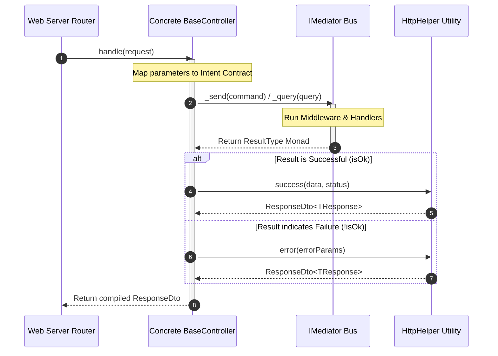

# Base Controller

The Base Controller documentation defines the programmatic boundaries, request
orchestration signatures, and bus routing shortcuts implemented inside the
ingress transport abstraction ring.

---

## Direct Definition Block

The `BaseController` is an abstract infrastructure template class within the
Xeno framework that implements the core `IController` contract. Operating as the
primary gateway for inbound traffic, it decouples physical presentation
frameworks from application-layer core logic by capturing external payloads,
routing operations through the centralized `IMediator` bus, and normalising
functional outcomes into structured `ResponseDto` models.

---

## The Ingress Isolation Paradigm

### What it is

The ingress isolation paradigm is an anti-corruption layer designed to sanitize
application entry points and strip web transport specifics from execution logic.

### How it works

Rather than writing logic bound to unique network routers, HTTP contexts, or
server request objects, ingress components extend `BaseController`. The
controller encapsulates communication mechanics, executing a deterministic
single-entry process that handles structural types agnostically before
delegating requests down the messaging bus.

### Why it exists

Exposing core application use cases directly to transport primitives (such as
Node.js HTTP request objects, serverless payload dictionaries, or WebSocket
frames) creates rigid coupling. Changing web serving dependencies or switching
runtime execution frameworks forces a rewrite of boundary validation and parsing
rules. Centralizing the entry pipeline layout guarantees that the system core
processes pure, transport-agnostic data structures exclusively.

---

## Execution Lifecycle Topology

### What it is

The Execution Lifecycle Topology represents the top-down transaction propagation
path from raw transport ingestion through mediator dispatch to output DTO
creation.

### How it works

Transactions traverse four separate processing phases inside the ingress class
boundary:

1. **Network Ingress**: The host routing wrapper captures a client request, maps
   properties to raw parameter maps, and invokes the abstract `.handle()`
   execution lane.
2. **Bus Forwarding**: The concrete implementation translates data maps into
   explicit command or query contracts, routing them down the `.send()` or
   `.query()` shortcut paths.
3. **Monadic Resolution**: The central dispatcher drives processing through
   pipeline behavior sequences, resolving an immutable `ResultType` monad back
   to the controller boundary.
4. **DTO Formatting**: The helper utilities wrap outcomes inside uniform success
   or error payloads using `HttpHelper`, exiting the presentation ring.



---

## Method Signature Reference

The `BaseController` class requires the injection of the `IMediator` core engine
and manages state routing through five programmatic method hooks:

| Method Signature           | Scope       | Parameter Contract                             | Return Matrix                     | Operational Behavior                                                                      |
| -------------------------- | ----------- | ---------------------------------------------- | --------------------------------- | ----------------------------------------------------------------------------------------- |
| `abstract handle(request)` | `public`    | `TRequest`                                     | `Promise<ResponseDto<TResponse>>` | Abstract entry lane defining the unique route orchestration logic.                        |
| `ok(data, status)`         | `protected` | `data: T`, `status: number` (Default: `200`)   | `ResponseDto<T>`                  | Helper shortcut that passes arguments directly to `HttpHelper.success`.                   |
| `fail(error, details)`     | `protected` | `error: AppError`, `details: Optional<string>` | `ResponseDto<TResponse>`          | Maps an internal `AppError` profile into a standardized `HttpHelper.error` contract.      |
| `_query(request)`          | `protected` | `request: IQuery<TResponse>`                   | `Promise<ResultType<TResponse>>`  | Instantiates a local `AbortSignal` and triggers a query request via the mediator bus.     |
| `_send(request)`           | `protected` | `request: ICommand<TResponse>`                 | `Promise<ResultType<TResponse>>`  | Instantiates a local `AbortSignal` and triggers a command execution via the mediator bus. |

---

## Practical Implementation Manual

The blueprint below demonstrates how to construct an isolated API entry point by
extending `BaseController`, encapsulating a custom data payload, and mapping
monad failures using the integrated `fail()` method:

```typescript
// src/presentation/controllers/create-product.controller.ts
import { BaseController } from '@xeno/core'
import type { ResponseDto, ResultType } from '@xeno/core'
import { CreateProductCommand } from '../../application/use-cases/create-product.command.js'

interface CreateProductBody {
  name: string
  price: number
  sku: string
}

interface CreateProductResponse {
  productId: string
  active: boolean
}

export class CreateProductController extends BaseController<
  CreateProductBody,
  CreateProductResponse
> {
  /**
   * @description Handles network request parameters agnostically and dispatches the structural intent.
   */
  public async handle(
    request: CreateProductBody,
  ): Promise<ResponseDto<CreateProductResponse>> {
    // 1. Map input variables to a type-safe Command envelope
    const command = new CreateProductCommand({
      name: request.name,
      price: request.price,
      sku: request.sku,
    })

    // 2. Route payload through the centralized mediator shortcut
    const result: ResultType<CreateProductResponse> = await this._send(command)

    // 3. Process outcomes uniformly via the built-in result mapping macros
    if (!result.isOk()) {
      return this.fail(
        result.getErrorOrThrow(),
        'Product creation aborted at entry boundary.',
      )
    }

    // 4. Return formatted success structure with HTTP 201 Created status
    return this.ok(result.getValueOrThrow(), 201)
  }
}
```

---

## Architectural Constraints & Trade-offs

- **Compulsory Monadic Transformation Penalties**: Software engineers cannot
  bypass the `ResponseDto` structural interface by returning raw objects or
  primitive variables directly from the `.handle()` function execution lane.
  Every operational path must explicitly map outcomes using the `this.ok()` or
  `this.fail()` helper templates, enforcing structured payload discipline at the
  cost of additional manual mapping code.
- **Hardcoded Interceptor Signal Generation Invariants**: The internal `_send()`
  and `_query()` execution pathways instantiate an independent local
  `AbortSignal` using a freshly evaluated `AbortController` instance upon every
  call. While this guarantees a clean cancellation context for background bus
  processes, it detaches execution cancellation tracking from incoming web
  server transport controls unless the developer passes custom tracking contexts
  manually.

---

## Next Steps

Now that the structure and capabilities of the Base Controller are established,
explore the architectural patterns governing output standardisation:

- **[Proceed to Standardise HTTP Response Index](./standardize-http-response/README)**
