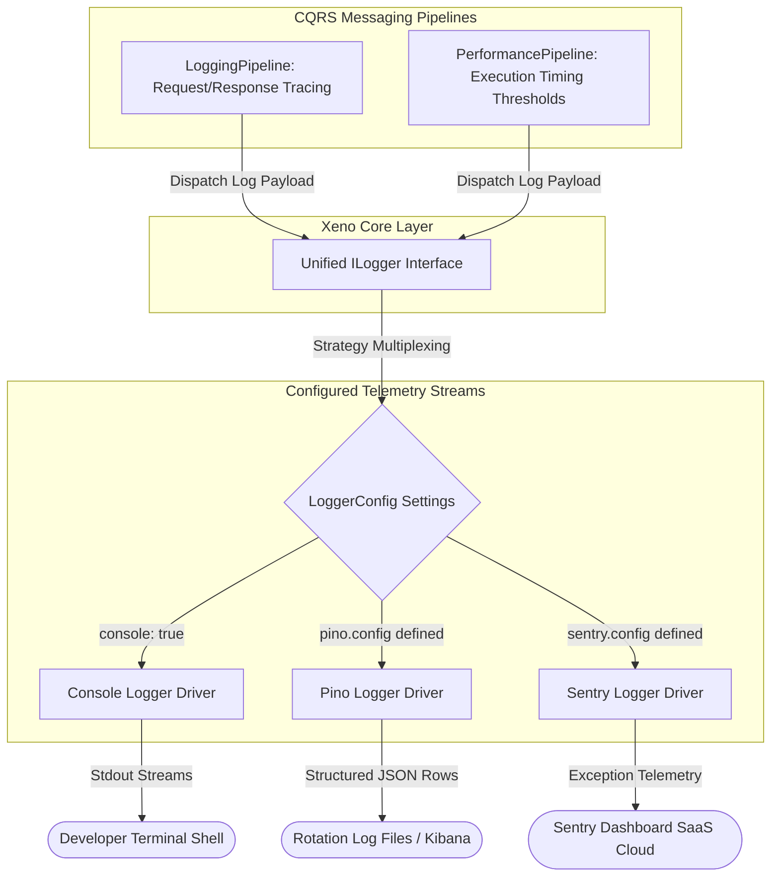

# Telemetry & Logging Layer

The Telemetry & Logging Layer page documents the application diagnostic streams,
asynchronous framework execution counters, and transport channel routing
infrastructure managed within the framework kernel.

---

## Direct Definition Block

The Telemetry & Logging Layer is the centralized observability infrastructure of
Xeno, managed globally via the `LoggerModule`. It provides an abstract `ILogger`
interface that integrates with cross-cutting middleware pipelines to route
structured diagnostics, error payloads, and execution metrics to local shells,
structured data files, or external cloud monitoring systems.

---

## The Telemetry and Observability Paradigm

### What it is

The telemetry and observability paradigm is an automated infrastructure tier
that detaches diagnostic stream collection and execution profiling loops from
application use-case logic.

### How it works

The observability engine provides a unified `ILogger` contract that routes
messaging data packets processed by the `LoggingPipeline` and
`PerformancePipeline`. It intercepts commands and queries, extracts tracing
context data, captures unhandled exceptions, and streams formatted telemetry
metrics across multiple configured physical drivers according to active log
level constraints.

### Why it exists

Hardcoding framework-specific logging commands (such as `console.log()` or
third-party monitoring SDK calls) inside handlers pollutes business rules with
infrastructure code and introduces technical debt. Fragmented diagnostic code
creates inconsistencies in log formats, obfuscates transaction tracing across
parallel execution tracks, and introduces telemetry gaps if a developer omits
manual profiling code within a newly implemented endpoint.

---

## Default Baseline Behavior

### Definition

Default Baseline Behavior represents the automated initialization of logging
services when explicit provider callback functions are omitted from the
bootstrapping sequence.

### Behavior

The framework automatically instantiates and registers the native Console Logger
driver configured to a `DEBUG` severity threshold within the
inversion-of-control container graph.

### Effect

This provides readable terminal trace outputs during local prototyping phases
and integration testing cycles without requiring external database connections,
docker configurations, or third-party node package attachments.

---

## Observability Subsystem Architecture

The diagram below traces the sequential flow of structural application logs,
performance execution timers, and use-case error payloads from the messaging
pipelines through the core interfaces to the active physical drivers:



---

## Document Directory

Navigate through the specialized telemetry and logging provider configuration
manuals sequentially:

### 1. [Configuring Console Logging](./configure-console.md)

- **What it covers:** Adjusting global verbosity parameters, toggling standard
  output tracks, and using the built-in console logging driver for localized
  developer workflows.

### 2. [Configuring Pino Structured Logging](./configure-pino.md)

- **What it covers:** Initializing high-performance JSON log streaming, setting
  up output file destination handles, and configuring clean printing utilities
  for production monitoring stacks.

### 3. [Configuring Sentry Error Tracking](./configure-sentry.md)

- **What it covers:** Wiring your remote Data Source Name (DSN) client, defining
  target environments, and capturing production errors automatically within
  cloud monitoring ecosystems.

---

## Configuration Reference: `LoggerConfig` Options

### Definition

`LoggerConfig` is the configuration layout structure used to programmatically
control severity thresholds, activate built-in drivers, and register custom
logging extensions within the `AppBuilder` layer.

### Behavior

The initialization engine maps settings using the following specific interface
parameters:

- **`level`**: Specifies the minimum severity threshold layer captured by the
  logging driver (`DEBUG` | `INFO` | `WARN` | `ERROR`). Logs beneath this filter
  are ignored to manage volume.
- **`console`**: A boolean flag used to enable or disable standard terminal
  stream outputs (`stdout`).
- **`pino`**: An optional configuration block used to initialize the
  high-performance structured Pino logging driver.
- **`sentry`**: An optional configuration block used to configure the Sentry
  tracking SDK for error collection and performance reporting.
- **`customLoggers`**: An optional collection of dependency injection tokens
  allowing developers to register custom logger implementations directly into
  the core pipelines.

### Effect

This enables centralized management of application verbosity and diagnostics
parameters, allowing the entire monitoring setup to be modified from a single
setup function callback.

---

## Practical Setup Blueprint: Multi-Logger Configuration

The following programmatic sequence registers an integrated multi-provider
tracking strategy: local terminal outputs remain enabled, the Pino adapter is
wired to generate structured JSON data rows for log routers, and the Sentry SDK
is integrated to intercept transactional errors:

```typescript
// src/bootstrap.ts
import { AppBuilder, LOG_LEVEL } from '@xeno/core'
import type { IServiceContainer } from '@xeno/core'

export async function bootstrap(): Promise<IServiceContainer> {
  const builder = new AppBuilder()

  builder
    .addContext()
    .addMiddlewares()
    .addPipeline()
    // Layer and customize multiple logging providers simultaneously
    .addLogger((opts) => {
      // 1. Set the global visibility filter to capture INFO and higher severities
      opts.level = LOG_LEVEL.INFO

      // 2. Keep standard console prints active
      opts.console = true

      // 3. Configure structured JSON log streaming via Pino
      opts.pino.config = {
        env: process.env.NODE_ENV ?? 'production',
        destination: 'stdout',
        prettyPrint: false, // Leave false in production to optimize JSON performance
      }

      // 4. Configure real-time cloud exception tracking via Sentry
      opts.sentry.config = {
        dsn: process.env.SENTRY_DSN ?? 'https://publicKey@sentry.io/projectId',
        environment: process.env.NODE_ENV ?? 'production',
      }
    })

  return await builder.build()
}
```

:::warning

## Important Alert: Bootstrap Ordering

The logger must be configured in the bootstrap sequence only after
`.addPipeline()`. If `.addLogger()` is registered before the pipeline setup, the
logger configuration can be overwritten by the default Console Logger
registration.

Correct way:

```typescript
builder
  .addContext()
  .addMiddlewares()
  .addPipeline()
  .addLogger((opts) => {
    // custom logger configuration
  })
```

:::

---

## Architectural Constraints & Trade-offs

- **Production Use of Pino `prettyPrint` Configurations Prohibited**: Activating
  `prettyPrint: true` translates JSON parameters into human-readable terminal
  blocks. While designed for local debugging comfort, string formatting
  execution loops add considerable processing overhead. In high-traffic
  environments, this configuration blocks the single-threaded Node.js event loop
  and degrades container throughput. It must be kept disabled in production
  runtimes to maintain raw JSON stream efficiency.
- **Vulnerabilities of Persistent `DEBUG` Severity Levels in Live Clusters**:
  Retaining a minimum log threshold level of `DEBUG` forces the
  `LoggingPipeline` to capture, format, and serialize every single command and
  query transactional lifecycle step. In live production environments, this
  continuous serialization inflates cloud ingestion costs, saturates physical
  disk capacity, and creates system performance degradation, necessitating that
  filters be promoted to `INFO` or `WARN`.

---

## Next Steps

Now that the telemetry configuration fundamentals and logger definitions are
established, explore how to optimize your terminal diagnostics using the native
console logging engine:

- **[Proceed to Configuring Console Logging](./configure-console.md)**
