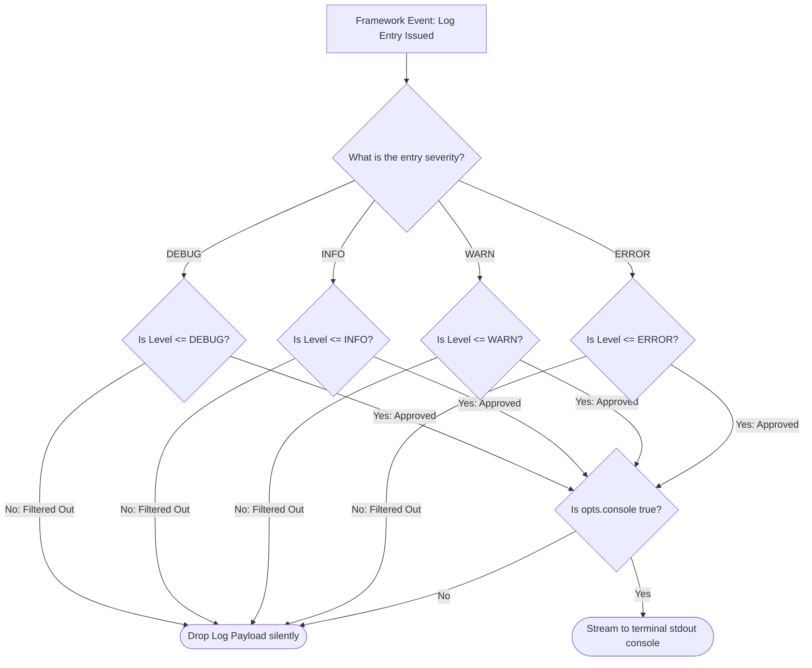

# Configuring Console Logging

The Configuring Console Logging page specifies the activation parameters,
severity filtering configurations, and runtime behavior of the native console
logging infrastructure inside the Xeno framework kernel.

---

## Direct Definition Block

The Native Console Logger is the default infrastructure diagnostic provider in
Xeno. It hooks directly into the standard output stream (`stdout`) of the active
operating system process to print framework execution paths, pipeline
transitions, and use-case error payloads directly to the command-line terminal
interface.

---

## The Terminal Observability Paradigm

### What it is

The Native Console Logger is an internal infrastructure logging driver designed
to translate application execution milestones into text-stream representations.

### How it works

The logging utility captures diagnostic payloads dispatched from the unified
`ILogger` interface, evaluates their severity properties against active log
level constraints, and streams legible text messages to the system terminal
interface.

### Why it exists

While production microservices require structured JSON files or third-party
cloud monitoring aggregators to parse distributed telemetry, local development
workflows demand immediate, human-readable feedback. The console logging
provider operates with sub-millisecond serialization overhead and requires no
cloud access tokens, external library installations, or sidecar container
environments, removing deployment prerequisites during rapid prototyping phases.

---

## Default Framework Behavior

#### Definition

Default Framework Behavior represents the automated initialization sequence that
registers logging primitives without explicit programmatic option setups.

#### Behavior

When the `.addLogger()` registration block is called inside the
`src/bootstrap.ts` file with no configuration arguments, the framework
automatically instantiates and registers the native Console Logger service
configured to a `DEBUG` severity ranking.

#### Effect

This provides software engineers with immediate, verbose visual tracing of
command and query execution paths, validation gates, and dependency tree
resolutions during the application initialization and local testing phases.

```typescript
// src/bootstrap.ts
import { AppBuilder } from '@xeno/core'
import type { IServiceContainer } from '@xeno/core'

export async function bootstrap(): Promise<IServiceContainer> {
  const builder = new AppBuilder()

  builder
    // Registers the native Console Logger automatically, enabled at DEBUG level
    .addLogger()

  return await builder.build()
}
```

---

## Explicit Console Activation & Severity Tuning

#### Definition

Explicit Console Activation & Severity Tuning represents the programmatic
configuration phase where developers adjust minimum severity ranks and
visibility properties via options callbacks.

#### Behavior

The `AppBuilder` configures log routing properties through specific interface
parameters: `opts.console` controls whether the console log client is mounted
inside the container registry, and `opts.level` enforces strict minimum severity
filtering based on explicit ranking criteria (`DEBUG < INFO < WARN < ERROR`).

#### Effect

This limits log verbosity in staging or user acceptance environments, ensuring
that low-priority tracing data is dropped silently to conserve processing
resources while allowing severe warnings and infrastructure errors to pass
through.

```typescript
// src/bootstrap.ts
import { AppBuilder, LOG_LEVEL } from '@xeno/core'
import type { IServiceContainer } from '@xeno/core'

export async function bootstrap(): Promise<IServiceContainer> {
  const builder = new AppBuilder()

  builder.addLogger((opts) => {
    // 1. Explicitly keep console output tracking alive
    opts.console = true

    // 2. Adjust log level to suppress DEBUG traces, capturing only warnings and errors
    opts.level = LOG_LEVEL.WARN
  })

  return await builder.build()
}
```

---

## Log Filtering Architecture

The diagram below highlights how the application’s global log level filter acts
as a gateway, blocking or passing diagnostic payloads dynamically before they
reach the standard output stream:



---

## Architectural Constraints & Trade-offs

- **Disabling the Console Flag in Local Workspaces Prohibited**: Configuring
  `opts.console = false` inside local development modules completely detaches
  the terminal output driver. If the framework encounters a boot failure or
  use-case initialization exception, the process terminates silently without
  routing structural stack dumps or tracking variables to the terminal shell,
  hindering local debugging tracks.
- **Incompatibility of Raw Terminal Text Streams with Log Routers**: The console
  provider outputs plain string messages optimized for human readability rather
  than programmatic serialization. In distributed production clusters (such as
  Kubernetes or AWS ECS), automated log aggregators expect structured JSON line
  patterns for pattern filtering and index creation, necessitating a transition
  to the native Pino structured logging module.

---

## Next Steps

Now that your local terminal text diagnostics are configured, learn how to scale
your observability capabilities into structured JSON streaming formats for
high-volume production cloud environments:

- **[Proceed to Configuring Pino Structured Logging](./configure-pino)**
