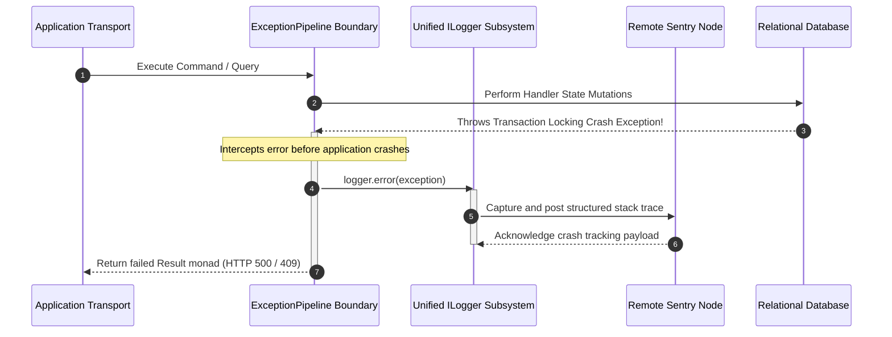

# Configuring Sentry Error Tracking

The Configuring Sentry Error Tracking page defines the initialization
parameters, exception propagation paths, and cloud telemetry integration rules
managed by the Sentry logging module.

---

## Direct Definition Block

The Sentry Exception Logger is an infrastructure-layer error tracking provider
integrated into the Xeno observability tier. Managed globally through the
programmatic `LoggerModule`, it captures application failures, unhandled
exceptions, and use-case handler rejections, automatically transmitting
formatted telemetry packets to an external centralized Sentry dashboard
workspace.

---

## The Cloud Telemetry Paradigm

### What it is

Sentry error tracking is an out-of-process exception collection infrastructure
that aggregates unhandled runtime failures across distributed application
environments.

### How it works

The logging driver monitors transaction boundaries inside the mediator ring.
When an operation rejects or encounters an uncaught code fault, the outermost
exception pipeline intercepts the exception, passes the error payload to the
unified logging subsystem, and triggers an asynchronous HTTP network
transmission to the Sentry API endpoints according to active log level
constraints.

### Why it exists

While local text files and standard raw terminal streams capture system behavior
during development, they lack automated alerting capabilities for multi-instance
cloud deployments. Centralizing error gathering behind an integrated cloud
telemetry provider removes error tracking code from use cases, allowing
engineering teams to capture contextual execution stack traces, evaluate
environment-specific stability metrics, and isolate platform incidents without
introducing manual monitoring blocks inside application handlers.

---

## Technical Exception Propagation Flow

### What it is

The technical exception propagation flow is the runtime interception sequence
executed by the cross-cutting `ExceptionPipeline` when a downstream operation
encounters an unrecoverable database fault or application exception.

### How it works

The execution infrastructure maps the error handling lifecycle across a
multi-stage boundary trace:

1. **Interception**: The `ExceptionPipeline` captures the unhandled exception
   before it triggers process termination within the active V8 loop.
2. **Telemetry Forwarding**: The pipeline passes the raw exception reference to
   the unified `ILogger` contract interface.
3. **External Posting**: The active Sentry logging client maps the error
   properties, structures the stack trace variables, and transmits the data
   packet over an encrypted network wireframe to the remote Sentry nodes.



### Why it exists

Enforcing an automated translation and transmission loop at the outermost tier
ensures that the application transport node receives a uniform failure result
payload while the diagnostic backend logs the exact code line failure and state
variables necessary for debugging.

---

## Configuration Reference: `SentryLoggerConfig` Options

### What it is

`SentryLoggerConfig` is the structural configuration layout used to
programmatically map project endpoints and environment tags for the Sentry
logging driver.

### How it works

The `AppBuilder.addLogger()` options block configures connection properties
through specific interface parameters:

- **`opts.sentry.config.dsn`**: The Data Source Name string provided by the
  Sentry dashboard that contains the protocol, public authentication keys,
  target host, and project identifier required to route data payloads.
- **`opts.sentry.config.environment`**: An optional string tag (e.g.,
  `'staging'`, `'production'`) used to categorize and filter incoming telemetry
  events inside the cloud workspace.

### Why it exists

Isolating connection specifications within distinct parameter configurations
prevents environment leakage, ensuring that application errors are directed to
the correct project bucket according to the host deployment profile.

---

## Practical Setup Blueprint

### What it is

The practical setup blueprint represents the programmatic composition sequence
where software engineers register Sentry infrastructure parameters into the
container graph using options callbacks.

### How it works

The initialization logic acts through a programmatic fluent layout inside
`src/bootstrap.ts`, binding connection properties and target log level filters
to the `LoggerModule` context maps during the container assembly phase:

```typescript
// src/bootstrap.ts
import { AppBuilder, LOG_LEVEL } from '@xeno/core'
import type { IServiceContainer } from '@xeno/core'

export async function bootstrap(): Promise<IServiceContainer> {
  const builder = new AppBuilder()

  builder
    .addContext()
    .addMiddlewares()
    .addPipeline((opts) => {
      opts.queryBus.isEnabled = true // Automatically engages corresponding telemetry middlewares
    })
    // Layer and customize multiple logging providers simultaneously
    .addLogger((opts) => {
      // 1. Capture only ERROR severity ranks to minimize cloud ingestion usage costs
      opts.level = LOG_LEVEL.ERROR
      opts.console = true // Keep local terminal prints active for container logs

      // 2. Configure the Sentry Exception Tracking Provider
      opts.sentry.config = {
        // Provide the unique cloud client connection address string
        dsn: process.env.SENTRY_DSN ?? 'https://publicKey@sentry.io/projectId',
        // Define the target tracking space environment
        environment: process.env.NODE_ENV ?? 'production',
      }
    })

  return await builder.build()
}
```

### Why it exists

Executing setup logic explicitly through a fluent builder API strips the
codebase of hidden configuration dependencies and eliminates dynamic runtime
class scanning, maintaining sub-millisecond graph compilation metrics during
process initialization.

---

## Architectural Constraints & Trade-offs

- **Vulnerabilities of Missing or Malformed DSN Keys**: Triggering the Sentry
  configuration block with an empty, null, or malformed DSN string prevents the
  underlying client factories from establishing network connections. While the
  framework includes defensive try-catch wrappers to isolate initialization
  errors without crashing the boot sequence, the codebase will run with silent
  telemetry gaps, leaving endpoints without cloud error monitoring.
- **Risk of Personally Identifiable Information (PII) Data Leakage**: Because
  core logging pipelines automatically serialize failed commands, input queries,
  and parameter metadata whenever an exception occurs, sensitive parameters can
  bleed into external history logs. Passing unencrypted plain-text user
  passwords, personal identification tokens, or financial records directly into
  command parameters risks exporting sensitive fields to external cloud servers
  during a validation failure, necessitating upstream payload sanitization
  boundaries.

---

## Next Steps

You have completed the **Xeno Telemetry & Logging Layer** architecture guide
series. Return to the main application boundaries index or explore the caching
configuration tier:

- 👉 **[Return to Telemetry & Logging Layer Index](./README)**
- 👉
  **[Proceed to Presentation Layer](../presentation-layer-response-contracts/README)**
