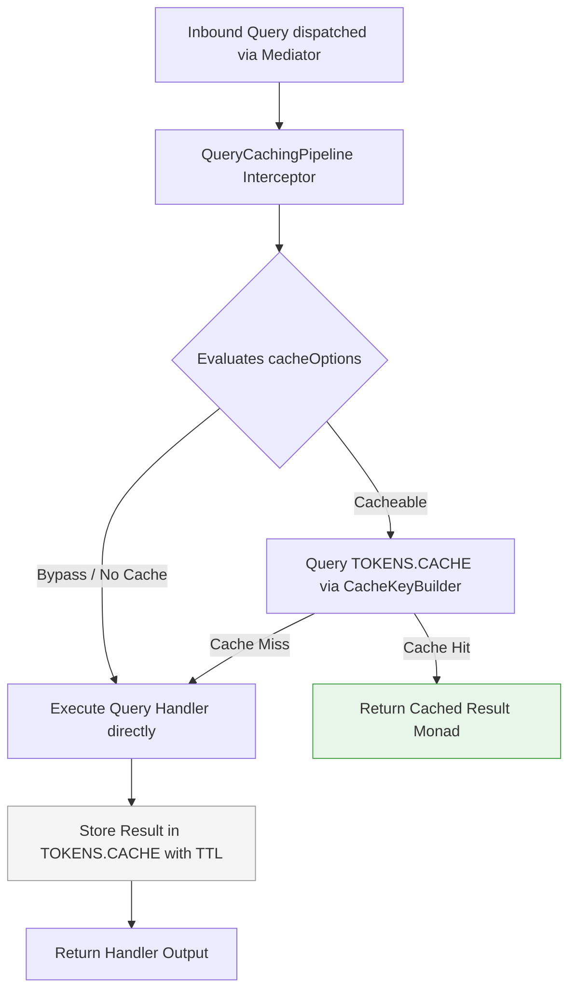

## Caching Subsystem Architecture & Storage Overview

High-throughput applications require caching strategies to minimize database
workload, decrease query latency, and manage distributed locks. Xeno provides a
unified caching subsystem backed by a standardized `ICache` interface, allowing
applications to seamlessly alternate between local process memory and
distributed out-of-process data stores.

---

## Supported Caching Engines: In-Memory and Redis

The Xeno caching subsystem supports two primary storage implementations: an
lightweight In-Memory driver for process-local caching and a Redis driver for
distributed, multi-instance environments. Both drivers implement the agnostic
`ICache` contract, ensuring application logic remains decoupled from the storage
layer.

Xeno provides two out-of-the-box cache providers:

- **In-Memory Cache (`InMemoryCache`)** — A process-local, lightweight key-value
  store. It requires no external dependencies and is ideal for single-instance
  deployments, local development, or unit testing suites where caching overhead
  must be minimal.

- **Redis Cache (`RedisCache`)** — A distributed cache provider powered by the
  `ioredis` driver. It features exponential reconnection backoff strategies,
  custom port/TLS support, and max-retry controls. It is engineered for
  horizontally scaled, multi-tenant production environments where cache state
  and idempotency locks must be shared across server instances.

---

## Configuring Caching via the AppBuilder Bootstrapper

Configuring the cache provider is handled during host assembly via the
AppBuilder interface. By populating the cache configuration parameters, the
framework's internal setup actions instantiate the targeted storage driver and
register it in the dependency container under the unified cache token.

Cache initialization is coordinated through `CacheUtils.addCache` during
application startup. When configuring the CQRS pipeline or core services,
passing either `inMemory: true` or a populated `redis` configuration dictionary
instructs the framework to bind the appropriate driver to `TOKENS.CACHE`.

### Programmatic Bootstrap Configuration Example

```typescript
// src/infrastructure/bootstrap-cache.ts
import { AppBuilder } from '@xeno/core'
import type { AppRegistry } from './xeno-registry/app-registry'

export const configureCachingHost = async () => {
  const builder = new AppBuilder<AppRegistry>()

  builder.addContext().addCache((opts, config) => {
    // Register the in memory cache
    opts.inMemory = true
  })

  return await builder.build()
}
```

When Redis is configured, specify connection credentials matching the
`CacheClientConfig` contract:

```typescript
// Example Redis Configuration Object
builder.addCache((opts, config) => {
  opts.redis.config = {
    host: config.getOrThrow('REDIS_HOST'),
    port: config.getNumber('REDIS_PORT', 6379),
    password: config.getOrThrow('REDIS_PASSWORD'),
    username: config.getOrThrow('REDIS_USERNAME'),
    tls: config.get('REDIS_TLS') === 'true',
    maxRetriesPerRequest: 3,
  }
})
```

---

## Framework Integration Across CQRS Pipelines

Xeno integrates the caching subsystem directly into its internal CQRS behavioral
pipelines. This enables cross-cutting concerns like query result caching and
distributed idempotency locking to operate automatically without dirtying
business handlers.

The framework leverages `TOKENS.CACHE` internally across two core execution
paths:

### 1. Idempotency Pipeline (`IdempotencyPipeline`)

The idempotency behavior protects command handlers from duplicate execution by
acquiring locks and storing transaction outcomes in `IdempotencyStore`. It uses
`setIfAbsent` to establish lock keys (e.g., `idempotency_lock:command:<id>`) and
retrieves cached response payloads for previously processed requests. For full
details, see the [Idempotency & Concurrency Documentation](../cqrs/overview.md).

### 2. Query Caching Pipeline (`QueryCachingPipeline`)

The query caching pipeline intercepts `IQuery` execution on the mediator bus. If
a query exposes `cacheOptions` (of type `ICacheableOptions`), the pipeline
automatically checks `TOKENS.CACHE` for existing results before invoking the
query handler. If missed, it executes the handler, stores the result under a
context-built cache key, and returns the response.



---

## Resolving and Utilizing the ICache Interface

Application services and repositories can directly resolve the `ICache`
interface from the IoC container to execute custom caching operations. The
standardized contract provides type-safe asynchronous primitives for reading,
writing, checking, and evicting cached entries.

### Key-Value Specification of ICache Primitives

- **get<T>(key)** — Resolves a cached entry by key string, returning
  `Promise<Optional<T>>`.

- **set<T>(key, value, ttlSeconds?)** — Persists an entry in the cache with an
  optional time-to-live threshold in seconds.

- **setIfAbsent<T>(key, value, ttlSeconds?)** — Atomic conditional write; sets
  the key only if it does not already exist, returning `true` if set or `false`
  if occupied.

- **has(key)** — Asynchronously returns `true` if the key exists in the storage
  provider.

- **remove(key)** — Evicts a target key from the cache store.

### Programmatic Cache Resolution Example

To use the cache inside a custom application service, resolve `TOKENS.CACHE`
from the dependency container:

```typescript
// src/application/services/catalog.service.ts
import type { ICache } from '@xeno/core'

export class CatalogService {
  constructor(private readonly _cache: ICache) {}

  public async getProductDetails(
    productId: string,
  ): Promise<Record<string, unknown>> {
    const cacheKey = `catalog:product:${productId}`

    // 1. Check cache for existing item
    const cachedProduct =
      await this._cache.get<Record<string, unknown>>(cacheKey)
    if (cachedProduct) {
      return cachedProduct
    }

    // 2. Fetch product from database if missed
    const product = { id: productId, name: 'Sample Item', price: 99.99 }

    // 3. Store result in cache with a 300-second TTL
    await this._cache.set(cacheKey, product, 300)

    return product
  }
}
```

### Registering the Custom Service with Dependency Injection

```typescript
// src/infrastructure/bootstrap-services.ts
import { AppBuilder, TOKENS } from '@xeno/core'
import { CatalogService } from '../application/services/catalog.service'
import type { AppRegistry } from './xeno-registry/app-registry'

export const registerCatalogServices = async () => {
  const builder = new AppBuilder<AppRegistry>()

  builder
    .addContext()
    .addCache((opt) => {
      opts.inMemory = true
    })
    .addServices((services) => {
      services.addScoped('CATALOG_SERVICE', (container) => {
        // Resolve the global ICache instance from IoC
        const cache = container.resolve(TOKENS.CACHE)
        return new CatalogService(cache)
      })
    })

  return await builder.build()
}
```
