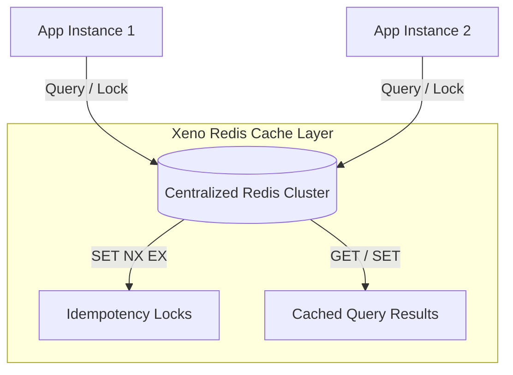

## RedisCache Driver: Distributed Caching Architecture

When scaling microservices horizontally or running multi-instance application
servers, process-local memory caches cannot share state across cluster nodes.
Xeno addresses this by providing `RedisCache`, an out-of-process, distributed
cache provider powered by the `ioredis` engine.

---

## Understanding How RedisCache Works

The `RedisCache` driver acts as a distributed implementation of the framework's
standard `ICache` interface. It translates generic caching primitives (`get`,
`set`, `setIfAbsent`, `has`, `remove`) into Redis commands, executing operations
over a centralized data store accessible by all server instances in your network
topology.

Under the hood, the driver is instantiated via `RedisCacheFactory`. It
configures an `ioredis` client with an automatic exponential reconnection
strategy to handle transient network blips and cluster failovers:

$$\text{delay} = \min(\text{times} \times 50, 2000) \text{ ms}$$

### Key Operational Characteristics

- **Distributed State Synchronization** — Cache state, query results, and
  idempotency locks are centralized, ensuring consistency across all application
  nodes.

- **Resilient Connection Handling** — Native exponential retry backoff
  recalculates connection intervals automatically when network sockets drop.

- **Atomic Locks for Idempotency** — Supports `setIfAbsent` natively (via Redis
  `SET NX EX` commands) to prevent race conditions during concurrent command
  dispatching.

- **Decoupled Architecture** — Fully satisfies `ICache`, allowing you to swap
  between `InMemoryCache` and `RedisCache` seamlessly without modifying
  application handlers.



---

## Configuring RedisCache via the AppBuilder Bootstrapper

Registering `RedisCache` is managed during host assembly using the fluent
`AppBuilder` configuration sequence. Under the hood, `CacheUtils.addCache`
evaluates the cache options. When a populated `redis` configuration block is
provided, `RedisCacheFactory` creates the underlying native Redis client and
binds `RedisCache` to `TOKENS.CACHE`.

### Programmatic Bootstrap Registration Example

```typescript
// src/infrastructure/bootstrap-redis-cache.ts
import { AppBuilder, TOKENS } from '@xeno/core'
import type { AppRegistry } from './xeno-registry/app-registry'

export const configureRedisCaching = async () => {
  const builder = new AppBuilder<AppRegistry>()

  builder.addContext().addCache((opts, config) => {
    // 1. Enable Redis
    opts.redis = {
      host: config.getOrThrow('REDIS_HOST'),
      port: config.getNumber('REDIS_PORT', 6379),
      password: config.getOrThrow('REDIS_PASSWORD'),
      username: config.getOrThrow('REDIS_USERNAME'),
      tls: config.get('REDIS_TLS') === 'true',
      maxRetriesPerRequest: 3,
    }
  })

  return await builder.build()
}
```

---

## Understanding Redis Configuration Parameters

The `CacheClientConfig` parameters dictate how `RedisCacheFactory` initializes
the native `ioredis` instance.

### Key-Value Specification of Redis Configuration Options

- **host** — The hostname or IP address of the target Redis server (defaults to
  `'localhost'` if unsupplied).

- **port** — The TCP port used to connect to the Redis server (defaults to
  `6379`).

- **username** — An optional username parameter required for Redis
  ACL-authenticated clusters.

- **password** — An optional secret password string required for authenticated
  Redis instances.

- **tls** — A boolean flag indicating whether to establish an encrypted TLS/SSL
  socket connection (defaults to `false`).

- **maxRetriesPerRequest** — The maximum number of retry attempts permitted per
  queued request before raising a driver exception (defaults to `3`).

---

## Resolving and Utilizing RedisCache

Application services, repositories, and handlers resolve `RedisCache` by
requesting `TOKENS.CACHE` from the service container. The container returns an
object implementing `ICache`, ensuring your business logic remains isolated from
Redis-specific logic.

### Key-Value Specification of Exposed Methods

- **get<T>(key)** — Resolves a cached entry from Redis by key, returning
  `Promise<Optional<T>>`. Returns `undefined` if the key is missing or expired.

- **set<T>(key, value, ttlSeconds?)** — Persists an entry in Redis with an
  optional expiration TTL in seconds.

- **setIfAbsent<T>(key, value, ttlSeconds?)** — Atomically writes the entry only
  if the key does not already exist, returning `true` if saved or `false` if
  occupied.

- **has(key)** — Asynchronously returns `true` if the key exists in Redis.

- **remove(key)** — Evicts the target key from the Redis instance.

### Programmatic Usage Example in an Application Service

```typescript
// src/application/services/session.service.ts
import type { ICache } from '@xeno/core'

export class SessionService {
  constructor(private readonly _cache: ICache) {}

  public async getSessionData(
    sessionId: string,
  ): Promise<Record<string, unknown> | null> {
    const key = `session:${sessionId}`

    // 1. Attempt to fetch session payload from distributed Redis
    const session = await this._cache.get<Record<string, unknown>>(key)
    if (session) {
      return session
    }

    return null
  }

  public async acquireSessionLock(
    sessionId: string,
    lockTtl = 30,
  ): Promise<boolean> {
    const lockKey = `lock:session:${sessionId}`

    // 2. Perform atomic conditional write (SET NX) for distributed concurrency control
    return await this._cache.setIfAbsent(lockKey, 'LOCKED', lockTtl)
  }

  public async removeSession(sessionId: string): Promise<void> {
    const key = `session:${sessionId}`
    // 3. Evict entry from Redis cluster
    await this._cache.remove(key)
  }
}
```

### Dependency Injection Registration Example

```typescript
// src/infrastructure/bootstrap-services.ts
import { AppBuilder, TOKENS } from '@xeno/core';
import { SessionService } from '../application/services/session.service';
import type { AppRegistry } from './xeno-registry/app-registry';

export const configureServices = async () => {
  const builder = new AppBuilder<AppRegistry>();

  builder
    .addContext()
    .addCache((opts, config) => {
      // 1. Enable Redis Cache
      opts.redis = {
        host: config.getOrThrow('REDIS_HOST'),
        port: config.getNumber('REDIS_PORT', 6379),
        password: config.getOrThrow('REDIS_PASSWORD'),
        username: config.getOrThrow('REDIS_USERNAME'),
        tls: config.get('REDIS_TLS') === 'true',
        maxRetriesPerRequest: 3
      };
    });
    .addServices((services) => {
      services.addScoped('SESSION_SERVICE', (container) => {
        // Resolve the global ICache instance (bound to RedisCache)
        const cache = container.resolve(TOKENS.CACHE);
        return new SessionService(cache);
      });
    });

  return await builder.build();
};

```

---

## Installing Mandatory Peer Dependencies for Redis

To use the `RedisCache` driver, you must explicitly install the `ioredis`
package in your project. Because Xeno uses an **optional peer dependency
model**, external drivers are lazy-loaded to prevent bloating application
bundles that only require in-memory caching.

Execute the following package manager command within your project workspace:

```
# Install mandatory ioredis peer dependency for Redis support
npm install ioredis

```

> **Note**: If you configure `opts.redis` inside `CacheUtils.addCache` or
> `AppBuilder` without installing `ioredis`, Node.js will throw a runtime module
> resolution exception during host initialization when attempting to import
> `ioredis`.
