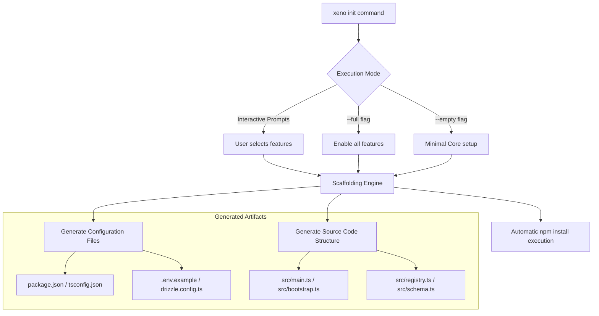

## Xeno CLI: Overview & Scaffolding Engine

`@xeno/cli` is the official command-line utility for the Xeno framework.
Executable via the `xeno` binary token, it automates project initialization,
infrastructure setup, dependency wiring, and configuration file generation for
Xeno applications.

---

## 1. Panoramica Generale (General Overview)

`@xeno/cli` acts as an interactive scaffolding engine designed to eliminate
boilerplate setup time. It guides developers through prompt-driven setups or
quick execution flags (`--full` / `--empty`) to assemble tailored application
architecture templates.

### Key Technical Attributes

- **Target Execution Runtime**: Node.js `>=20.0.0`.

- **Exposed Binary Identifier**: `xeno` (`dist/index.js`).

- **Core Dependencies**: Driven by `prompts` for interactive user selection and
  `picocolors` for terminal output formatting.

- **Extensible Engine**: Powered by an internal `ScaffoldingEngine` that
  coordinates sequential file generation tasks through modular generator
  handlers.

---

## 2. Installazione Globale (Global Installation)

To make the `xeno` command globally available across your local environment,
install the package using `npm`:

```bash
# Global installation command
npm install -g @xeno/cli

```

### Verification and System Engine Check

Ensure your Node.js version satisfies the package requirement (`>=20.0.0`):

```bash
node -v
# Output should be >= v20.0.0

xeno --version

```

---

## 3. Scopi della CLI (Core Scaffolding Capabilities)

The primary goal of `@xeno/cli` is to establish production-ready Xeno
application structures configured with strongly-typed setups out of the box.



### Core Responsibilities

1. **Modular Feature Opt-In / Opt-Out** Dynamically enables/disables integration
   packages based on project requirements:

- **Validation**: Zod schema validation.

- **Persistence Layer**: Choice between PostgreSQL (Drizzle ORM +
  `pg`/`postgres`) or SQLite (`@libsql/client`).

- **Remote HTTP Client**: Axios & Cockatiel integration.

- **Authentication**: Supabase client (`@supabase/supabase-js`).

- **Logging & Observability**: Pino JSON logger (`pino` / `pino-pretty`) and
  Sentry tracking (`@sentry/node`).

- **Distributed Caching**: Redis driver (`ioredis`).

2. **Automated Code Generation** Creates all essential project configuration
   files and application bootstrap scripts:

- **`package.json`**: Generated with matching dependency versions and database
  script aliases (`db:generate`, `db:push`, `db:migrate`).

- **`src/bootstrap.ts`**: Assembles the programmatic `AppBuilder` pipeline
  according to selected modules.

- **`src/main.ts`**: Provides the entry point for starting the application
  container.

- **`src/registry.ts`**: Prepares the type-safe `XenoRegistry` container tokens.

- **`.env.example`**: Populates environment variable keys for configured
  drivers.

3. **Automated Workspace Bootstrap** Executes `npm install` inside the created
   target directory automatically upon completing file generation.

---

## Command Usage Examples

```bash
# Interactive setup in a custom folder
xeno my-xeno-service

# Non-interactive full feature scaffold
xeno my-xeno-service --full

# Non-interactive minimal scaffold
xeno my-xeno-service --empty

```

---

## Support Us

Xeno is an MIT-licensed open source project. It can grow thanks to the support
of these awesome people. If you'd like to join them, please read more at
[support section](../support-us)
