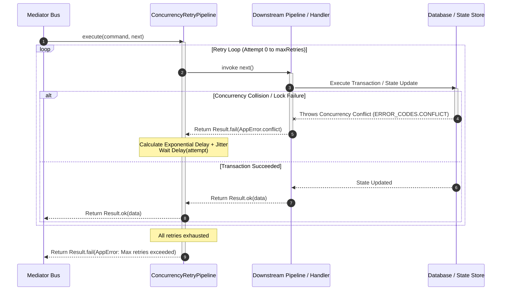

## Automated Retries & Concurrency Conflict Resolution

In high-concurrency systems, multiple execution threads or service instances
frequently attempt to update the same domain aggregate or database record
simultaneously. When optimistic locking or row-level state verification rejects
a state modification, throwing an unhandled conflict error directly to the
client degrades user experience. Xeno provides `ConcurrencyRetryPipeline`, a
command pipeline behavior that automatically catches state concurrency conflicts
and executes retry attempts using exponential backoff and randomized jitter.

---

## Understanding How Concurrency Behavior Works

The `ConcurrencyRetryPipeline` behavior wraps the execution of commands
dispatched through `IMediator` on the command bus. Positioned within the command
behavior stack, it detects transactional state collisions (such as database
optimistic concurrency lock exceptions or `ERROR_CODES.CONFLICT` failures) and
re-executes the command pipeline up to a configured retry limit.

When a command enters `ConcurrencyRetryPipeline`, the behavior executes the
target operation within an internal retry loop. If a downstream pipeline
behavior or business handler encounters a concurrency conflict,
`ConcurrencyRetryPipeline` intercepts the failure, calculates a randomized
delay, pauses execution, and retries the entire downstream command behavior
chain.

### Exponential Backoff with Jitter Formula

To mitigate the **Thundering Herd problem**—where multiple concurrent client
retries repeatedly collide by attempting execution at identical time
intervals—the pipeline applies exponential backoff combined with randomized
jitter:

$$\text{Delay}_{\text{attempt}} = \text{baseDelayMs} \times 2^{\text{attempt}} + \text{randomJitter}$$

Where:

- $\text{baseDelayMs}$ is the minimum baseline delay (defaults to `20` ms).

- $\text{attempt}$ is the zero-based current retry attempt counter.

- $\text{randomJitter}$ is an integer uniformly distributed between `0` and
  $\text{maxJitterMs}$ (defaults to `30` ms).



### Key Operational Characteristics

- **Automatic Collision Recovery** — Transparently resolves transient state
  conflicts without requiring manual retry logic inside application services or
  controllers.

- **Thundering Herd Mitigation** — Randomizes retry backoff timing across
  competing worker processes to stagger re-execution attempts.

- **Command Bus Specificity** — Applies exclusively to state-modifying
  operations ([`ICommand`](../fundamentals/command-query)), keeping read-only
  queries free from unnecessary retry loops.

---

## Configuring Concurrency Behavior via AppBuilder

Concurrency retry behavior is registered during host bootstrapping by populating
`options.commandBus.concurrency` inside `.addPipeline()` on
[`AppBuilder`](../fundamentals/app-builder). Under the hood,
`PipelineUtils.addCommand` instantiates `ConcurrencyRetryPipeline` and registers
it under `TOKENS.CONCURRENCY_RETRY_PIPELINE`.

### Programmatic Bootstrap Configuration Example

```typescript
// src/infrastructure/bootstrap-cqrs.ts
import { AppBuilder } from '@xeno/core'
import type { AppRegistry } from './infrastructure/app-registry'

export const bootstrap = async () => {
  const builder = new AppBuilder<AppRegistry>()

  builder.addContext().addPipeline((options) => {
    // Enable automated concurrency retries on the Command Bus
    options.commandBus.concurrency = {
      maxRetries: 5, // Maximum retry attempts before returning a failure
      delayConfig: {
        baseDelayMs: 25, // Initial exponential base delay in milliseconds
        maxJitterMs: 50, // Maximum randomized jitter offset in milliseconds
      },
    }
  })

  return await builder.build()
}
```

---

## Understanding Concurrency Configuration Defaults

If `options.commandBus.concurrency` is configured as an empty object (`{}`), the
framework applies standard defaults from `DEFAULT_CONCURRENCY`.

### Key-Value Specification of Concurrency Parameters

- **`maxRetries`** — An integer dictating the maximum number of retry attempts
  permitted after the initial execution failure (defaults to
  `DEFAULT_CONCURRENCY.MAX_RETRIES` = `3`).

- **`delayConfig.baseDelayMs`** — The baseline delay in milliseconds used as the
  multiplier for exponential expansion (defaults to
  `DEFAULT_CONCURRENCY.BASE_DELAY` = `20` ms).

- **`delayConfig.maxJitterMs`** — The maximum random millisecond offset added to
  each backoff cycle (defaults to `DEFAULT_CONCURRENCY.MAX_JITTER` = `30` ms).

---

## Handling Exceeded Retries & API Error Response

If a command repeatedly encounters concurrency collisions and exhausts all
allowed retry attempts (`attempt > maxRetries`), `ConcurrencyRetryPipeline`
stops retrying and returns a functional error monad.

### Returned AppError Envelope

The resulting failure is wrapped in an
[`AppError`](../fundamentals/result-app-error) containing the `CONFLICT` error
code:

- **Error Code**: `ERROR_CODES.CONFLICT` (`'CONFLICT'`).

- **HTTP Status**: `STATUS_CODES.CONFLICT` (`409`).

- **Message**:
  `[Concurrency Error]: Maximum retry attempts exceeded due to persistent concurrency conflicts.`.

When processed by a controller extending
[`BaseController`](../fundamentals/base-controller), the failure renders as a
standardized 409 API response envelope:

```json
{
  "success": false,
  "error": {
    "code": "CONFLICT",
    "message": "errors.conflict",
    "details": "[Concurrency Error]: Maximum retry attempts exceeded due to persistent concurrency conflicts.",
    "path": "/api/v1/orders/ord_123/checkout"
  },
  "correlationId": "4c918f3b-2a10-4e2b-b890-1e2a3b4c5d6e",
  "requestId": "5e6f1a2b-3c4d-7a8b-9c0d-1e2f3a4b5c6d",
  "spanId": "4c918f3b-2a10-4e2b-b890-1e2a3b4c5d6e",
  "timestamp": "2026-07-27T18:00:00.000Z"
}
```

---

## Support Us

Xeno is an MIT-licensed open source project. It can grow thanks to the support
of these awesome people. If you'd like to join them, please read more at
[support section](../support-us)
