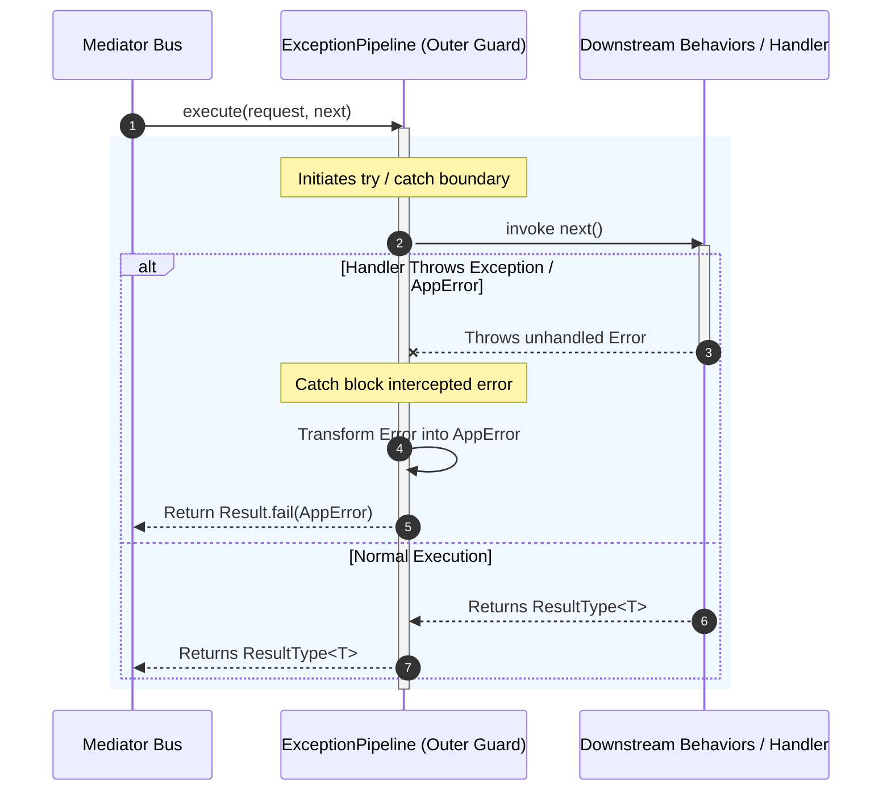

## Global Error Management with Exception Behavior

In a robust CQRS architecture, unexpected execution exceptions must be
intercepted at the outer framework boundary to prevent process crashes,
unhandled promise rejections, and raw error leaks. Xeno provides the
`ExceptionPipeline` behavior as the outermost guard rail of the mediator
pipeline, ensuring all runtime exceptions are safely caught and transformed into
functional failure monads (`Result.fail`).

---

## Understanding How Exception Behavior Works

The `ExceptionPipeline` acts as the first behavior executed in the CQRS pipeline
chain and the last behavior processed when returning an execution result. It
wraps downstream behaviors and handler execution in a safety boundary,
intercepting any thrown exceptions and standardizing them into functional
[`AppError`](../fundamentals/result-app-error) structures.

When a message is dispatched via the mediator, `ExceptionPipeline` executes a
`try/catch` block around the invocation of `next()`. If a downstream pipeline
behavior or business handler throws an exception (whether a standard JS `Error`,
a domain `AppError`, or an unexpected runtime exception), `ExceptionPipeline`
intercepts the error and returns a failed functional result monad
(`Result.fail(AppError)`) instead of allowing the error to propagate up the call
stack.



### Key Operational Characteristics

- **Outermost Safety Barrier** — Positioned at the very top of both command and
  query pipeline behavior arrays (`commandPipelines` and `queryPipelines`),
  shielding all subsequent pipeline operations.

- **Monadic Standardization** — Guarantees that mediator methods (`send` and
  `query`) always resolve to a
  [`ResultType<T>`](../fundamentals/result-app-error) monad and never throw
  unhandled promise rejections.

- **Exception Normalization** — Converts raw JavaScript exceptions into
  strongly-typed `AppError` instances, retaining error names, cause chains, and
  contextual intent metadata.

---

## Registering Exception Behavior in the Bootstrap Cycle

The `ExceptionPipeline` is registered automatically as a core framework behavior
during application startup when calling `.addPipeline()` on
[`AppBuilder`](../fundamentals/app-builder).

During module assembly, `CqrsModule` registers `ExceptionPipeline` under
`TOKENS.EXCEPTION_PIPELINE` as a singleton inside the dependency injection
container. It automatically prepends this behavior token to both
`COMMAND_PIPELINES_BEHAVIOR` and `QUERY_PIPELINES_BEHAVIOR`.

### Programmatic Bootstrap Configuration Example

```typescript
// src/infrastructure/bootstrap-cqrs.ts
import { AppBuilder } from '@xeno/core'
import type { AppRegistry } from './infrastructure/app-registry'

export const bootstrap = async () => {
  const builder = new AppBuilder<AppRegistry>()

  builder
    .addContext()
    .addMiddleware()
    // Calling .addPipeline() automatically registers EXCEPTION_PIPELINE at position 0
    .addPipeline(
      // Configure additional optional behaviors as needed
    )

  return await builder.build()
}
```

---

## Error Access and Processing in Application Code

Because `ExceptionPipeline` wraps errors inside the `Result` monad, application
code (such as HTTP controllers) handles failures through explicit, functional
checks rather than `try/catch` blocks.

### Accessing Errors from Mediator Execution

When invoking commands or queries via the mediator, callers evaluate the
returned [`ResultType<T>`](../fundamentals/result-app-error):

```typescript
// Example inside a custom application service or workflow
const result = await mediator.send(command, signal)

if (!result.isOk()) {
  // Extract the standardized AppError instance
  const error: AppError = result.getErrorOrThrow()

  console.log(`Operation failed with code: ${error.code}`)
  console.log(`HTTP Status: ${error.status}`)
  console.log(`Error Message: ${error.message}`)
  console.log(`Inner Cause:`, error.cause)
}
```

### Key-Value Specification of AppError Properties

When an exception is transformed into an `AppError`, the object exposes the
following properties:

- **code** — Machine-readable error string (e.g., `ERROR_CODES.SYSTEM_ERROR`,
  `ERROR_CODES.VALIDATION_FAILED`).

- **message** — Human-readable description or localized translation key
  describing the failure.

- **status** — Canonical HTTP status integer corresponding to the failure type
  (e.g., `500`, `400`, `404`).

- **name** — Originating component or strategy name where the failure was
  caught.

- **cause** — The underlying original error or exception instance preserved for
  debugging.

---

## Mapping Errors to Standardized API Responses

When a command or query fails, controllers extending
[`BaseController`](../fundamentals/base-controller) map the returned `AppError`
monad directly into an HTTP response envelope using `this.fail(error)`.

Under the hood, `BaseController.fail()` delegates response construction to
`HttpHelper.error()`, enriching the payload with active request context metadata
(such as `correlationId`, `requestId`, `spanId`, and request `path`) extracted
from [`AsyncLocalStorage`](../fundamentals/node-request-context).

### Controller Error Handling Pattern

```typescript
// src/presentation/controllers/user.controller.ts
import { BaseController, type ResponseDto } from '@xeno/core'
import type { DeleteUserCommand } from '../commands/delete-user.command'

export class UserController extends BaseController<DeleteUserCommand, void> {
  public async handle(command: DeleteUserCommand): Promise<ResponseDto<void>> {
    // 1. Dispatch command through mediator bus
    const result = await this._send(command)

    // 2. Evaluate functional result monad
    if (!result.isOk()) {
      // Automatically maps AppError + context metadata to standardized ErrorResponseDto
      return this.fail(result.getErrorOrThrow())
    }

    return this.ok(undefined, 204)
  }
}
```

### Structure of the Rendered API Error Payload

When `this.fail(error)` is executed, the API client receives a structured JSON
payload formatted according to `ErrorResponseDto` alongside matching HTTP
response headers:

```json
{
  "success": false,
  "error": {
    "code": "SYSTEM_ERROR",
    "message": "errors.system_error",
    "details": "An unexpected error occurred during operation processing.",
    "path": "/api/v1/users/usr_123"
  },
  "correlationId": "550e8400-e29b-41d4-a716-446655440000",
  "requestId": "9b1deb4d-3b7d-4bad-9bdd-2b0d7b3dcb6d",
  "spanId": "550e8400-e29b-41d4-a716-446655440000",
  "timestamp": "2026-07-27T09:41:00.000Z"
}
```

### Accompanying HTTP Response Headers

Alongside the JSON body, `HttpHelper.error()` populates standardized network
headers for distributed tracing and cache control:

- `Content-Type`: `application/json` (or active format indicator)

- `X-Correlation-Id`: Matching context correlation GUID

- `X-Request-Id`: Matching request execution GUID

- `Cache-Control`: `no-store, no-cache, must-revalidate, proxy-revalidate`

---

## Support Us

Xeno is an MIT-licensed open source project. It can grow thanks to the support
of these awesome people. If you'd like to join them, please read more at
[support section](../support-us)
