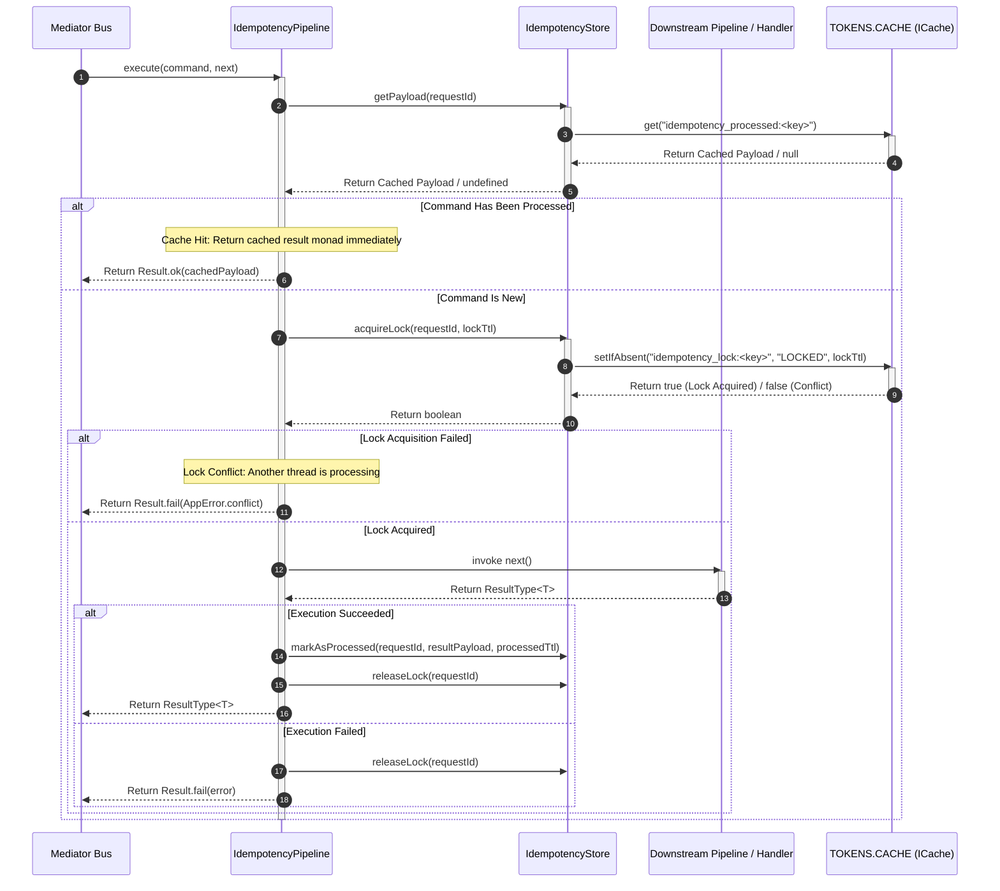

---
title:
  'Idempotency Behavior: Duplicate Execution Protection & Distributed Locks'
description:
  'Technical specification for the IdempotencyPipeline behavior in Xeno,
  detailing duplicate command protection, execution locking, cache store
  integration, and multi-tenant key isolation.'
keywords:
  [
    'IdempotencyPipeline',
    'IdempotencyStore',
    'Distributed Lock',
    'Command Idempotency',
    'AppBuilder Pipeline',
    'Multi-Tenancy Key Isolation',
    'Xeno',
  ]
author: 'Xeno'
---

## Duplicate Execution Protection with Idempotency Behavior

In distributed environments and network-sensitive architectures, clients or API
gateways often retry HTTP requests due to transient network timeouts, client
disconnects, or retry policies. Processing a state-modifying Command multiple
times can cause critical data anomalies—such as duplicate billing, duplicate
order creation, or corrupted record states. Xeno resolves this by providing
`IdempotencyPipeline`, a built-in CQRS command pipeline behavior that enforces
transactional idempotency using lock primitives and cached response payloads.

---

## Understanding How Idempotency Behavior Works

The `IdempotencyPipeline` behavior intercepts every `ICommand` dispatched
through the mediator bus when idempotency is enabled. It ensures that commands
sharing the same unique request identifier are executed **exactly once** within
a configured TTL window.

When an inbound command enters `IdempotencyPipeline`, the behavior extracts the
request's unique identifier (`requestId`) from `NetworkContext`. It then
executes the following transactional lifecycle:

1. **Processed Payload Check**: Queries `IdempotencyStore` to check if the
   command has already completed (`hasBeenProcessed`). If a cached payload
   exists, `IdempotencyPipeline` short-circuits execution and immediately
   returns the previously cached `ResultType<T>` payload without invoking the
   command handler.

2. **Lock Acquisition**: If the command has not been processed,
   `IdempotencyPipeline` attempts to acquire an in-flight execution lock
   (`acquireLock` using `setIfAbsent`). If lock acquisition fails (indicating
   another request thread is currently processing the exact same command), the
   behavior aborts and returns an error monad indicating an active concurrent
   operation in progress.

3. **Handler Execution**: With the lock held, control passes to downstream
   pipeline behaviors and the target business command handler via `next()`.

4. **Completion & Result Persistence**: Upon successful execution,
   `IdempotencyPipeline` saves the output result in `IdempotencyStore`
   (`markAsProcessed`) with a configured TTL (defaults to 24 hours), then
   releases the in-flight lock (`releaseLock`).

5. **Failure Rollback**: If downstream execution throws an exception or returns
   a failure, the pipeline releases the execution lock without caching a
   processed payload, allowing subsequent retry attempts.



---

## Configuring Idempotency via AppBuilder

Idempotency behavior is enabled during application bootstrapping by populating
`options.commandBus.idempotency` inside `.addPipeline()` on `AppBuilder`.

```typescript
// src/infrastructure/bootstrap-cqrs.ts
import { AppBuilder } from '@xeno/core'
import type { AppRegistry } from './xeno-registry/app-registry'

export const bootstrap = async () => {
  const builder = new AppBuilder<AppRegistry>()

  builder.addContext().addPipeline((options) => {
    // Configure Idempotency locks and processing TTLs on the Command Bus
    options.commandBus.idempotency = {
      lockTtlSeconds: 60, // In-flight execution lock TTL (defaults to 60s)
      processedTtlSeconds: 86400, // Processed response cache TTL (defaults to 24 hours)
    }
  })

  return await builder.build()
}
```

### Key-Value Specification of Configuration Attributes

- **`lockTtlSeconds`** — An integer setting the maximum time-to-live in seconds
  for an active in-flight execution lock (defaults to `60` seconds). If a node
  crashes while holding a lock, the lock automatically expires after this window
  to prevent permanent resource blocking.

- **`processedTtlSeconds`** — An integer setting the time-to-live in seconds for
  storing the completed command result payload (defaults to `86400` seconds / 24
  hours). Subsequent requests matching the same request ID within this window
  receive the cached result.

---

## Under the Hood: Cache Engine & Default Fallbacks

`IdempotencyPipeline` relies on `IdempotencyStore`, which wraps the generic
`ICache` abstraction bound to `TOKENS.CACHE`.

### Automatic InMemoryCache Initialization

When idempotency is configured via `options.commandBus.idempotency` and no
explicit cache driver has been registered, `CqrsModule` automatically imports
and initializes `InMemoryCache` as a default singleton provider under
`TOKENS.CACHE`. This guarantees that local development and single-instance
deployments work out of the box without requiring external database services.

### Scaling to Distributed Environments

For horizontally scaled, multi-instance microservices where requests may be
routed to different container nodes, local process memory cannot share lock
state. In production environments, developers should register **RedisCache** to
distribute idempotency locks and payloads across a shared Redis cluster.

> **Refer to Caching Architecture**: For full details on configuring distributed
> Redis caching, connection parameters, and driver setup, consult the
> [Caching Subsystem Overview](../cache/overview.md).

---

## Multi-Tenant vs. Single-Tenant Key Isolation

To support enterprise SaaS applications and multi-tenant architectures,
`IdempotencyStore` delegates key creation to `CacheKeyBuilder`.
`CacheKeyBuilder` evaluates the active `UserContext` and `Identity` attached to
`AsyncLocalStorage` to construct context-aware storage keys.

### Key Resolution Mechanics

`CacheKeyBuilder` builds storage keys using the AWS SaaS Factory pattern for
logical data partitioning:

```
[Lock Key Prefix] + [Contextual Prefix] + [Command Request Key]

```

Where:

- Lock prefix = `idempotency_lock:`

- Processed payload prefix = `idempotency_processed:`

### 1. Multi-Tenant Execution (Tenant Isolation)

When an authenticated request contains an active `tenantId` in `UserContext`,
`CacheKeyBuilder` injects the tenant identifier directly into the key namespace:

$$\text{Key} = \text{\texttt{idempotency\_lock:tenant:tenant\_12345:command:req\_998877}}$$

- **Security Benefit**: Prevents cross-tenant key collision. If two different
  tenants generate an identical UUID or request identifier, their idempotency
  locks and stored payloads remain strictly isolated within their respective
  tenant namespaces.

### 2. Single-Tenant / Guest Execution

When processing requests outside a multi-tenant boundary (such as system
commands, guest endpoints, or single-tenant applications), `tenantId` is absent.
`CacheKeyBuilder` falls back to a root-level contextual key namespace:

$$\text{Key} = \text{\texttt{idempotency\_lock:command:req\_998877}}$$
