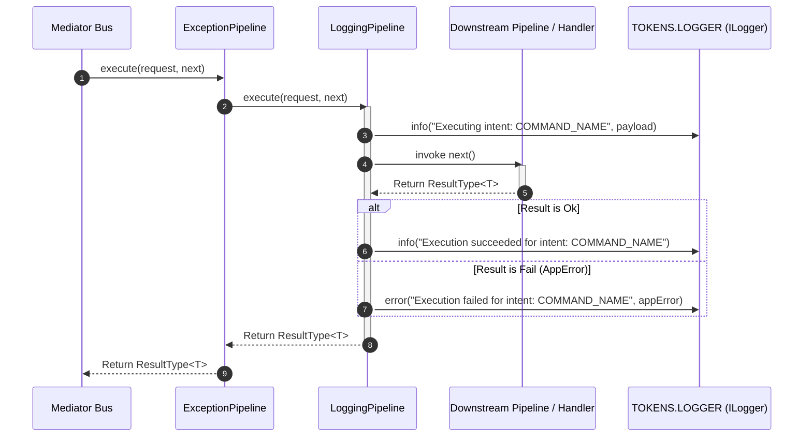

## Audit Trails & Operational Telemetry with Logging Behavior

In event-driven and CQRS architectures, tracking inbound message execution and
capturing operational telemetry are critical for debugging, auditing, and
observability. Xeno provides the `LoggingPipeline` behavior as an automatic
cross-cutting concern that records every command and query transaction
dispatched through the mediator bus.

---

## Understanding How Logging Behavior Works

The `LoggingPipeline` behavior intercepts every
[`ICommand` and `IQuery`](../fundamentals/command-query.md) message dispatched
via `IMediator`. Positioned immediately behind `ExceptionPipeline` in the
pipeline stack, it provides complete execution auditing across success and
failure outcomes.

When a message enters `LoggingPipeline`, the behavior reads the request's unique
`intent` string and resolves the global composite logger (`TOKENS.LOGGER`). It
emits an entry log prior to invoking downstream pipeline behaviors or business
handlers. Once the execution thread returns, `LoggingPipeline` inspects the
functional [`ResultType<T>`](../fundamentals/result-app-error.md) monad and
records either a success outcome or detailed failure properties (such as
`AppError` error codes and status values).



### Key Operational Characteristics

- **Automatic Intent Auditing** — Records the start and end of every mediator
  operation using the message's explicit `intent` identifier.

- **Result-Aware Logging** — Evaluates monadic `Result` objects directly,
  emitting `info` entries for successful transactions and `error` or `warn`
  entries for functional failures.

- **Context Preservation** — Automatically inherits request-scoped metadata
  (`correlationId`, `requestId`, `tenantId`, `userId`) attached to
  `AsyncLocalStorage` by `RequestContextMiddleware`.

---

## Default Logger Fallback & Custom Setup via AppBuilder

Calling `.addPipeline()` on `AppBuilder` automatically registers the
`LoggingPipeline` behavior into both command and query behavior execution
stacks. To ensure logging is available out of the box without requiring manual
setup, Xeno includes an automatic fallback mechanism.

### Default ConsoleLogger Fallback

If you enable the CQRS pipeline using `.addPipeline()` without explicitly
configuring a logger, the framework automatically imports and registers
[`ConsoleLogger`](../loggers/overview.md) as a default singleton under
`TOKENS.LOGGER`. This enables immediate stdout logging during local development
and prototyping without throwing missing-dependency errors.

### Configuring Custom Loggers

When building production applications that require structured JSON logs,
sensitive data redaction, or remote exception tracking, developers should
explicitly call `.addLogger()` on `AppBuilder` during host initialization.
Calling `.addLogger()` replaces or enriches the default logger stack with
drivers such as **PinoLogger**, **SentryLogger**, or bespoke custom logging
drivers.

> **Refer to Detailed Documentation**: For full architectural details on
> configuring specific logging drivers see the dedicated
> [Loggers Architecture & Overview Manual](../loggers/overview.md).

---

## Programmatic Bootstrap Configuration Example

The following code illustrates how to enable CQRS pipeline logging, overriding
the default `ConsoleLogger` fallback with a custom logger configuration:

```typescript
// src/infrastructure/bootstrap-cqrs.ts
import { AppBuilder, LOG_LEVEL } from '@xeno/core';
import type { AppRegistry } from './xeno-registry/app-registry';

export const bootstrap = async () => {
  const builder = new AppBuilder<AppRegistry>();

  builder
    // 1. Establish request-scoped AsyncLocalStorage context
    .addContext()

    // 2. Configure a specific logging setup (overrides standard ConsoleLogger default)
    .addLogger((options, config) => {
      options.level = LOG_LEVEL.INFO;
      options.console = true; // Enables standard console output

      // Configure Pino for structured production logs
      options.pino.config = {
        env: configuration.get('NODE_ENV', 'development'),
        destination: configuration.get('LOG_DESTINATION', 'stdout')
        filePath: configuration.get('LOG_FILE_PATH', 'logs/app.log'),
        prettyPrint: configuration.get('LOG_PRETTY_PRINT') === 'true',
      }
    })

    // 3. Register CQRS pipeline behaviors (automatically mounts LoggingPipeline)
    .addPipeline();

  return await builder.build();
};

```

---

## Captured Telemetry Payload Structure

When `LoggingPipeline` executes, it formats log entries using the active
`ILogger` implementation resolved from `TOKENS.LOGGER`. Log outputs contain
standard telemetry attributes:

### Telemetry Attributes Specification

- **Intent Token** — The exact string token identifying the executing command or
  query (e.g., `'CREATE_USER_COMMAND'`).

- **Execution Stage** — Logs both the initiation step
  (`"Executing command/query: <intent>"`) and completion status
  (`"Command/Query executed successfully: <intent>"`).

- **Error Context** — On handler failure, captures the full `AppError` payload,
  including error codes (e.g., `VALIDATION_FAILED`), status codes, and inner
  cause exceptions.

- **Request Correlation** — Extracted automatically from `RequestContext`,
  linking log statements across middleware, pipeline behaviors, and database
  repositories.
