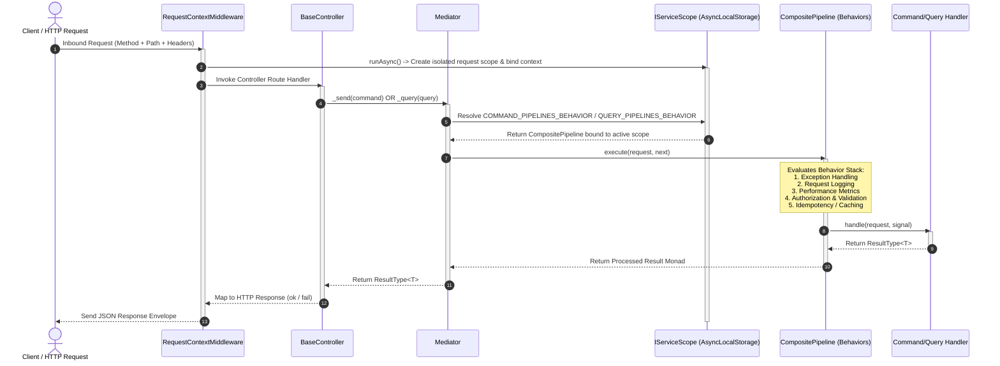

## Command-Query Responsibility Segregation (CQRS) Architecture Overview

Command-Query Responsibility Segregation (CQRS) in Xeno separates
state-modifying operations (Commands) from read-only data operations (Queries).
Rather than calling business logic directly from HTTP controllers, all
operations are dispatched as strongly-typed messages through a central mediator
bus. This architecture enforces cross-cutting concerns—such as security,
validation, logging, and error handling—transparently through a pipeline of
behaviors before reaching the handler.

---

## The End-to-End CQRS Execution Flow

The CQRS request processing lifecycle in Xeno spans transport middleware,
controller invocation, scope-isolated mediator resolution, pipeline behavior
chains, and final handler execution.



### 1. Transport Middleware & Scope Initialization

When an inbound request hits the server,
[`RequestContextMiddleware`](../fundamentals/middleware) intercepts the payload.
It extracts tracing metadata and authorization headers, then invokes
`NodeRequestContext.runAsync()`. This creates a new request-scoped IoC container
instance (`IServiceScope`) and binds both the scope and the active
[`RequestContext`](../fundamentals/node-request-context) (containing identity,
network, and tracing metrics) to Node.js `AsyncLocalStorage`.

### 2. Controller Dispatch

The route handler inside a controller (extending
[`BaseController`](../fundamentals/base-controller)) receives the request.
Instead of instantiating business services directly, the controller constructs a
typed command or query message and calls its protected helper methods:
`this._send(command)` or `this._query(query)`. These helpers delegate execution
directly to `IMediator.send()` or `IMediator.query()`.

### 3. Mediator & Scope-Isolated Behavioral Resolution

When [`Mediator`](../fundamentals/command-query) receives a message, it accesses
`SERVICE_SCOPE_ACCESSOR` to resolve the current active request scope from
`AsyncLocalStorage`. It resolves `COMMAND_PIPELINES_BEHAVIOR` (for commands) or
`QUERY_PIPELINES_BEHAVIOR` (for queries) from the container scope. Because
resolution happens within the request-scoped boundary, dependencies injected
into handlers or behaviors retain strict context isolation.

### 4. Composite Pipeline Execution Chain

The resolved pipeline behavior is a `CompositePipeline` that wraps all
registered `IPipelineBehavior` instances in a sequential chain. The pipeline
executes behaviors in order, passing control to downstream behaviors via a
`next()` callback delegate.

### 5. Target Handler Processing

If all pipeline behaviors pass (e.g., authorization is verified, input schemas
are valid, cache checks are evaluated), the target handler is invoked with the
message payload and an `AbortSignal`. The handler executes core business logic
and returns a functional [`ResultType<T>`](../fundamentals/result-app-error)
monad back up the behavior stack to the controller.

---

## Minimal Pipeline Configuration via AppBuilder

Configuring the CQRS messaging pipeline is handled during application host
bootstrapping using the fluent `.addPipeline()` setup method. Calling
`.addPipeline()` without parameters mounts the core default behaviors required
for standard framework operation.

```typescript
// src/infrastructure/bootstrap-cqrs.ts
import { AppBuilder } from '@xeno/core'
import type { AppRegistry } from './infrastructure/app-registry'

export const bootstrap = async () => {
  const builder = new AppBuilder<AppRegistry>()

  builder
    // 1. Mandatory: Initialize AsyncLocalStorage request context tracking
    .addContext()

    // 2. Mandatory: Initialize Middleware
    .addMiddleware()

    // 3. Register baseline CQRS pipeline behaviors with default options
    .addPipeline()

  return await builder.build()
}
```

### Out-of-the-Box Baseline Behaviors

Calling `.addPipeline()` with empty or default parameters automatically
registers three core behaviors into both the command and query behavior chains:

- **Exception Pipeline (`EXCEPTION_PIPELINE`)** — A global safety behavior that
  catches unhandled exceptions thrown during pipeline or handler execution. It
  converts runtime errors into standardized, machine-readable `AppError` result
  monads.

- **Logging Pipeline (`LOGGING_PIPELINE`)** — An auditing behavior that records
  incoming message intents, execution entry logs, and success/failure outcomes
  using `TOKENS.LOGGER`.

- **Performance Pipeline (`PERFORMANCE_PIPELINE`)** — A telemetry behavior that
  measures execution duration for every command and query handler. If execution
  time exceeds the configured threshold (defaults to 500ms), it emits latency
  warning logs.

---

## Overview of Configurable Pipeline Behaviors

Xeno includes an array of built-in pipeline behaviors that can be conditionally
enabled within the `.addPipeline()` setup action. Each behavior addresses a
specific cross-cutting concern without altering domain handlers.

| Behavior Name                                                  | Target Bus      | Description                                                                                                             |
| -------------------------------------------------------------- | --------------- | ----------------------------------------------------------------------------------------------------------------------- |
| [**Exception Pipeline**](./exception-pipeline)                 | Command & Query | Catches unexpected exceptions and formats them into functional `AppError` failure results.                              |
|                                                                |
| [**Logging Pipeline**](./logging-pipeline)                     | Command & Query | Captures message intent name, start timestamps, payload contents, and execution completion results.                     |
|                                                                |
| [**Performance Pipeline**](./performance-pipeline)             | Command & Query | Monitors handler execution latency and flags slow-running operations exceeding threshold limits.                        |
|                                                                |
| [**Authorization Behavior**](../security/authorization)        | Command & Query | Enforces user existence, multi-tenant isolation, role checks, and permission requirements via intent policies.          |
|                                                                |
| [**Validation Behavior**](./validatio-pipeline)                | Command & Query | Validates message payloads against registered validation schemas (such as Zod) before handler execution.                |
|                                                                |
| [**Idempotency Pipeline**](./idempotency-pipeline)             | Command Bus     | Prevents duplicate command execution by acquiring distributed locks and caching transaction outputs.                    |
|                                                                |
| [**Concurrency Retry Pipeline**](./concurrency-retry-pipeline) | Command Bus     | Automatically retries commands encountering state concurrency conflicts using exponential backoff and jitter.           |
|                                                                |
| [**Query Caching Pipeline**](./query-caching-pipeline)         | Query Bus       | Automatically checks `ICache` for pre-calculated query results using context-aware cache keys before handler execution. |
|                                                                |

_Detailed setup configurations, option schemas, and code implementations for
each individual behavior are covered in dedicated sub-manuals within this
section._

---

## Support Us

Xeno is an MIT-licensed open source project. It can grow thanks to the support
of these awesome people. If you'd like to join them, please read more at
[support section](../support-us)
