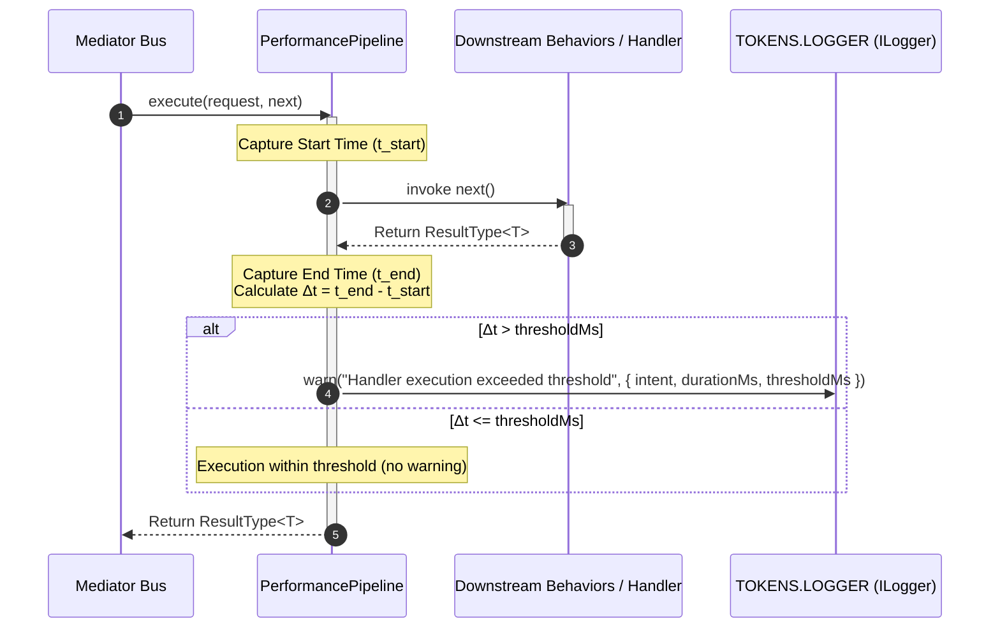

## Latency Tracking & Bottleneck Detection with Performance Behavior

Monitoring execution latency across Command and Query handlers is essential for
identifying performance degradation, unoptimized database queries, and slow
downstream service dependencies before they impact end users. Xeno provides the
`PerformancePipeline` behavior as a built-in cross-cutting behavior that
measures message processing duration and automatically flags slow-running
operations.

---

## Understanding How Performance Behavior Works

The `PerformancePipeline` behavior wraps execution loops for commands and
queries dispatched through the mediator bus. Positioned within the mediator
pipeline behavior stack, it captures high-resolution timestamps before and after
invoking `next()`.

When a message passes through `PerformancePipeline`, the behavior starts a timer
and delegates execution to downstream pipeline behaviors and business handlers.
Upon completion, it calculates the total elapsed time in milliseconds:

$$\Delta t = t_{\text{end}} - t_{\text{start}}$$

If $\Delta t$ exceeds the configured execution threshold (`thresholdMs`),
`PerformancePipeline` logs a performance warning via `TOKENS.LOGGER`, providing
intent details and timing metrics.



### Key Operational Characteristics

- **Non-Blocking Telemetry** — Measures execution duration in memory without
  adding asynchronous I/O overhead to handler processing.

- **Threshold-Based Warning Triggers** — Filters log noise by only emitting
  warnings when execution times breach pre-configured latency limits.

- **Transparent Integration** — Executes automatically across all registered
  Commands and Queries when enabled via `.addPipeline()`.

---

## Configuring Performance Behavior via AppBuilder

The `PerformancePipeline` behavior is registered during host assembly when
calling `.addPipeline()` on `AppBuilder`. Developers can customize the
millisecond latency threshold by populating `options.performance.thresholdMs`.

### Configuring the Execution Threshold

Inside `.addPipeline()`, specify the maximum allowable execution duration before
warning logs are triggered:

- **thresholdMs** — An integer setting the latency limit in milliseconds
  (defaults to `500` ms if unsupplied).

### Logger Dependency and Custom Driver Setup

`PerformancePipeline` resolves the composite logger instance registered under
`TOKENS.LOGGER` to emit latency warnings.

- **Default Fallback**: If `.addPipeline()` is enabled without an explicit
  logger configuration, the framework registers `ConsoleLogger` by default under
  `TOKENS.LOGGER`.

- **Custom Logger Configuration**: For production environments requiring
  structured JSON logging (Pino), error monitoring (Sentry), or bespoke
  telemetry sinks, developers should explicitly configure logging using
  `.addLogger()` on `AppBuilder`.

> **Refer to Logging Documentation**: For complete instructions on setting up
> custom logging drivers consult the
> [Loggers Overview & Architecture Guide](../loggers/introduction.md).

---

## Programmatic Bootstrap Configuration Example

The code snippet below illustrates how to configure `PerformancePipeline` with a
custom 300ms latency threshold alongside a structured Pino logger setup:

```typescript
// src/infrastructure/bootstrap-cqrs.ts
import { AppBuilder, LOG_LEVEL } from '@xeno/core';
import type { AppRegistry } from './xeno-registry/app-registry';

export const configurePerformanceMonitoring = async () => {
  const builder = new AppBuilder<AppRegistry>();

  builder
    // 1. Mandatory: Initialize AsyncLocalStorage request context tracking
    .addContext()

    // 2. Configure a structured logger (overrides default ConsoleLogger)
    .addLogger((options, config) => {
      options.level = LOG_LEVEL.INFO;

      options.pino.config = {
        env: configuration.get('NODE_ENV', 'development'),
        destination: configuration.get('LOG_DESTINATION', 'stdout')
        filePath: configuration.get('LOG_FILE_PATH', 'logs/app.log'),
        prettyPrint: configuration.get('LOG_PRETTY_PRINT') === 'true',
      }
    })

    // 3. Register CQRS pipelines and set performance latency threshold
    .addPipeline((options) => {
      options.performance.thresholdMs: 300 // Emit warning logs for operations exceeding 300ms
    });

  return await builder.build();
};

```

---

## Performance Warning Telemetry Structure

When a command or query handler execution exceeds `thresholdMs`,
`PerformancePipeline` invokes `logger.warn()`. The emitted warning includes
structured diagnostic metadata to aid in identifying slow application routines:

### Performance Telemetry Attributes Specification

- **Intent Token** — The unique message intent string identifying the slow
  command or query (e.g., `'GENERATE_MONTHLY_REPORT_QUERY'`).

- **Elapsed Time (`durationMs`)** — The total duration in milliseconds taken by
  the handler to process the message.

- **Configured Threshold (`thresholdMs`)** — The threshold value used to
  evaluate execution speed.

- **Tracing Context** — Inherits active `correlationId`, `requestId`, and
  `tenantId` from `RequestContext`, enabling correlation with database queries
  and downstream HTTP calls.
