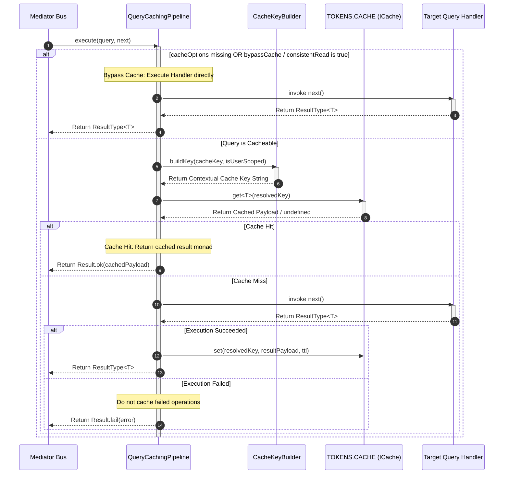

## Automated Query Result Acceleration with Query Caching Behavior

Executing repetitive database read operations or complex aggregation queries
places unnecessary load on persistence infrastructure and introduces processing
latency into client response times. Xeno resolves this by providing
`QueryCachingPipeline`, an automated CQRS query pipeline behavior that
intercepts query executions, evaluates context-built cache keys, and serves
pre-calculated result monads directly from cache stores.

---

## Understanding How Query Caching Behavior Works

The `QueryCachingPipeline` behavior intercepts every
[`IQuery`](../fundamentals/command-query) dispatched through `IMediator` when
query bus processing is enabled. It transparently handles cache checks, key
construction, and result persistence without requiring caching logic inside
individual query handlers.

When an inbound query passes through `QueryCachingPipeline`, the behavior
evaluates the message for `cacheOptions` (conforming to `ICacheableOptions`).
The pipeline executes the following execution flow:

1. **Option Evaluation**: The pipeline verifies whether `cacheOptions` is
   present on the query. If omitted, or if explicit cache-bypass flags
   (`bypassCache: true` or `consistentRead: true`) are set, the pipeline skips
   cache lookup and forwards the query directly to the handler.
2. **Context-Aware Key Resolution**: If cacheable, the pipeline delegates key
   construction to `CacheKeyBuilder`. `CacheKeyBuilder` inspects
   `cacheOptions.isUserScoped` and active request context from
   [`AsyncLocalStorage`](../fundamentals/node-request-context) to append tenant
   and user identifiers to `cacheOptions.cacheKey`.
3. **Cache Lookup (Hit vs. Miss)**: The pipeline queries the global cache
   instance bound to `TOKENS.CACHE`.

- **Cache Hit**: The cached result payload is immediately returned inside a
  successful [`Result`](../fundamentals/result-app-error) monad,
  short-circuiting handler execution.
- **Cache Miss**: Control passes downstream to the query handler via `next()`.
  Upon successful execution, the returned payload is saved in `TOKENS.CACHE`
  with the specified Time-To-Live (`ttl`) before being returned to the caller.



### Key Operational Characteristics

- **Zero Handler Pollution** — Keeps domain handlers focused entirely on data
  fetching and transformation, decoupling business logic from cache
  infrastructure.
- **Selective Cache Bypass** — Supports real-time consistent reads
  (`consistentRead`) for critical paths requiring guaranteed fresh data.
- **Monadic Result Caching** — Caches raw data models or DTO payloads,
  re-wrapping them into [`ResultType<T>`](../fundamentals/result-app-error)
  monads upon retrieval to maintain interface consistency.

---

## Configuring Query Caching via AppBuilder

Query caching is enabled during host bootstrapping by setting
`options.queryBus.isEnabled = true` inside `.addPipeline()` on
[`AppBuilder`](../fundamentals/app-builder).

```typescript
// src/infrastructure/bootstrap-cqrs.ts
import { AppBuilder } from '@xeno/core'
import type { AppRegistry } from './infrastructure/app-registry'

export const bootstrap = async () => {
  const builder = new AppBuilder<AppRegistry>()

  builder.addContext().addPipeline((options) => {
    // 1. Enable Query Bus processing and automatic Query Caching behavior
    options.queryBus.isEnabled = true
  })

  return await builder.build()
}
```

---

## Under the Hood: Default InMemoryCache Fallback

When `options.queryBus.isEnabled = true` is configured in `AppBuilder`,
`CqrsModule` automatically registers `QueryCachingPipeline` under
`TOKENS.QUERY_CACHING_PIPELINE`.

### Default InMemoryCache Initialization

To guarantee that caching functions out of the box without requiring external
database services, the framework invokes `CacheUtils.addCache` during startup.
If no explicit cache driver (such as Redis) has been configured,
`CacheUtils.addCache` automatically registers `InMemoryCache` as a singleton
provider bound to `TOKENS.CACHE`.

### Upgrading to Distributed Cache Engines

For production deployments operating across multiple server instances or
container replicas, process-local memory cannot share cached query results
across nodes. In these scenarios, configure a distributed **RedisCache**
provider during bootstrapping.

> **Refer to Caching Subsystem Documentation**: For comprehensive details on
> configuring storage providers, connection parameters, and driver setup,
> consult the [Caching Subsystem Overview](../cache/overview).

---

## Configuring Cache Options on Query Messages (`ICacheableOptions`)

To make an `IQuery` message eligible for caching, attach a `cacheOptions`
property matching the `ICacheableOptions` interface to the query object.

### Key-Value Specification of ICacheableOptions Attributes

- **`cacheKey`** (`string`) — A unique string key identifying the query result
  set (e.g., `'catalog:products:page-1'`).
- **`ttl`** (`number`, optional) — Time-To-Live duration in seconds for the
  cached entry. If omitted, the default TTL defined by the storage provider is
  applied.
- **`bypassCache`** (`boolean`, optional) — When set to `true`, instructs
  `QueryCachingPipeline` to skip cache lookups and execute the query handler
  directly.
- **`consistentRead`** (`boolean`, optional) — Semantically explicit flag for
  real-time reads. Takes precedence over `bypassCache` to force direct handler
  execution.
- **`isUserScoped`** (`boolean`) — When `true`, instructs `CacheKeyBuilder` to
  inject the active `userId` or `tenantId` into the cache key namespace,
  isolating cached data per user or tenant.

---

## Programmatic Query Implementation Example

Below is an example of an `IQuery` message exposing `cacheOptions` and
dispatched through a controller:

### 1. Defining the Cacheable Query Message

```typescript
// src/application/catalog/queries/get-products.query.ts
import { type IQuery, REQUEST_TYPE } from '@xeno/core'
import type { ProductDto } from '../dtos/product.dto'

export class GetProductsQuery implements IQuery<ProductDto[]> {
  public readonly intent = 'GET_PRODUCTS_QUERY'
  public readonly type = REQUEST_TYPE.QUERY

  // Configure caching parameters directly on the query object
  public readonly cacheOptions = {
    cacheKey: 'catalog:products:featured',
    ttl: 300, // Cache result for 5 minutes (300 seconds)
    isUserScoped: false, // Shared global product catalog across all users
    bypassCache: false,
    consistentRead: false,
  }

  constructor(public readonly category: string) {}
}
```

### 2. Dispatching the Query from a Controller

```typescript
// src/presentation/controllers/catalog.controller.ts
import { BaseController, type ResponseDto } from '@xeno/core'
import { GetProductsQuery } from '../../application/catalog/queries/get-products.query'
import type { ProductDto } from '../../application/catalog/dtos/product.dto'

export class CatalogController extends BaseController<
  GetProductsQuery,
  ProductDto[]
> {
  public async handle(request: {
    category: string
  }): Promise<ResponseDto<ProductDto[]>> {
    const query = new GetProductsQuery(request.category)

    // QueryCachingPipeline automatically checks TOKENS.CACHE before invoking handler
    const result = await this._query(query)

    if (!result.isOk()) {
      return this.fail(result.getErrorOrThrow())
    }

    return this.ok(result.getValueOrThrow())
  }
}
```

---

## Support Us

Xeno is an MIT-licensed open source project. It can grow thanks to the support
of these awesome people. If you'd like to join them, please read more at
[support section](../support-us)
