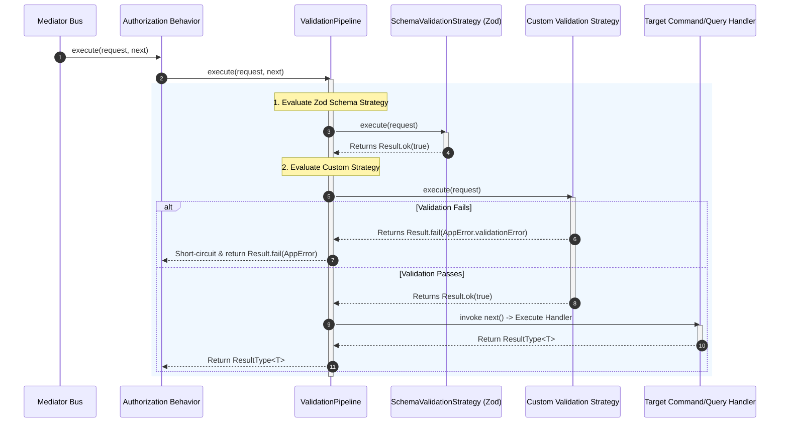

## Schema Enforcement & Input Protection with Validation Behavior

In domain-driven applications and CQRS architectures, business handlers and
domain entities rely on strict structural invariants. Processing malformed,
incomplete, or unvalidated message payloads pollutes domain logic and risks
runtime exceptions deep within application boundaries. Xeno resolves this by
introducing the `ValidationPipeline` behavior as an automated interceptor that
validates command and query requests before they reach application handlers.

---

## Understanding How Validation Works in Xeno

The `ValidationPipeline` behavior intercepts every command (`ICommand`) and
query (`IQuery`) dispatched through the mediator bus. Positioned after
authorization behaviors, it evaluates message payloads against registered
validation schemas and custom validation rules.

When a message enters `ValidationPipeline`, the behavior executes its array of
registered validation strategies sequentially. If any strategy detects a
validation failure, execution is immediately halted (short-circuited), and
`ValidationPipeline` returns a functional failure monad
(`Result.fail(AppError.validationError(...))`) containing error details. The
request is rejected with an `ERROR_CODES.VALIDATION_FAILED` code and an HTTP
`400 BAD_REQUEST` status code before the target handler is instantiated.



### Key Operational Characteristics

- **Pre-Handler Interception** — Validates incoming request payloads before
  invoking business handlers, keeping handlers free from redundant schema check
  logic.
- **Short-Circuit Shortening** — Aborts pipeline execution at the first
  validation error, avoiding unnecessary database queries or external RPC calls.
- **Monadic Failure Envelope** — Wraps input validation failures into
  standardized `AppError` instances, providing formatted, field-specific error
  paths (e.g., `[user.email] Invalid email address`).
- **Hybrid Strategy Support** — Allows combining declarative Zod schema
  validation with dynamic custom validation strategies within the same pipeline
  execution chain.

---

## Configuring Zod Schema Validation

Xeno includes native integration with the Zod validation library via
`ZodValidatorService` and `SchemaValidationStrategy`. Schema validation maps
request intent strings directly to Zod schemas, automatically validating
incoming payloads against their corresponding schema definition.

> ⚠️ **Installation Disclaimer**: Zod is an **optional peer dependency** in Xeno
> (`@xeno/core`). To use Zod schema validation, you must explicitly install
> `zod` in your project workspace:
>
> ```
> npm install zod
>
> ```
>
> If `options.validation.zod` is configured without `zod` installed in your
> project, Node.js will throw a module resolution exception at startup.

### 1. Defining Zod Validation Schemas

Define Zod schemas matching your command or query payload structure:

```typescript
// src/application/users/schemas/create-user.schema.ts
import { z } from 'zod'

export const CreateUserCommandSchema = z.object({
  name: z.string().min(2, 'Name must be at least 2 characters long.'),
  email: z.string().email('Invalid email address format.'),
  role: z.enum(['admin', 'user', 'guest']),
  age: z
    .number()
    .int()
    .min(18, 'User must be at least 18 years old.')
    .optional(),
})

export type CreateUserSchemaType = z.infer<typeof CreateUserCommandSchema>
```

### 2. Registering Schemas in AppBuilder

To enable Zod validation, populate the `options.validation.zod.schemas`
dictionary inside `.addPipeline()` during application bootstrapping, mapping
message `intent` keys to their respective Zod schemas:

```typescript
// src/infrastructure/bootstrap-validation.ts
import { AppBuilder } from '@xeno/core'
import { CreateUserCommandSchema } from '../application/users/schemas/create-user.schema'
import type { AppRegistry } from './xeno-registry/app-registry'

export const configureValidationPipeline = async () => {
  const builder = new AppBuilder<AppRegistry>()

  builder.addContext().addPipeline((options) => {
    // Configure Zod schema validation
    options.validation.zod = {
      schemas: {
        // Intent string token mapped to its target Zod schema
        CREATE_USER_COMMAND: CreateUserCommandSchema,
      },
    }
  })

  return await builder.build()
}
```

---

### Disclaimer on Using the `.strict()` Modifier with Zod Schemas

> ⚠️ **WARNING** — Handling Base Attributes of `IRequest`, `ICommand`, and
> `IQuery**` When applying the `.strict()` modifier to a Zod schema, Zod rejects
> the payload and emits a validation error (`unrecognized_keys`) for any
> property present on the target object that is not explicitly declared in the
> schema. Because the `ValidationPipeline` validates the entire request object
> dispatched through the Mediator, the evaluated payload contains both
> command/query specific properties and the **base metadata attributes enforced
> by the framework's interfaces** (`IRequest`, `ICommand`, `IQuery`). If you
> choose to use `.strict()`, **it is mandatory to include the base interface
> attributes in your Zod schema**, otherwise validation will consistently fail.

---

### Required Base Attributes for CQRS Interfaces

Depending on the interface used for the message dispatched through the Mediator,
the base attributes to declare in your `.strict()` schema are as follows:

#### 1. Base Attributes of `IRequest` (Generic Contract)

- **`intent`** (`string`): Unique string token identifying the intent (e.g.,
  `'CREATE_USER_COMMAND'`).
- **`type`** (`'COMMAND' | 'QUERY'`): The type of request executed.

#### 2. Base Attributes of `ICommand<T>`

Inherits the base structure of `IRequest`:

- **`intent`**: `z.string()`
- **`type`**: `z.literal('COMMAND')`
- **`props`** (or payload fields defined at root level)

#### 3. Base Attributes of `IQuery<T>`

Inherits `IRequest` and includes caching configuration:

- **`intent`**: `z.string()`
- **`type`**: `z.literal('QUERY')`
- **`cacheOptions`** (optional): Object matching the `ICacheableOptions`
  configuration:
- `cacheKey`: `z.string()`
- `ttl`: `z.number().optional()`
- `bypassCache`: `z.boolean().optional()`
- `consistentRead`: `z.boolean().optional()`
- `isUserScoped`: `z.boolean()`

---

### Practical Implementation Example with `.strict()`

To avoid code duplication across strict schemas, it is recommended to create
reusable base Zod schemas for the framework's core metadata:

```typescript
import { BaseRequestSchema, CacheOptionsSchema } from '@xeno/core'
import { z } from 'zod'

// 1. Strict Schema for a Command (.strict())
export const CreateUserCommandSchema = BaseRequestSchema.extend({
  type: z.literal('COMMAND'),
  props: z.object({
    name: z.string().min(2),
    email: z.string().email(),
  }),
}).strict()

// 2. Strict Schema for a Query (.strict())
export const GetUserByIdQuerySchema = BaseRequestSchema.extend({
  type: z.literal('QUERY'),
  cacheOptions: CacheOptionsSchema,
  props: z.object({
    userId: z.string().uuid(),
  }),
}).strict()
```

---

## Configuring Custom Validation Strategies

When validation rules require business logic outside the scope of static schema
parsing—such as checking database uniqueness, verifying cross-field domain logic
against external services, or evaluating dynamic runtime rules—you can register
custom validation strategies.

A custom validation strategy is a factory function that resolves dependencies
from the active request scope (`IServiceScope`) and returns an object
implementing the `IStrategy<IRequest, boolean>` contract.

### 1. Authoring a Custom Validation Strategy Class

Implement the generic `IStrategy<IRequest, boolean>` contract:

```typescript
// src/application/users/strategies/unique-email-validation.strategy.ts
import {
  Result,
  AppError,
  type IStrategy,
  type IRequest,
  type ResultType,
} from '@xeno/core'
import type { IUserRepository } from '../../domain/repositories/user-repository.interface'

interface ICreateUserRequest extends IRequest {
  readonly props: { email: string }
}

export class UniqueEmailValidationStrategy implements IStrategy<
  ICreateUserRequest,
  boolean
> {
  constructor(private readonly _userRepository: IUserRepository) {}

  public async execute(
    request: ICreateUserRequest,
  ): Promise<ResultType<boolean>> {
    // Only apply check to specific request intents
    if (request.intent !== 'CREATE_USER_COMMAND') {
      return Result.ok(true)
    }

    const email = request.props?.email
    if (!email) {
      return Result.fail(
        AppError.validationError(
          'UniqueEmailValidationStrategy',
          'Missing email attribute in request props.',
        ),
      )
    }

    // Perform database lookup to verify email uniqueness
    const exists = await this._userRepository.existsByEmail(email)
    if (exists) {
      return Result.fail(
        AppError.validationError(
          'UniqueEmailValidationStrategy',
          `Validation failed: Email address '${email}' is already registered.`,
        ),
      )
    }

    return Result.ok(true)
  }
}
```

### 2. Registering Custom Strategies in AppBuilder

Register your custom strategy factory in the
`options.validation.customValidationStrategy` array inside `.addPipeline()`. The
factory callback receives the request-scoped dependency injection container
(`c`), allowing safe resolution of scoped services or repositories:

```typescript
// src/infrastructure/bootstrap-custom-validation.ts
import { AppBuilder, TOKENS } from '@xeno/core'
import { CreateUserCommandSchema } from '../application/users/schemas/create-user.schema'
import { UniqueEmailValidationStrategy } from '../application/users/strategies/unique-email-validation.strategy'
import type { AppRegistry } from './xeno-registry/app-registry'

export const bootstrap = async () => {
  const builder = new AppBuilder<AppRegistry>()

  builder.addContext().addPipeline((options) => {
    options.validation = {
      // 1. Standard Zod schema checks
      zod: {
        schemas: {
          CREATE_USER_COMMAND: CreateUserCommandSchema,
        },
      },
      // 2. Custom validation strategy factories
      customValidationStrategy: [
        (container) => {
          // Resolve dependencies safely from IoC
          const userRepo = container.resolve('USER_REPOSITORY')
          return new UniqueEmailValidationStrategy(userRepo)
        },
      ],
    }
  })

  return await builder.build()
}
```

---

## Formatted Validation Error Output

When validation fails (either from a Zod schema parse or a custom strategy
rejection), `ValidationPipeline` catches the `AppError` and returns it through
the mediator. When mapped by a controller via `this.fail(error)`, the API
response returns a structured 400 error payload:

```json
{
  "success": false,
  "error": {
    "code": "VALIDATION_FAILED",
    "message": "errors.validation_failed",
    "details": "Validation failed for schema: [email] Invalid email address format., [age] User must be at least 18 years old.",
    "path": "/api/v1/users"
  },
  "correlationId": "8f3b2a10-4c91-4e2b-b890-1e2a3b4c5d6e",
  "requestId": "1a2b3c4d-5e6f-7a8b-9c0d-1e2f3a4b5c6d",
  "spanId": "8f3b2a10-4c91-4e2b-b890-1e2a3b4c5d6e",
  "timestamp": "2026-07-27T12:00:00.000Z"
}
```
