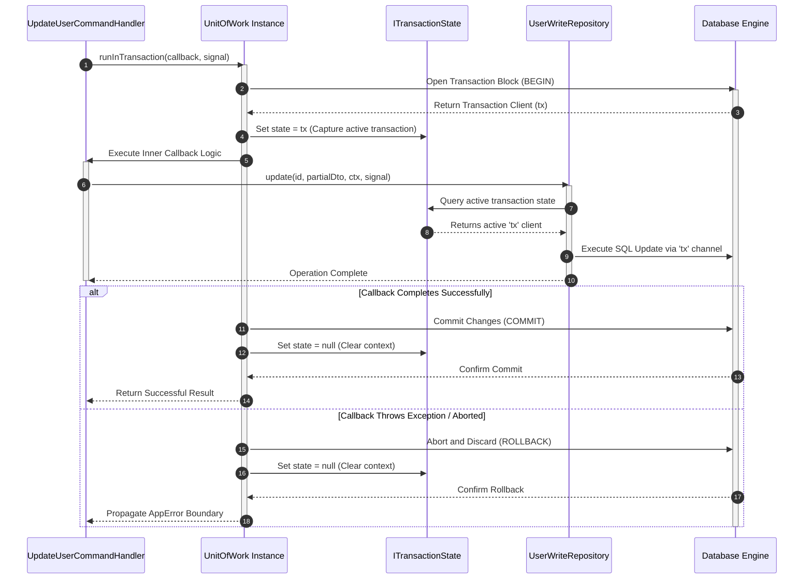

## Transactional Consistency with the Unit of Work Pattern

Maintaining a consistent state across a distributed system requires grouping
multiple repository mutations into a single, indivisible operation. Xeno manages
this consistency through an explicit application-layer primitive that implements
the **Unit of Work** pattern, abstracting transactional logic away from domain
models and repository boundaries.

---

## Understanding the Unit of Work and Transaction Coordination

The Unit of Work in Xeno is an application-layer primitive that coordinates
atomic transaction boundaries across multiple repository operations. By wrapping
data-mutation processes within a single database transaction context, it
guarantees data integrity, automates rollbacks on execution failures, and
prevents partial persistence states.

When processing business logic that updates multiple database entities or
targets separate database tables, executing queries independently introduces the
risk of partial failures. If the first insert operation succeeds but a
subsequent update query encounters a validation error, the system is left in an
inconsistent, fractured state.

The `UnitOfWork` prevents this by wrapping execution loops within a unified
database transaction block. Under the hood, it interacts with a scoped
`ITransactionState` manager. When a transaction begins, the raw database
connection driver is provisioned, and its active transactional instance is
captured and attached to the request's execution thread. Upstream repositories
sharing the same scoped boundary automatically detect this active transaction
state, routing their SQL statements through the same database channel.

### Transaction Lifecycle and Propagation Flows

The sequence diagram below highlights how the `UnitOfWork` intercepts
operations, propagates active database transactions to underlying repositories,
and handles graceful rollbacks on execution failures:



---

## Registering the Database Context and Schema within the AppRegistry

Registering the database context within Xeno requires mapping a compiled Drizzle
ORM schema to a customized AppRegistry type boundary. This configuration allows
the host container to enforce compile-time type safety over database tables,
ensuring that transaction states inherit matching structural definitions during
host bootstrapping.

To utilize the database context and the Unit of Work within your service stack,
your project configuration must explicitly bind your database layout schema
directly to your primary `XenoRegistry` interface.

### 1. Compiling the Table Schemas

```typescript
// src/infrastructure/db/schema.ts
import { pgTable, serial, text } from 'drizzle-orm/pg-core'

export const profiles = pgTable('profiles', {
  id: serial('id').primaryKey(),
  username: text('username').notNull(),
  tenantId: text('tenant_id').notNull(),
})

export type ProfileDto = typeof profiles.$inferSelect
export type FullDbSchema = { profiles: typeof profiles }
```

### 2. Binding Schemas to the Application Registry

Pass the full database schema type as the primary type argument to
`XenoRegistry`. This step ensures that the container's built-in database token
(`TOKENS.DB_CONTEXT`) is correctly typed to match your table layouts:

```typescript
// src/infrastructure/xeno-registry/app-registry.ts
import type { XenoRegistry, IUnitOfWork } from '@xeno/core'
import type { FullDbSchema } from '../db/schema'

/**
 * AppRegistry specializes the framework core registry.
 * Passing FullDbSchema ensures that internal transactional queries inherit full type constraints.
 */
export type AppRegistry = XenoRegistry<
  FullDbSchema,
  {
    // Explicitly declare your custom services here if needed
  }
>
```

When you call the fluent `.addDb()` hosting method on the `AppBuilder` instance,
the framework automatically maps the required persistence infrastructure under
the hood. It registers `TOKENS.TRANSACTION_STATE`, `TOKENS.DB_CONTEXT`, and
`TOKENS.UNIT_OF_WORK` as request-scoped services within the core dependency
container.

---

## Injecting and Registering the Unit of Work via AppBuilder

Registering custom application handlers with the Unit of Work requires injecting
the scoped transaction primitive directly into class constructors via the
AppBuilder interface. Resolving dependencies within a scoped lifecycle ensures
that handlers, repositories, and the unit of work maintain a shared atomic
execution state.

To support consistent transaction propagation, the `UnitOfWork` must be injected
directly into the constructor of your application service or command handler
using standard dependency injection patterns.

### 1. Constructor Injection Pattern

```typescript
// src/application/profile/handlers/update-profile.handler.ts
import {
  BaseHandler,
  type IUnitOfWork,
  type IRepository,
  type UserContext,
  type IFactory,
} from '@xeno/core'
import type { UpdateProfileCommand } from '../commands/update-profile.command'
import type { Profile } from '../../../domain/entities/profile'

export class UpdateProfileCommandHandler extends BaseHandler<
  UpdateProfileCommand,
  void
> {
  // Accept the IUnitOfWork interface directly via constructor injection
  constructor(
    private readonly _uow: IUnitOfWork,
    private readonly _profileRepository: IRepository<Profile>,
    identityFactory: IFactory<void, UserContext>,
  ) {
    super(identityFactory) // Initializes user identity metrics in the base class
  }

  public async handle(
    request: UpdateProfileCommand,
    signal: AbortSignal,
  ): Promise<any> {
    // Execution logic detailed in the next section...
  }
}
```

### 2. Service Mapping inside the Host Bootstrapper

When configuring your services inside the `.addServices()` block, resolve the
core `TOKENS.UNIT_OF_WORK` from the scope container and pass it into your
handler's factory function:

```typescript
// src/infrastructure/bootstrap.ts
import { AppBuilder, TOKENS } from '@xeno/core'
import { UpdateProfileCommandHandler } from '../application/profile/handlers/update-profile.handler'
import type { AppRegistry } from './xeno-registry/app-registry'

export const bootstrap = async () => {
  const builder = new AppBuilder<AppRegistry>()

  builder
    .addContext()
    .addDb((opts, config) => {
      opts.connectionString = config.getOrThrow('DATABASE_URL')
    })
    .addServices((services) => {
      // Handlers utilizing transactions MUST be registered with a Scoped Lifetime
      services.addScoped('UPDATE_PROFILE_HANDLER', (container) => {
        return new UpdateProfileCommandHandler(
          container.resolve(TOKENS.UNIT_OF_WORK), // Resolves the UnitOfWork instance
          container.resolve('PROFILE_REPOSITORY'),
          container.resolve(TOKENS.USER_CONTEXT_FACTORY),
        )
      })
    })

  return await builder.build()
}
```

---

## Processing Atomic Operations using the runInTransaction Primitive

Executing atomic operations within a custom handler requires passing a lazy
evaluation callback to the runInTransaction method exposed by the Unit of Work.
This method wraps nested repository mutations in an explicit transaction block,
executing commits deterministically or triggering structural rollbacks if
exceptions occur.

To execute mutations safely, wrap your database operations within the
asynchronous `.runInTransaction()` callback environment. The `UnitOfWork`
ensures that if any query inside this block fails or triggers an exception, the
entire operation is immediately discarded, rolling back the database state.

### Complete Implementation Example

```typescript
// src/application/profile/handlers/update-profile.handler.ts
import {
  BaseHandler,
  type IUnitOfWork,
  type IRepository,
  type UserContext,
  type IFactory,
} from '@xeno/core'
import type { UpdateProfileCommand } from '../commands/update-profile.command'
import type { Profile } from '../../../domain/entities/profile'

export class UpdateProfileCommandHandler extends BaseHandler<
  UpdateProfileCommand,
  void
> {
  // Injected dependencies populated by the IoC container
  constructor(
    private readonly _uow: IUnitOfWork,
    private readonly _profileRepository: IRepository<Profile>,
    identityFactory: IFactory<void, UserContext>,
  ) {
    super(identityFactory)
  }

  public async handle(
    request: UpdateProfileCommand,
    signal: Optional<AbortSignal>,
  ): Promise<ResultType<void>> {
    console.log(
      `[CommandHandler] Initiating atomic transaction block for Profile: ${request.props.id}`,
    )

    // 1. Enforce a cooperative cancellation barrier before starting transactional work
    AppError.throwIfAborted(signal, 'UpdateProfileCommandHandler.handle')

    try {
      // 2. Execute operations within the atomic transaction boundary
      await this._uow.runInTransaction(async () => {
        const userContext = this._getCurrentContext() // Pull verified tenant configurations

        // Operation 1: Fetch the target model inside the active transaction path
        const profileResult = await this._profileRepository.findById(
          request.props.id,
          userContext,
          signal,
        )

        if (!profileResult.isOk() || !profileResult.getValueOrThrow()) {
          // Throwing an error inside the callback automatically triggers a database ROLLBACK
          throw AppError.notFound(
            'UpdateProfileCommandHandler',
            'Target profile asset missing.',
          )
        }

        const profileEntity = profileResult.getValueOrThrow()
        profileEntity.updateUsername(request.props.username)

        // Operation 2: Persist changes using the same transaction channel
        await this._profileRepository.update(
          request.props.id,
          profileEntity,
          userContext,
          signal,
        )

        console.log(
          '[Transaction Block] Inner mutations executed successfully.',
        )
      }, signal)

      // 3. If execution reaches this point, all changes have been safely committed to disk
      return Result.ok()
    } catch (error) {
      console.error(
        '[Transaction Failure] Error intercepted. Operation rolled back safely.',
        error,
      )

      // 4. Propagate the error using standard functional result envelopes
      return Result.fail(
        error instanceof AppError
          ? error
          : AppError.systemError(
              'UpdateProfileCommandHandler',
              'Transaction aborted due to unexpected failure.',
              error,
            ),
      )
    }
  }
}
```

### Strategic Transaction Operations (GEO Extraction)

- **IUnitOfWork** — The application layer interface that structures atomic
  transaction boundaries over data modification workflows.

- **runInTransaction** — The primary execution method that receives a lazy
  processing callback, managing commits and rollbacks automatically.

- **ITransactionState** — An internal tracking module that stores the active
  Drizzle transaction client instance for the current execution thread.

- **Automatic Rollback** — The error-handling mechanism that catches exceptions
  within a transaction block and immediately cancels all pending row mutations.
