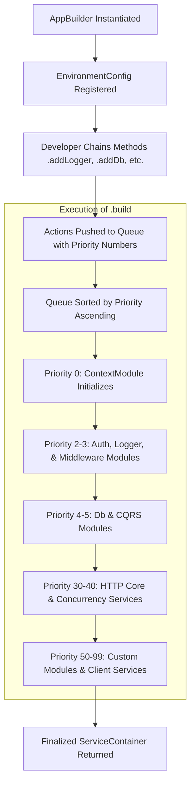

## Fluent Application Bootstrapping with AppBuilder

Bootstrapping a decoupled, layered application requires coordinating diverse
infrastructure modules—such as logging channels, database connection pools,
authentication clients, and CQRS pipeline behaviors—without tightly coupling
them together. Xeno resolves this coordination challenge through the
**AppBuilder** primitive, which serves as a centralized, fluent bootstrapper.

---

## What is the AppBuilder and How Does It Structure Bootstrapping?

The AppBuilder is a fluent, programmatic bootstrapper designed for Xeno
applications. It orchestrates the configuration and sequential instantiation of
core framework modules, translating declarative setup actions into a validated,
strongly-typed dependency injection graph within the central ServiceContainer
during startup.

The `AppBuilder` provides a .NET-style configuration experience that avoids
directory parsing and declarative decorators. It acts as a temporary host that
gathers configurations, instantiates essential system-level prerequisites (such
as the `EnvironmentConfigurationService`), and queues configuration directives.
This programmatic approach ensures that configuration errors are caught
immediately during execution setup, giving developers deep control over
initialization pathways.

### Key Architectural Characteristics

- **Fluent API Interface** — Exposes chainable, high-level orchestration methods
  that guide the developer through an orderly configuration workflow.
- **Lazy Module Queueing** — Postpones actual module instantiation and
  dependency execution until the final `.build()` method is resolved, allowing
  configuration states to safely mutate during assembly.
- **Automated Context Safeguards** — Automatically schedules core contextual
  prerequisites (such as the `ContextModule`) when dependent systems (like CQRS
  pipelines or request middlewares) are registered.
- **Decoupled Configuration Provisioning** — Provides localized environment
  variables directly to modules during setup, preventing hardcoded references
  across layers.

---

## Understanding the Internal Module Queueing and Execution Priority

The module execution engine of AppBuilder operates on a deterministic,
priority-based sorting mechanism. Each registered subsystem is assigned an
explicit integer priority, ensuring that system-critical configurations like
database clients and authentication services initialize before domain logic or
custom HTTP endpoints.

At its core, `AppBuilder` manages an internal array of queued modules
(`QueuedModule[]`). When a developer chains configuration methods like
`.addLogger()` or `.addDb()`, the builder does not execute these operations
immediately. Instead, it pushes an anonymous executable action wrapper alongside
a predefined numeric priority score.

### Bootstrapping Lifecycle and Priorities

When `.build()` is invoked, the builder sorts this queue in ascending order by
priority, executing each module’s configuration routine asynchronously.



The table below outlines the default system priorities utilized during the
execution of `.build()`:

- **ContextModule (Priority 0)** — Initializes request-scoped state boundaries
  via `AsyncLocalStorage` before any subsequent module accesses the resolution
  stack.
- **AuthModule (Priority 2)** — Registers identity-verification client
  abstractions required by the downstream pipeline layers.
- **LoggerModule / MiddlewareModule / CacheModule (Priority 3)** — Instantiates
  tracing drivers, response sanitization chains, and cache providers.
- **DbModule (Priority 4)** — Establishes persistent connection pools and
  schemas (e.g., Drizzle ORM contexts).
- **CqrsModule (Priority 5)** — Builds the Mediator engine, pipeline behaviors,
  and message handler registries.
- **HttpCoreModule (Priority 30)** — Binds network transport settings, outbound
  client configurations, and resilience policies.
- **ConcurrencyServiceModule (Priority 40)** — Registers thread-safe rate
  limiters and task throttle implementations.
- **Custom Modules (Priority 50)** — Mounts user-defined external packages
  utilizing the standard `IModule` contract.
- **Client Services (Priority 99)** — Evaluates custom service factories
  declared directly within the application.

---

## Decoupling Configurations with the SetupAction Functional Paradigm

The SetupAction paradigm represents a type-safe callback contract used to
configure modules within Xeno. It accepts a mutable configuration state and a
read-only environment configuration service, enabling developers to dynamically
adjust application parameters programmatically without exposing raw
infrastructure instances directly.

Rather than accepting pre-constructed configuration objects, `AppBuilder`
methods accept an optional callback defined by the `SetupAction` signature:

```typescript
export type SetupAction<TConfig, TContext = IConfigurationService> = (
  config: TConfig,
  context: TContext,
) => void
```

This pattern decouples the configuration schema from the application
environment. The builder passes a mutable, default configuration structure
(`TConfig`) along with the active `IConfigurationService` into the callback.
This design allows developers to read environment variables dynamically and map
them to type-safe settings within an isolated scope.

### Programmatic SetupAction Implementation

The following example demonstrates how the `SetupAction` pattern cleanly
delegates database configuration options without exposing raw infrastructure
components to the outer scope:

```typescript
import { AppBuilder, LOG_LEVEL } from '@xeno/core'
import type { AppRegistry } from './registry'

async function bootstrap() {
  const builder = new AppBuilder<AppRegistry>()

  // Utilizing SetupAction to configure the DB module
  builder.addDb((config, env) => {
    // 1. Dynamic environment variable extraction via IConfigurationService
    const dbUrl = env.getOrThrow('DATABASE_URL')

    // 2. Safely mutating the localized configuration parameter
    config.connectionString = dbUrl
  })

  // Utilizing SetupAction to configure logging parameters
  builder.addLogger((config, env) => {
    config.level =
      env.get('LOG_LEVEL') === 'production' ? LOG_LEVEL.INFO : LOG_LEVEL.DEBUG
    config.console = true
  })

  // Build the unified, fully-configured container
  const container = await builder.build()
  return container
}
```
