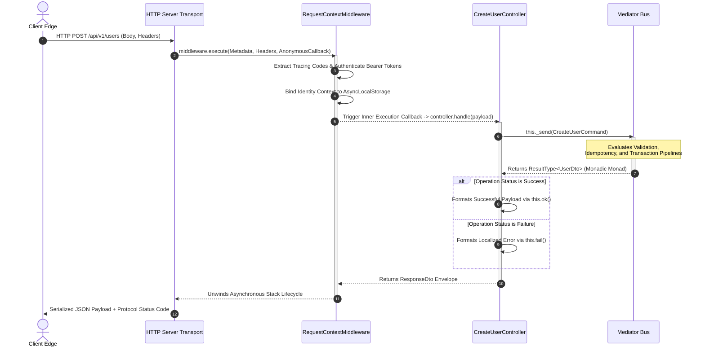

## Presentation Layer Orchestration with BaseController

The presentation layer of Xeno separates delivery networks—such as HTTP engines,
WebSockets, or distributed event consumers—from core application use cases. This
layer uses the **BaseController** abstract primitive, which standardizes
incoming request collection, isolates request handling, and uniformizes outbound
response serialization.

---

## Understanding the Role and Management of BaseController

The Xeno `BaseController` is an abstract presentation primitive that unifies
request processing across delivery channels. It encapsulates context accessors
and a mediator client to execute type-safe interaction contracts while
standardizing lifecycle response mapping without coupling business routines to
HTTP transport engines.

Rather than embedding protocol-specific details (such as Express or Fastify
request objects) deeply into your execution track, `BaseController` accepts
clean data contracts. It acts as an integration gateway that interacts with the
framework's internal **Dependency Injection (DI) container**, manages request
scopes, and catches application exceptions. It exposes built-in serialization
helpers to map monadic operation outcomes into protocol-compliant diagnostic
response formats.

### Key-Value Specification of BaseController Dependencies

- **\_requestContext** — An instance of `IContextAccessor<RequestContext>`
  tasked with safely pulling metadata strings and tracking identities from
  **asynchronous local storage**.

- **\_mediator** — An instance of `IMediator` providing a decoupled transport
  channel to transmit command or query objects to their associated execution
  handlers.

- **handle()** — The mandatory, abstract entry-point method that subclasses must
  implement to process incoming request envelopes asynchronously.

---

## Extending BaseController for Custom Request Processing

Extending the `BaseController` requires declaring concrete request and response
structural models via TypeScript generics. Subclasses implement the asynchronous
`handle` contract, leveraging native execution primitives to return standardized
data envelopes compiled safely within the central framework runtime context.

When authoring a concrete controller class, developers declare two generic type
parameters: `TRequest` (describing the structural shape of the incoming payload)
and `TResponse` (defining the structural signature of the success payload).

### Programmatic Implementation of a Concrete Controller

The following code illustrates how to inherit from `BaseController` to process a
request payload safely:

```typescript
// src/presentation/controllers/create-user.controller.ts
import {
  BaseController,
  type ResponseDto,
  AppError,
  STATUS_CODES,
} from '@xeno/core'
import { CreateUserCommand } from '../../application/user/commands/create-user.command'
import type { UserDto } from '../../infrastructure/schema'
import type { UserProps } from '../../domain/entities/user'
import type { IContextAccessor, IMediator, RequestContext } from '@xeno/core'

export class CreateUserController extends BaseController<UserProps, UserDto> {
  constructor(
    requestContext: IContextAccessor<RequestContext>,
    mediator: IMediator,
  ) {
    super(requestContext, mediator) // Propagates core orchestration services upwards
  }

  public async handle(request: UserProps): Promise<ResponseDto<UserDto>> {
    console.log(`[Controller] Collecting data payload for: ${request.email}`)

    // 1. Construct a type-safe Command intent message
    const command = new CreateUserCommand(request)

    // 2. Transmit the command down the mediator pipeline execution stack
    const result = await this._send(command)

    // 3. Evaluate the monadic Result layer outcome
    if (!result.isOk()) {
      const error = result.getErrorOrThrow()
      // Automatically serialize the AppError structure into a standardized failure envelope
      return this.fail(
        error,
        'User transaction compilation aborted by pipeline.',
      )
    }

    const createdUserDto = result.getValueOrThrow()

    // 4. Return a standardized 201 Created ResponseDto wrapper
    return this.ok(createdUserDto, STATUS_CODES.CREATED)
  }
}
```

---

## Dispatching CQRS Messages and Extracting Monadic Returns

Invoking commands or queries inside custom controllers relies on internal
protected dispatch wrappers connected to the internal mediator bus. These
primitives coordinate asynchronous transmission across pipeline stacks,
returning functional result monads that validate execution invariants before
state mutations occur.

The `BaseController` isolates communication paths by exposing two distinct,
protected communication hooks:

- **\_send(command)** — Dispatches a state-mutating `ICommand` primitive. It
  intercepts the request to inject execution timeout limits, evaluate
  distributed idempotency markers, and coordinate transactional states through a
  unit-of-work container.

- **\_query(query)** — Evaluates an idempotent read-only `IQuery` primitive. It
  bypasses mutation locks and interacts directly with active cache layers based
  on your defined cache options.

Both routing channels wrap their eventual outputs inside a functional **Result
monad** (`ResultType<T>`), ensuring compile-time safety by preventing direct
field access until the success condition is verified.

---

## Registering Controllers into the AppBuilder Bootstrap Cycle

Registering extended controllers into the bootstrap sequence utilizes the
programmatic `addServices` factory container chain. Defining controllers with
transient lifecycles prevents concurrent request contamination, establishing
type-safe resolution channels tied securely to the centralized application
service registry.

Controllers should be registered with a **Transient Lifetime**. Because
controllers contain instance-level dependencies linked to execution contexts,
generating a fresh, unshared object instance on every subsequent resolution call
eliminates cross-request memory contamination.

```typescript
// src/infrastructure/bootstrap.ts
import { AppBuilder, TOKENS } from '@xeno/core'
import { CreateUserController } from '../presentation/controllers/create-user.controller'
import type { AppRegistry } from './xeno-registry/app-registry'

export const initializeHost = async () => {
  const builder = new AppBuilder<AppRegistry>()

  builder
    .addContext()
    .addMiddlewares()
    .addPipeline((opts) => {
      opts.queryBus.isEnabled = true
    })
    .addServices((services) => {
      // Register the controller with a transient scope inside the DI container
      services.addTransient('CREATE_USER_CONTROLLER', (container) => {
        return new CreateUserController(
          container.resolve(TOKENS.CONTEXT_ACCESSOR), // Resolves core context accessor
          container.resolve(TOKENS.MEDIATOR), // Resolves system mediator bus
        )
      })
    })

  return await builder.build()
}
```

---

## Executing Controller Handlers inside Middleware Context Boundaries

Executing controller handlers within middleware boundaries ensures incoming
request envelopes safely populate asynchronous local storage before business
logic fires. Passing the controller's execution block as a lazy evaluation
callback allows cross-cutting pipeline stacks to intercept downstream
transactions cleanly.

To preserve clean separation of concerns, the entry server (e.g., Fastify or
Hono) should never invoke a controller method directly. Instead, execution is
routed through the framework's core request middleware layer. This architecture
ensures that telemetry attributes, security signatures, and multi-tenant routing
profiles are bound to the execution thread's storage context before any
controller business logic is evaluated.

### Complete Egress Integration Example (Fastify / Hono Adapter)

```typescript
// src/main.ts
import { TOKENS } from '@xeno/core'
import fastify from 'fastify'
import { initializeHost } from './infrastructure/bootstrap'
import type { UserProps } from './domain/entities/user'

async function startServer() {
  const container = await initializeHost()
  const server = fastify()

  // Resolve required presentation primitives from the compiled container
  const middleware = container.resolve(TOKENS.MIDDLEWARE)
  const controller = container.resolve('CREATE_USER_CONTROLLER')

  // Define transport routing path
  server.post('/api/v1/users', async (request, reply) => {
    const rawHeaders = request.headers as Record<string, string | string[]>
    const transportMetadata = {
      path: request.url,
      method: request.method as any,
    }

    // Execute within the protected, isolated request-scoped context pipeline
    const responseDto = await middleware.execute(
      transportMetadata,
      rawHeaders,
      async () => {
        // The handler is executed safely inside an AsyncLocalStorage context boundary
        const payload = request.body as UserProps
        return await controller.handle(payload)
      },
    )

    // Standardize serialization output back across the network edge
    return reply
      .status(responseDto.status)
      .type('application/json')
      .send(responseDto.data)
  })

  await server.listen({ port: 3000 })
  console.log('Xeno runtime listening safely on http://localhost:3000')
}

startServer().catch(console.error)
```

### Architectural Layout: End-to-End Execution Trace

The layout below traces the data propagation flow as an inbound network request
shifts into a localized contextual execution thread managed by the controller:


