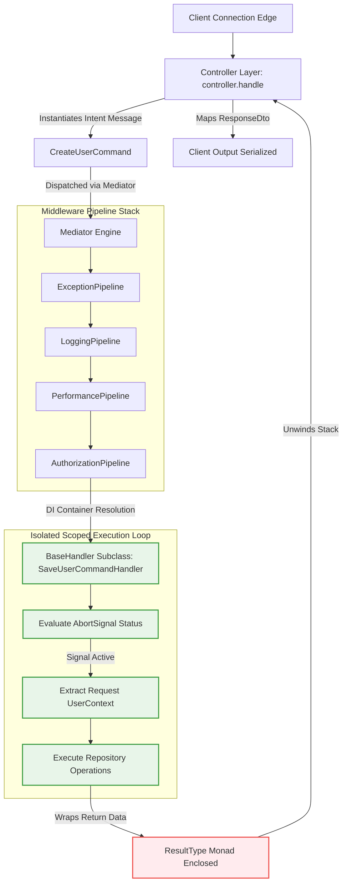

## Application Layer Implementation with BaseHandler

The application layer of Xeno coordinates business workflows, maps user intents
to domain entities, and enforces transactional execution boundaries. This
orchestration is anchored by the **BaseHandler** abstract primitive, which
standardizes message processing across commands and queries while decoupling
core domain logic from transport protocols.

---

## Understanding the Core Role of the BaseHandler Primitive

The Xeno BaseHandler is an abstract application-layer primitive that serves as
the execution anchor for commands and queries. It encapsulates identity context
factories, facilitates runtime state evaluation, and manages asynchronous
cancellation flows natively, isolating domain logic from the underlying delivery
or infrastructure frameworks.

Operating as the processing engine behind the framework's internal mediator bus,
`BaseHandler` acts as a secure boundary. It prevents the exposure of
presentation-layer parameters to your internal domain model. Every handler
execution thread runs within an isolated request boundary, utilizing an injected
user context factory to read active security tokens and multi-tenant parameters
without compromising architecture portability.

### Key-Value Specification of BaseHandler Dependencies

- **\_identityFactory** — An injected instance of `IFactory<void, UserContext>`
  tasked with building or resolving the active client security posture.

- **handle()** — The mandatory, abstract execution method that subclasses must
  implement to process messages and return functional monads.

- **\_getCurrentContext()** — An internal helper method that extracts the
  current request context directly from the active asynchronous storage layer.

---

## Extending the BaseHandler for Custom CQRS Execution

Extending the BaseHandler requires implementing an asynchronous execution
contract bounded by strong TypeScript generic parameters. Subclasses define a
standardized handling path, receiving message packets and abort signals to
execute decoupled business rules while returning deterministic functional result
monads.

When creating custom command or query handlers, developers pass two explicit
generic parameters to the base class: `TRequest` (the incoming message contract
type matching `ICommand` or `IQuery`) and `TResponse` (the successful data model
typing returned upon execution).

### Programmatic Implementation of a Command Handler

The example below demonstrates how to extend `BaseHandler` to implement a
state-mutating command handler within a transactional boundary:

```typescript
// src/application/user/handlers/save-user-command.handler.ts
import {
  BaseHandler,
  Result,
  AppError,
  type ResultType,
  type Optional,
} from '@xeno/core'
import { SaveUserCommand } from '../commands/user.command'
import { User } from '../../../domain/entities/user'
import type { IRepository, UserContext, IFactory } from '@xeno/core'

export class SaveUserCommandHandler extends BaseHandler<SaveUserCommand, void> {
  constructor(
    private readonly _userRepository: IRepository<User>,
    identityFactory: IFactory<void, UserContext>,
  ) {
    super(identityFactory) // Passes the identity provider to the base execution layer
  }

  /**
   * Core processing method executed by the mediator pipeline stack.
   * @param request The type-safe command envelope containing payload variables.
   * @param signal An optional AbortSignal used to monitor connection terminations.
   */
  public async handle(
    request: SaveUserCommand,
    signal: Optional<AbortSignal>,
  ): Promise<ResultType<void>> {
    console.log(
      `[CQRS: Command] Processing SaveUserCommand for: ${request.props.email}`,
    )

    // 1. Enforce transactional cancellation barriers early
    AppError.throwIfAborted(signal, 'SaveUserCommandHandler.handle')

    // 2. Hydrate a new Domain Entity from incoming properties
    const userEntity = new User(request.props)

    // 3. Persist the change via the injected infrastructure repository contract
    const saveResult = await this._userRepository.save(userEntity, signal)

    if (!saveResult.isOk()) {
      return Result.fail(saveResult.getErrorOrThrow())
    }

    // 4. Return a successful functional Result monad envelope
    return Result.ok()
  }
}
```

---

## Managing Cancellation Signals and Asynchronous Request Contexts

The BaseHandler coordinates runtime state safety by monitoring explicit
cancellation paths and user context parameters during asynchronous execution. By
accessing localized storage variables and evaluating abort triggers early, the
processor short-circuits execution paths to prevent resource leakage or orphaned
database transactions.

To assure reliability within high-throughput concurrent systems, handlers track
execution status parameters through two cross-cutting mechanisms:

### Managing Cooperative Cancellation via AbortSignal

Every handler method signature receives an explicit `AbortSignal` propagated
down from the transport layer edge (e.g., a client disconnecting their browser
midway through a transaction). Handlers use the standard helper method
`AppError.throwIfAborted(signal, context)` before starting heavy input/output
procedures. This ensures that resource-intensive operations stop processing
immediately if the client disconnects, preserving database pools and thread
loops.

### Extracting Verified User Context Metrics

By querying the internal identity helper methods, a handler can read security
parameters without requiring properties to be hardcoded into incoming payload
objects:

- **userId** — A unique `Guid` string identifying the authenticated actor
  executing the transaction.

- **tenantId** — A unique `Guid` isolating data visibility blocks within
  multi-tenant keyspaces.

- **roles / permissions** — Explicit validation arrays evaluated by
  authorization strategies prior to handler invocation.

---

## Registering Application Handlers within the AppBuilder Host Container

Registering handlers into the application host relies on explicit scoped factory
mapping chains declared inside the AppBuilder setup cycle. Binding specific
message tokens to handler implementations ensures that the mediator bus can
resolve and execute appropriate domain logic within type-safe pipeline contexts.

To support context isolation, handlers are typically registered with a **Scoped
Lifetime**. This guarantees that all repositories and units of work resolved
within that specific handling loop share the same database transaction state and
request context metadata.

```typescript
// src/infrastructure/bootstrap.ts
import { AppBuilder, TOKENS } from '@xeno/core'
import { SaveUserCommandHandler } from '../application/user/handlers/save-user-command.handler'
import type { AppRegistry } from './xeno-registry/app-registry'

export const configureApplicationHost = async () => {
  const builder = new AppBuilder<AppRegistry>()

  builder
    .addContext()
    .addPipeline()
    .addServices((services) => {
      // 1. Register underlying infrastructural dependencies
      services.addScoped(
        'USER_REPOSITORY',
        (c) => new SqlUserRepository(c.resolve(TOKENS.DB_CONTEXT)),
      )

      // 2. Register the specific command handler inside the DI container
      services.addScoped('SAVE_USER_COMMAND_HANDLER_TOKEN', (c) => {
        return new SaveUserCommandHandler(
          c.resolve('USER_REPOSITORY'),
          c.resolve(TOKENS.USER_CONTEXT_FACTORY), // Provides request-scoped client identity metrics
        )
      })
    })

  return await builder.build()
}
```

---

## End-to-End Execution Lifecycles: Presentation to BaseHandler Execution

The architectural diagram below traces an incoming application request as it
transitions through the presentation layer, passes into the mediator's execution
pipelines, and activates the corresponding `BaseHandler`.



### Invoking the Handler via the Presentation Layer

This pattern connects the delivery layer directly to the handler's entry point
via the mediator bus, allowing you to pass the transaction down the pipeline
stack safely:

```typescript
// src/presentation/controllers/user.controller.ts
import { BaseController, type ResponseDto, STATUS_CODES } from '@xeno/core'
import { SaveUserCommand } from '../../application/user/commands/user.command'
import type { UserProps } from '../../domain/entities/user'

export class UserController extends BaseController<UserProps, void> {
  public async handle(request: UserProps): Promise<ResponseDto<void>> {
    // 1. Package incoming properties into a command transaction package
    const command = new SaveUserCommand(request)

    // 2. Dispatch down the mediator bus.
    // The bus locates 'SAVE_USER_COMMAND_HANDLER_TOKEN' and fires its handle method.
    const result = await this._send(command)

    if (!result.isOk()) {
      return this.fail(
        result.getErrorOrThrow(),
        'Application handler registration failure.',
      )
    }

    return this.ok(result.getValueOrThrow(), STATUS_CODES.CREATED)
  }
}
```

---

> [!IMPORTANT]
>
> ### Enforcing Intent Alignment in `XenoRegistry` and Bootstrap
>
> Every Command or Query handler within Xeno must be explicitly registered
> inside your custom `AppRegistry` using a literal string key that matches
> **exactly** the `intent` property declared on the corresponding message.
>
> To maximize architectural clarity, maintainability, and traceability, it is an
> enforced best practice that the **Message Intent is identical to the Token
> Name** inside the registry. This guarantees that your business intentions are
> tightly and predictably coupled to their specialized execution handlers,
> completely avoiding loose string mismatches during the bootstrap
> initialization.
>
> #### 1. Static Token Mapping in `AppRegistry`
>
> When extending `XenoRegistry`, the literal key must mirror the exact intent
> token of your command or query:
>
> ```typescript
> // src/infrastructure/xeno-registry/app-registry.ts
> import type { XenoRegistry } from '@xeno/core'
> import type { CreateUserCommandHandler } from '../../application/users/handlers/create-user.handler'
> import type { GetUserQueryHandler } from '../../application/users/handlers/get-user.handler'
>
> export interface AppRegistry extends XenoRegistry {
>   // The token keys match the exact conceptual intents of the messages
>   CREATE_USER_COMMAND: CreateUserCommandHandler
>   GET_USER_QUERY: GetUserQueryHandler
> }
> ```
>
> #### 2. Create the Command (or Query)
>
> Whene creating the command/query, the intent must reflect the token's name
> used in `AppRegistry`
>
> ```typescript
> // src/domain/commands/create-user.command.ts
> import type { ICommand } from '@xeno/core'
> import { REQUEST_TYPE } from '@xeno/core'
> import type { UserProps } from '../../domain/entities/user'
>
> export class CreateUserCommand extends ICommand<UserProps> {
>   // The token keys match the exact conceptual intents of the messages
>   public readonly intent = 'CREATE_USER_COMMAND'
>   public readonly type = REQUEST_TYPE.COMMAND
>
>   constructor(public readonly props: UserProps & { id: string }) {}
> }
> ```
>
> #### 3. Explicit Factory Binding in the Bootstrap Phase
>
> During the `addServices` phase within your `AppBuilder` configuration, you
> must bind that exact semantic intent key to the concrete handler factory:
>
> ```typescript
> // src/main.ts
> import { AppBuilder, TOKENS } from '@xeno/core'
> import type { AppRegistry } from './infrastructure/xeno-registry/app-registry'
> import { CreateUserCommandHandler } from './application/users/handlers/create-user.handler'
>
> async function bootstrap() {
>   const builder = new AppBuilder<AppRegistry>()
>
>   builder.addContext().addServices((container) => {
>     // Binding the exact intent string to its corresponding handler class
>     container.addScoped('CREATE_USER_COMMAND', (c) => {
>       const userContextFactory = c.resolve(TOKENS.USER_CONTEXT_FACTORY)
>       const userRepository = c.resolve('USER_REPOSITORY')
>
>       return new CreateUserCommandHandler(userRepository, userContextFactory)
>     })
>   })
>
>   return await builder.build()
> }
> ```
