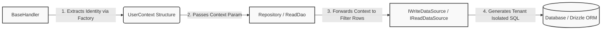

## Data Persistence Layers: Repository and ReadDao Primitives

The data persistence layer in Xeno segregates structural modification mechanisms
from idempotent data streaming queries. By separating data layers under distinct
architectural abstractions, the framework satisfies Command-Query Responsibility
Segregation (CQRS) boundaries while keeping pure domain models isolated from
persistent data-store mechanisms.

---

## Understanding the Architectural Differences Between Repository and ReadDao

The Repository and ReadDao primitives in Xeno separate command data mutation
from query data retrieval paths. While the Repository manages complete create,
read, update, and delete (CRUD) lifecycles for write models, the ReadDao acts as
a read-only data access object configured strictly to optimize data retrieval
paths.

Xeno splits data storage mechanics into two abstract classes located behind
explicit domain-layer interfaces to optimize operations across data layers:

- **Repository<T, TDto>** — An abstract base class designed for handling
  write-heavy mutations and state updates. It handles persistence logic for
  domain aggregates, interfacing with an `IWriteDataSource<TDto>` to commit,
  modify, or erase physical database rows.

- **ReadDao<T, TDto>** — An abstract data access object engineered exclusively
  for read-only querying operations. It utilizes an `IReadDataSource<TDto>` and
  sidesteps complex transactional block overhead to optimize retrieval paths and
  support heavy read workloads.

### Key-Value Specification of Exposed Interface Methods

- **findById(id, ctx, signal)** — Exposed by **both** abstractions. Resolves a
  single entity by its primary key, receiving an explicit `UserContext` to
  validate multi-tenant visibility parameters.

- **findAll(ctx, signal)** — Exposed by **both** abstractions. Streams every
  matched entity slice from the target persistence client under the rules of the
  current contextual envelope.

- **save(entity, signal)** — Exposed **exclusively** by `Repository`. Maps a
  domain entity into its equivalent database Data Transfer Object (DTO) before
  inserting it into the primary tables.

- **update(id, entity, ctx, signal)** — Exposed **exclusively** by `Repository`.
  Applies partial domain modifications to targeted rows while preserving tenant
  context parameters.

- **delete(entity, ctx, signal)** — Exposed **exclusively** by `Repository`.
  Permanently severs a targeted data row from the storage database engine.

---

## Retrieving and Propagating UserContext Safely Across Layers

Propagating UserContext through application layers preserves multi-tenant data
isolation and security constraints across asynchronous boundaries. Handlers
extract strongly-typed identity footprints using specialized context factories,
forwarding the resulting context envelope down through repository boundaries
directly to underlying database data sources.

The `UserContext` envelope carries the client's identity parameters across
application layers to prevent cross-tenant data pollution:

```typescript
// shared/types/auth.types.ts
export interface UserContext {
  readonly userId: Optional<Guid>
  readonly tenantId: Optional<Guid>
}
```

When an inbound query or command executes within a handler (`BaseHandler`), this
metadata is extracted using the context factory and passed down to repositories
and data sources.



### Complete Flow: Propagation from Handler to DataSource

The code block below demonstrates how a handler intercepts `UserContext` via its
internal helper methods and forwards it cleanly into a `ReadDao` invocation:

```typescript
// src/application/user/handlers/find-user-query.handler.ts
import { BaseHandler, Result, type ResultType } from '@xeno/core'
import type { IReadDao, UserContext, IFactory } from '@xeno/core'
import type { UserQuery } from '../queries/user.query'
import type { User } from '../../../domain/entities/user'

export class FindUserQueryHandler extends BaseHandler<UserQuery, User> {
  constructor(
    private readonly _userDao: IReadDao<User>,
    identityFactory: IFactory<void, UserContext>,
  ) {
    super(identityFactory) // Initializes the identity provider inside the BaseHandler
  }

  public async handle(
    request: UserQuery,
    signal: AbortSignal,
  ): Promise<ResultType<User>> {
    // 1. Recover the current request context securely using the factory abstraction
    const userContext = this._getCurrentContext()

    // 2. Forward the UserContext envelope directly into the ReadDao call
    const daoResult = await this._userDao.findById(
      request.id,
      userContext,
      signal,
    )

    if (!daoResult.isOk() || !daoResult.getValueOrThrow()) {
      return Result.fail(daoResult.getErrorOrThrow())
    }

    return Result.ok(daoResult.getValueOrThrow()!)
  }
}
```

---

## Extending Data Access with Custom Domain Methods

Extending framework persistence primitives allows developers to implement
tailored database queries unique to specific business aggregates. Subclasses
inherit standard CRUD capabilities while wrapping custom domain methods that map
lower-level Data Transfer Objects into pure domain entities through type-safe
mapper implementations.

Standard CRUD interfaces are rarely sufficient for complex application
constraints. Custom query methodologies require extending the default
`Repository` or `ReadDao` classes.

### 1. Extending ReadDao with Custom Queries

```typescript
// src/infrastructure/repositories/user-read.repository.ts
import { ReadDao, type Optional } from '@xeno/core'
import type { User } from '../../domain/entities/user'
import type { UserDto } from '../schema'
import type { IUserDataSource } from '../datasources/user.read-datasource'
import type { IMapper } from '@xeno/core'

// Declare a domain interface contract to stay compliant with Clean Architecture
export interface IUserReadRepository {
  findByUserId(
    userId: string,
    signal: Optional<AbortSignal>,
  ): Promise<User | null>
}

export class UserReadRepository
  extends ReadDao<User, UserDto>
  implements IUserReadRepository
{
  constructor(
    private readonly _userDatasource: IUserDataSource,
    private readonly _userMapper: IMapper<User, UserDto>,
  ) {
    super(_userDatasource, _userMapper) // Registers the dependencies within the framework base DAO
  }

  // Implementation of a specialized database retrieval query
  public async findByUserId(
    userId: string,
    signal: Optional<AbortSignal>,
  ): Promise<User | null> {
    const userDto = await this._userDatasource.findByUserId(userId, signal)

    if (!userDto) {
      return null
    }

    // Leverage the mapper contract to hand a pure domain entity back to the application layer
    return this._userMapper.toEntity(userDto)
  }
}
```

### 2. Extending Repository with Custom Operations

```typescript
// src/infrastructure/repositories/user-write.repository.ts
import { Repository, type Optional, type UserContext } from '@xeno/core'
import type { User } from '../../domain/entities/user'
import type { UserDto } from '../schema'
import type { IWriteDataSource, IMapper } from '@xeno/core'

export class UserWriteRepository extends Repository<User, UserDto> {
  constructor(
    private readonly _writeDatasource: IWriteDataSource<UserDto>,
    private readonly _userMapper: IMapper<User, UserDto>,
  ) {
    super(_writeDatasource, _userMapper) // Propagates write dependencies upwards
  }

  // Implementation of a state-mutation override that relies on tenant boundaries
  public async checkAccountAvailability(
    email: string,
    ctx: UserContext,
    signal: Optional<AbortSignal>,
  ): Promise<boolean> {
    const matchedRecord = await this._writeDatasource.findById(
      email,
      ctx,
      signal,
    )
    return matchedRecord === undefined
  }
}
```

---

## Registering Data Primitives within the Bootstrap Cycle

Registering persistence components within the AppBuilder bootstrap cycle relies
on explicit scoped factory chains to prevent connection pollution. Mapping data
sources, mappers, and repositories under unique injection tokens ensures that
data layers resolve within matching transactional unit-of-work boundaries.

Persistence layers scale cleanly when objects are mapped using **Scoped
Lifetimes**. This strategy guarantees that dependencies created during an active
execution thread (such as an active database transaction pool) remain unified
across that specific operation loop.

```typescript
// src/infrastructure/bootstrap.ts
import { AppBuilder, TOKENS } from '@xeno/core'
import { UserMapper } from './mappers/user.mapper'
import { UserDataSource } from './datasources/user.datasource'
import { UserWriteRepository } from './repositories/user-write.repository'
import type { AppRegistry } from './infrastructure/app-registry'

export const bootstrap = async () => {
  const builder = new AppBuilder<AppRegistry>()

  builder
    .addContext()
    .addDb((opts, config) => {
      opts.connectionString = config.getOrThrow('DATABASE_URL') // Mounts database pool variables
    })
    .addServices((services) => {
      // 1. Register the application data mapper utility
      services.addScoped('USER_MAPPER_TOKEN', () => new UserMapper())

      // 2. Register the specific database Drizzle Data Source client
      services.addScoped('USER_DS_TOKEN', (container) => {
        return new UserDataSource(container.resolve(TOKENS.DB_CONTEXT))
      })

      // 3. Register the concrete Repository tied to your AppRegistry token signatures
      services.addScoped('USER_REPOSITORY', (container) => {
        return new UserWriteRepository(
          container.resolve('USER_DS_TOKEN'),
          container.resolve('USER_MAPPER_TOKEN'),
        )
      })
    })

  return await builder.build()
}
```

---

## Support Us

Xeno is an MIT-licensed open source project. It can grow thanks to the support
of these awesome people. If you'd like to join them, please read more at
[support section](../support-us)
