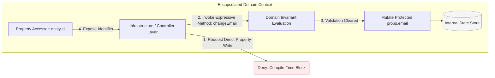

## Modeling Domain Entities with the Entity Primitive

Within Domain-Driven Design (DDD), an entity represents a business object
defined not by its transitory data attributes, but by a continuous thread of
identity. Xeno provides an explicit **Entity** abstract base class to help
developers build pure domain models that encapsulate business logic and protect
structural invariants independently of persistence frameworks.

---

## Extending the Abstract Entity Base Class

Extending the Xeno abstract Entity class establishes a stateful domain model
with a persistent identity context. It binds mutable or immutable property
schemas using TypeScript generics, separating pure core enterprise business
rules from persistent data transfer objects and database-specific identifiers.

To create a domain entity, a developer must define a structural interface
representing the entity's internal properties (`Props`). This interface is then
passed as a generic argument to the `Entity<TProps>` base class. The entity
constructor requires these properties and can optionally accept a pre-existing
`UniqueId` token—useful when rehydrating existing records from a persistent SQL
database or remote datasource.

### Programmatic Implementation of a Domain Entity

The following code illustrates how to inherit from the `Entity` base class to
model a domain object:

```typescript
// src/domain/entities/user.ts
import { Entity, type UniqueId } from '@xeno/core'

// 1. Define the internal property state schema contract
export interface UserProps {
  name: string
  email: string
  tenantId: string
  isActive: boolean
}

// 2. Extend the abstract Entity primitive using the defined property contract
export class User extends Entity<UserProps> {
  /**
   * Constructs a new instance of the User domain entity.
   * @param props The initial structural properties of the domain model.
   * @param id An optional unique identifier token for record rehydration.
   */
  constructor(props: UserProps, id?: UniqueId) {
    super(props, id) // Propagates the properties and identity token upwards
  }
}
```

---

## Understanding Property Encapsulation and Identity Access

Accessing domain properties and identifiers in Xeno relies on strict
encapsulation methods to protect internal state patterns. The framework exposes
dedicated data retrieval hooks to output property schemas or retrieve primary
identity values safely without exposing raw internal variables to external
corruption.

The `Entity` abstraction enforces encapsulation by hiding the raw properties
object from direct mutations. This design choice ensures that external layers
cannot modify fields arbitrarily, protecting the entity from invalid states.
Instead, state transitions must be driven through intentional methods defined on
the entity class.

### Key-Value Specification of Accessor Metrics

- **id** : A read-only property that exposes the entity's unique domain-level
  identifier (`UniqueId`). It remains constant across the object's entire
  lifespan, regardless of state changes.
- **getProps()** : An explicit retrieval method that returns a shallow copy or
  read-only snapshot of the internal property state dictionary. This method is
  primarily used by mappers to translate domain states into persistent database
  DTOs.

### Interacting with Identity and Properties

The following example demonstrates how data mappers or application services read
state information from an entity instance:

```typescript
// src/infrastructure/mappers/user.mapper.ts
import type { IMapper } from '@xeno/core'
import type { UserDto } from '../schema'
import { User, type UserProps } from '../../domain/entities/user'

export class UserMapper implements IMapper<User, UserDto> {
  public toDto(entity: User): UserDto {
    // Extract a read-only snapshot of internal properties safely
    const props = entity.getProps() // Returns the UserProps object contract

    return {
      id: entity.id, // Access the persistent UniqueId property directly
      name: props.name,
      email: props.email,
      tenantId: props.tenantId,
      isActive: props.isActive,
    }
  }

  public toEntity(dto: UserDto): User {
    const props: UserProps = {
      name: dto.name,
      email: dto.email,
      tenantId: dto.tenantId,
      isActive: dto.isActive,
    }
    // Rehydrate the domain entity using its persistent primary key identifier
    return new User(props, dto.id)
  }
}
```

---

## Implementing Custom Domain Methods and Invariants

Implementing custom domain behaviors allows developers to embed state validation
rules and transactional transitions within the entity boundary. This layout
maintains encapsulation by ensuring all state alterations execute exclusively
via explicit, intention-revealing methods that safeguard business invariants
natively.

Entities should never be anemic collections of getters and setters. Instead,
they should capture real-world operational workflows through domain methods.
Because the internal `props` dictionary is protected, state mutations are driven
by intention-revealing methods that validate constraints before updating
internal fields.

### Encapsulating Domain Actions and State Mutations

The updated model below implements specific business rules, restricting direct
data overwrites from outside layers:

```typescript
// src/domain/entities/user.ts
import { Entity, AppError } from '@xeno/core'
import type { UserProps } from './user'

export class User extends Entity<UserProps> {
  /**
   * Constructs a new instance of the User domain entity.
   * @param props The initial structural properties of the domain model.
   * @param id An optional unique identifier token for record rehydration.
   */
  constructor(props: UserProps, id?: UniqueId) {
    super(props, id) // Propagates the properties and identity token upwards
  }

  // Expose specific read-only access flags if required by domain rules
  public get email(): string {
    return this.getProps().email
  }
}
```

### Architectural Layout: State Modification Isolation

The diagram below outlines the structural boundary of a domain entity,
highlighting how external infrastructure layers are barred from direct state
mutation and must route all modifications through public domain workflows:



## Translating Domain States Using the IMapper Contract

The IMapper interface handles data translation between rich domain entities and
underlying database Data Transfer Objects (DTOs). By providing type-safe
mechanisms for full serialization, domain hydration, and partial DTO
transformations, it isolates business models from persistent storage constraints
and schema layouts.

To maintain an unpolluted domain model, entities must never be directly exposed
to database drivers or network transport protocols. Instead, the application
layer utilizes data mapping components to translate structural states across
persistence boundaries. The framework models these transformations via the
generic `IMapper<TEntity, TDto>` contract, forcing explicit implementation of
bidirectional conversion routines.

### Key-Value Specification of IMapper Operations

- **toEntity(dto)** — Enforces domain hydration by transforming a flat database
  DTO record back into a stateful, fully encapsulated domain entity equipped
  with its persistent identity token.

- **toDto(entity)** — Handles outward domain serialization, converting a live
  entity instance into an immutable data transport contract suitable for
  persistent storage engines.

- **toPartialDto(partialEntity)** — Manages incremental state changes, accepting
  an item containing partial entity overrides and mapping them safely to partial
  DTO database mutation schemas.

### Programmatic Implementation of a Complete Data Mapper

The following implementation demonstrates how a concrete mapper satisfies the
`IMapper` specification by coordinating bidirectional translation for the `User`
aggregate:

```typescript
// src/infrastructure/mappers/user.mapper.ts
import type { IMapper } from '@xeno/core'
import type { UserDto } from '../db/schema'
import { User, type UserProps } from '../../domain/entities/user'

export class UserMapper implements IMapper<User, UserDto> {
  /**
   * Transforms a persistent database record DTO into an active Domain Entity.
   * @param dto The raw table row layout structure recovered from the database.
   */
  public toEntity(dto: UserDto): User {
    const props: UserProps = {
      name: dto.name,
      email: dto.email,
      tenantId: dto.tenantId,
      isActive: dto.isActive ?? true,
    }

    // Instantiate and hydrate the domain entity alongside its primary key identifier
    return new User(props, dto.id)
  }

  /**
   * Serializes a live Domain Entity into an immutable table record DTO.
   * @param entity The live domain model instance containing active invariants.
   */
  public toDto(entity: User): UserDto {
    const props = entity.getProps()

    return {
      id: entity.id, // Maps the domain UniqueId parameter directly to the primary table key
      name: props.name,
      email: props.email,
      tenantId: props.tenantId,
      isActive: props.isActive,
      createdAt: new Date(),
    }
  }

  /**
   * Maps partial domain modifications to partial DTO database columns.
   * Useful for targeted SQL row PATCH or UPDATE operations.
   * @param entity A partial representation containing modified entity attributes.
   */
  public toPartialDto(entity: Partial<User>): Partial<UserDto> {
    // If the entity provides an explicit state getter, unpack it; otherwise fallback safely
    const props = entity.getProps
      ? entity.getProps()
      : ({} as Partial<UserProps>)

    return {
      name: props.name,
      email: props.email,
      userId: entity.id,
      tenantId: props.tenantId,
      isActive: props.isActive,
    }
  }
}
```

---

## Registering the Data Mapper Subsystem via AppBuilder

Data mappers are registered programmatically within the AppBuilder bootstrap
lifecycle configuration cycle using explicit injection tokens. Mapping these
compilation utilities under a request-scoped lifecycle ensures seamless
availability across repository boundaries and handling loops while maintaining
strict type safety within the dependency injection container.

Because data mappers are stateless utility components, they are typically
registered using a **Scoped Lifetime** or a **Singleton Lifetime** inside the
host orchestration sequence. Mapping mappers via scoped factories ensures they
resolve smoothly whenever downstream persistence engines (such as a `Repository`
or `ReadDao`) demand mapping conversions within a transactional unit of work
boundary.

### Integrating Data Mappers inside Bootstrapping

To register data mappers, attach their factory initializers inside the
`.addServices()` configuration sequence on your application builder host loop:

```typescript
// src/infrastructure/bootstrap-mapping.ts
import { AppBuilder } from '@xeno/core'
import { UserMapper } from './mappers/user.mapper'
import { UserWriteRepository } from './repositories/user-write.repository'
import type { AppRegistry } from './xeno-registry/app-registry'

export const bootstrap = async () => {
  const builder = new AppBuilder<AppRegistry>()

  builder
    .addContext()
    .addDb((opts, config) => {
      opts.connectionString = config.getOrThrow('DATABASE_URL')
    })
    .addServices((services) => {
      // 1. Register the structural data mapper as a reusable scoped utility
      services.addScoped('USER_MAPPER_TOKEN', () => new UserMapper())

      // 2. Inject the registered mapper directly into downstream repository boundaries
      services.addScoped('USER_REPOSITORY', (container) => {
        // Resolve structural dependencies straight out of the IoC container
        const dataSource = container.resolve('USER_DS_TOKEN')
        const mapper = container.resolve('USER_MAPPER_TOKEN') // Pulls the UserMapper instance safely

        return new UserWriteRepository(dataSource, mapper)
      })
    })

  return await builder.build()
}
```
