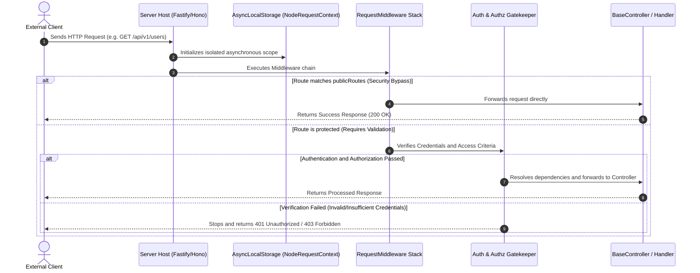

## Request Lifecycle Management through Middleware

Within a decoupled software architecture, the management of cross-cutting
concerns—such as security, traceability, and data formatting—requires a robust
and efficient interception system. Xeno addresses this need through an
integrated middleware stack, capable of operating upstream of application
controllers.

---

## Understanding the Framework's Middleware Architecture

A middleware in Xeno is an interception component positioned within the request
execution pipeline. It analyzes, validates, or enriches the metadata of incoming
transport packets, isolating the asynchronous execution context before the
request reaches application controllers.

The system is based on an ordered execution sequence defined as the **middleware
execution stack**. When an HTTP message or transaction reaches the server, the
module intercepts the request and performs fundamental infrastructure tasks. The
primary responsibility of the system middleware is to initialize the
asynchronous execution context, binding it to the current transaction through
**asynchronous local storage** (ALS). This isolation prevents memory collisions
between concurrent requests and enables the resolution of services with a
**request-scoped lifecycle** in complete safety.

### Flow Diagram: Request Interception and Routing

The following sequence diagram shows how an HTTP request passes through the
middleware stack and how the presence of exclusion criteria for public routes is
evaluated:



---

## Registering Middleware through AppBuilder

Middleware registration takes place programmatically by invoking the fluent
`addMiddlewares` method on the AppBuilder instance. This inserts the middleware
module into the bootstrap lifecycle with execution priority three, ensuring
context tracking initialization before CQRS and database module loading.

Initializing middleware through **AppBuilder** does not require complex manual
configurations in the IoC container. By using the fluent interface, the
framework takes care of registering the required services, including context
factories and routing engines, automatically configuring the internal setup
according to the active project dependencies.

### Programmatic Registration Flow

To register middleware and configure the application's global behavior, the
`.addMiddlewares()` method is used in combination with the `SetupAction`
pattern:

```typescript
// src/main.ts
import { AppBuilder } from '@xeno/core'
import type { AppRegistry } from './infrastructure/xeno-registry/app-registry'

async function bootstrap() {
  const builder = new AppBuilder<AppRegistry>()

  builder
    // 1. Enables isolated request state management
    .addContext()

    // 2. Registers and configures the system middleware stack
    .addMiddlewares()

    // 3. Registers application services in the DI container
    .addServices((container) => {
      // Custom client module registrations
    })

  const container = await builder.build()
  return container
}
```

---

## Configuring Public Routes Exempt from Authentication and Authorization

Public routes that exclude security checks are configured by passing a
SetupAction callback to the `addMiddlewares` method. By defining the
`publicRoutes` array inside the configuration file, the developer exempts
specific endpoints from authentication and authorization gatekeeper checks.

In many enterprise applications, certain endpoints (e.g. system health
monitoring, external webhooks, or public pages) must be accessible without
requiring authorization tokens or session credentials. Xeno provides an explicit
exclusion mechanism to bypass security checks configured at the infrastructure
level.

### Practical Configuration of Exclusions (`publicRoutes`)

Through the `MiddlewareConfig` configuration object exposed in the
`addMiddlewares` callback, it is possible to define an array of route objects to
exclude from gatekeeper checks:

```typescript
// src/infrastructure/bootstrap.ts
import { AppBuilder } from '@xeno/core'
import type { AppRegistry } from './xeno-registry/app-registry'

export async function initializeApplication() {
  const builder = new AppBuilder<AppRegistry>()

  builder.addContext().addMiddlewares((config, env) => {
    // Explicit definition of endpoints exempt from security checks
    config.publicRoutes = {
      // Allows public access to the main authentication endpoint
      '/api/v1/auth/login': { POST: 'isPublic' },
      '/api/v1/auth/register': { POST: 'isPublic' },
    }
  })

  const container = await builder.build()
  return container
}
```
