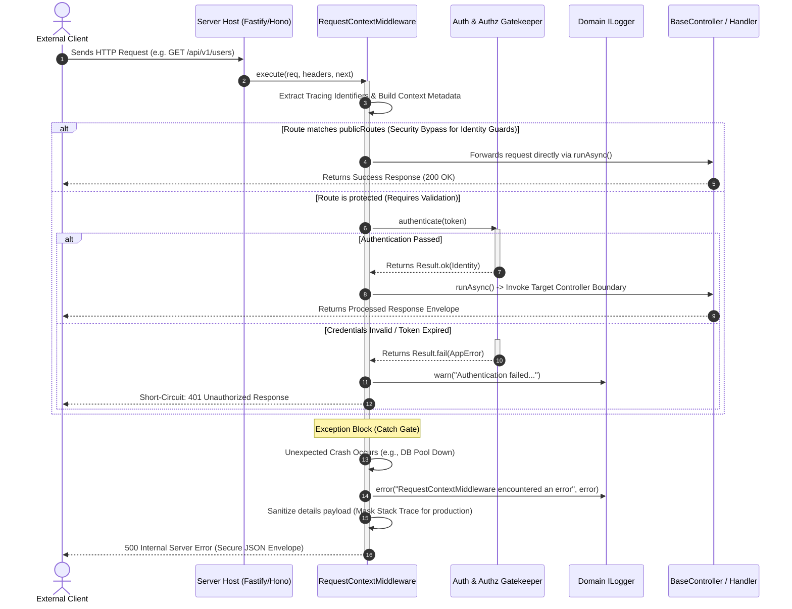

## Request Lifecycle Management through Middleware

Within a decoupled software architecture, the management of cross-cutting
concerns such as security, traceability, and data formatting requires a robust
and efficient interception system. Xeno addresses this need through an
integrated middleware stack, capable of operating upstream of application
controllers.

## Understanding the Framework's Middleware Architecture

A middleware in Xeno is an interception component positioned within the request
execution pipeline. It analyzes, validates, or enriches the metadata of incoming
transport packets, isolating the asynchronous execution context before the
request reaches application controllers.

The system is based on an ordered execution sequence defined as the **middleware
execution stack**. When an HTTP message or transaction reaches the server, the
module intercepts the request and performs fundamental infrastructure tasks.

The primary responsibility of the system middleware (`RequestContextMiddleware`)
is to initialize the asynchronous execution context, binding it to the current
transaction through **asynchronous local storage** (ALS). This isolation
prevents memory collisions between concurrent requests and enables the
resolution of services with a **request-scoped lifecycle** in complete safety.

### Injected Dependencies within the Core MiddlewareStack

To enforce structural decoupling, `RequestContextMiddleware` consumes only
domain-level and core infrastructural abstractions via constructor injection:

- **IMatcher** (`ROUTE_MATCHER`): Evaluates whether incoming HTTP methods and
  request paths map to open endpoints.
- **IRequestContext**: The AsyncLocalStorage engine wrapped to orchestrate
  asynchronous execution context streams.
- **IServiceExtractor**: Parses raw HTTP header maps to isolate correlation
  metadata and tracing span identifiers.
- **IGateKeeper**: Evaluates cryptographic tokens against identity repositories
  to materialize user profiles.
- **ILogger**: Explicit domain logging service utilized to capture
  infrastructure faults without pollution.

### Flow Diagram: Request Interception and Routing

The following sequence diagram shows how an HTTP request passes through the
middleware stack, emphasizing the security gates, the logging interception
points, and the production error masking strategy:



## Registering Middleware through AppBuilder

Middleware registration takes place programmatically by invoking the fluent
`addMiddlewares` method on the AppBuilder instance. This inserts the middleware
module into the bootstrap lifecycle with execution priority three, ensuring
context tracking initialization before CQRS and database module loading.

### Programmatic Registration Flow

To register middleware and configure the application's global behavior, the
`.addMiddlewares()` method is used in combination with the `SetupAction`
pattern:

```typescript
// src/main.ts
import { AppBuilder } from '@xeno/core'
import type { AppRegistry } from './infrastructure/xeno-registry/app-registry'

async function bootstrap() {
  const builder = new AppBuilder<AppRegistry>()
  builder
    // 1. Enables isolated request state management
    .addContext()
    // 2. Registers and configures the system middleware stack
    .addMiddlewares()
    // 3. Registers application services in the DI container
    .addServices((container) => {
      // Custom client module registrations
    })

  const container = await builder.build()
  return container
}
```

## Configuring Public Routes Exempt from Identity Guards

Public routes that exclude security checks are configured by passing a
`SetupAction` callback to the `addMiddlewares` method. By defining the
`publicRoutes` dictionary inside the bootstrap chain, the developer exempts
specific endpoints from mandatory `userId` and `tenantId` authorization checks.

In many enterprise applications, certain endpoints (e.g., system health
monitoring, external webhooks, or public portals) must be accessible without
requiring authorization tokens or session credentials. Xeno provides an explicit
exclusion mechanism to bypass baseline identity presence validation hooks.

### Practical Configuration of Exclusions (`publicRoutes`)

Through the `MiddlewareConfig` configuration object exposed in the
`addMiddlewares` callback, it is possible to define an array of route objects to
exclude from gatekeeper checks:

```typescript
// src/infrastructure/bootstrap.ts
import { AppBuilder } from '@xeno/core'
import type { AppRegistry } from './infrastructure/app-registry'

export async function initializeApplication() {
  const builder = new AppBuilder<AppRegistry>()

  builder.addContext().addMiddlewares((config, env) => {
    // Explicit definition of endpoints exempt from baseline security checks
    config.publicRoutes = {
      // Allows public access to the main authentication endpoint
      '/api/v1/auth/login': { POST: 'isPublic' },
      '/api/v1/auth/register': { POST: 'isPublic' },
      '/api/v1/system/health': { GET: 'isPublic' },
    }
  })

  const container = await builder.build()
  return container
}
```

> [!WARNING] While active public route bypasses exempt unauthenticated requests
> from strict `userId` or `tenantId` strategy gatekeeping, other authorization
> pipelines registered on messaging boundaries (such as Role-Based or
> Permission-Based intent mappings) remain fully operational and will continue
> to evaluate the active `GUEST` claims posture.

## Production Error Masking and Defensive Auditing (CWE-209 Mitigation)

To comply with enterprise security standards, `RequestContextMiddleware`
implements an automated **Information Disclosure Mitigation Policy**.

When an unhandled exception or critical infrastructural crash occurs inside the
request execution lifecycle (e.g., database connection timeouts or system
exceptions), the framework traps the failure, logs the full stack trace securely
into internal telemetry channels, and strips away all raw technical parameters
before compiling the outward HTTP response.

### Technical Properties of Safe Error Envelopes

- **Production Environment (`process.env.NODE_ENV !== 'development'`)**:
  Outbound response envelopes hide underlying technical codes. The client
  receives a generic `500 Internal Server Error` containing a secured diagnostic
  reference string.
- **Development Environment (`process.env.NODE_ENV === 'development'`)**: The
  framework can be configured via standard dev-logging streams to expose local
  stacks directly on stdout, optimizing developer feedback loops without risking
  exposure over public enterprise endpoints.
- **Telemetry Correlationship**: The outer response envelope includes the
  unmodifiable `correlationId` and `requestId` parameters. Calling actors can
  provide this correlation hash to system administrators to map lookups across
  distributed log aggregators without revealing systemic vulnerabilities.

---

## Support Us

Xeno is an MIT-licensed open source project. It can grow thanks to the support
of these awesome people. If you'd like to join them, please read more at
[support section](../support-us)
