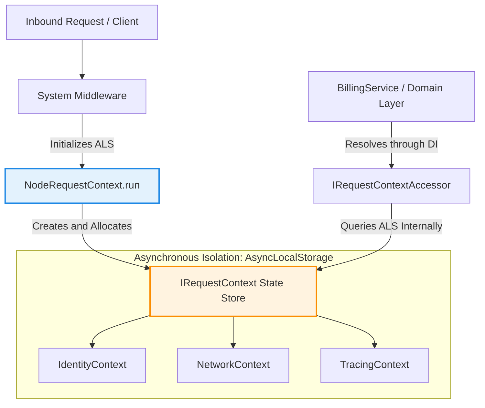

## Asynchronous Context Isolation with NodeRequestContext

Within modern, highly concurrent server applications, maintaining
request-specific state (such as user identity, tenant identifier, or tracing
data) throughout the entire asynchronous call chain represents a complex
architectural challenge. Xeno solves this problem natively through the
**NodeRequestContext** class, leveraging the asynchronous mechanisms of the
Node.js runtime.

---

## Understanding How NodeRequestContext Works

NodeRequestContext is the execution context management engine in Xeno that uses
Node.js AsyncLocalStorage. It safely isolates request-specific data for each
asynchronous request across all architectural layers, eliminating the need to
pass context parameters through method signatures.

Unlike traditional "parameter drilling", where every interface or service must
accept a `context` object among its arguments, `NodeRequestContext` stores the
current state directly inside Node.js thread's asynchronous execution store.
This allows any module, domain service, or repository to query the context at
any point during the request lifecycle, keeping interfaces clean and focused
exclusively on their business responsibilities.

### Data Propagation Flow in the Asynchronous Context

The flow diagram below illustrates how context state is inserted into the
asynchronous boundary and safely retrieved by lower architectural layers.



---

## How to Automatically Register the Context with AppBuilder

Automatic context registration takes place through the fluent `addContext`
method on the AppBuilder instance. This call instantiates the ContextModule with
execution priority zero, configuring lifecycle factories inside the
ServiceContainer and attaching asynchronous local storage to the pipelines and
system middleware.

Context activation is a centralized operation that declares the presence of
isolation services within the application's bootstrap lifecycle. The following
example shows how to activate the module inside the framework bootstrap file:

```typescript
// src/main.ts
import { AppBuilder } from '@xeno/core'
import type { AppRegistry } from './infrastructure/xeno-registry/app-registry'

async function bootstrap() {
  const builder = new AppBuilder<AppRegistry>()

  builder
    // 1. Automatically registers the ContextModule in the ServiceContainer
    .addContext()

    // 2. Configures the remaining dependent modules
    .addMiddlewares()
    .addLogger()

  const container = await builder.build()
  return container
}
```

If the developer registers middleware or CQRS pipelines without explicitly
invoking `.addContext()`, the **AppBuilder** will detect the missing dependency
and execute the registration safely internally, preventing bootstrap failures
caused by missing resources in the IoC container.

---

## Detailed Structure of the Xeno Execution Context

The Xeno execution context is structured into specialized sub-contexts that
describe the entire transaction. Structured through formal contracts, it
includes the Identity interface for security authorization, the NetworkContext
for network routing profiles, the TracingContext for distributed observability,
and the MessagingContext for asynchronous messaging flows.

The main `RequestContext` interface unifies access to these different aspects of
execution state, organizing them according to precise logical categories for
cross-layer interaction:

```typescript
// src/domain/contracts/context/context_types/request-context.types.ts
import type { Maybe } from '@/shared'
import type { Identity } from './identity-context.types'
import type { MessagingContext } from './messaging-context.types'
import type { NetworkContext } from './network-context.types'
import type { TracingContext } from './tracing-context.types'

export interface RequestContext {
  readonly identity: Identity
  readonly network: NetworkContext
  readonly tracing: TracingContext
  readonly messaging?: Maybe<MessagingContext>
}
```

### Inner Abstraction Sub-Interfaces

To understand the fine-grained data layout, the core sub-interfaces expose the
following explicit type specifications:

```typescript
import type { Guid, Optional } from '@/shared'

export interface Identity {
  readonly userId: Optional<Guid>
  readonly tenantId: Optional<Guid>
  readonly roles: Optional<string[]>
  readonly permissions: Optional<string[]>
}

export interface NetworkContext {
  readonly requestId: Guid
  readonly clientIp: Optional<string>
  readonly userAgent: Optional<string>
  readonly formatIndicator: Optional<string>
  readonly path: Optional<string>
  readonly isPublic: boolean
}

export interface TracingContext {
  readonly correlationId: Guid
  readonly startTime: number
  readonly spanId: Optional<string>
  readonly parentSpanId: Optional<string>
}

export interface MessagingContext {
  readonly returnAddress: Optional<string>
  readonly expiration: Optional<number>
  readonly sequence: Optional<MessageSequence>
}

export interface MessageSequence {
  readonly sequenceId: Optional<string>
  readonly position: Optional<number>
  readonly size: Optional<number>
}
```

---

## Semantic Structure of Context Data

- **Identity Context** — Encapsulates the token-extracted user properties,
  including the `userId` and the logical partitioning `tenantId`.

- **Network Context** — Captures the atomic transport attributes of the packet,
  such as `clientIp`, `path`, and the content negotiation `formatIndicator`.

- **Tracing Context** — Manages system-wide telemetry metadata, exposing the
  root `correlationId` and operational `startTime` performance metrics.

- **Messaging Context** — Maps transient transaction metadata for event-driven
  boundaries, storing sequence data and message expirations.

---

## Accessing Contexts and Injecting Context Accessors

Xeno avoids exposing raw execution contexts or native Node.js asynchronous
primitives directly to application services. Instead, the framework segregates
access by registering granular, single-responsibility **Accessor Interfaces** as
Singletons via the `ContextModule`.

### The Core Context Accessors Exposed by the Framework

The framework automatically configures and binds four distinct context accessor
interfaces to the central asynchronous context engine:

- **IContextAccessor`<RequestContext>`** — (TOKENS.CONTEXT_ACCESSOR) Exposes the
  method `getContext()`, which returns the comprehensive
  `Optional<RequestContext>` wrapper for complete transaction tracking.

- **IIdentityAccessor** — (TOKENS.IDENTITY_ACCESSOR) Exposes the method
  `getIdentity()`, returning an `Optional<Identity>` object to extract
  authorization scopes, roles, and user identifiers.

- **INetworkContextAccessor** — (TOKENS.NETWORK_CONTEXT_ACCESSOR) Exposes the
  method `getNetworkContext()`, returning an `Optional<NetworkContext>`
  structure for accessing transport metrics and client IP information.

- **IServiceScopeAccessor** — (TOKENS.SERVICE_SCOPE_ACCESSOR) Exposes the method
  `getScope()`, enabling internal infrastructure layers to resolve nested
  dependencies within the active request lifetime boundary.

### Injection and Usage in Domain Services

By registering these decoupled accessors inside the root dependency container,
any service can demand a specific, granular context interface within its
constructor. This maintains domain-layer purity and eliminates direct coupling
to runtime-specific components.

The following architectural layout demonstrates how to bootstrap application
services with the framework accessors, followed by their internal domain
consumption:

```typescript
// src/infrastructure/bootstrap.ts
import { AppBuilder, TOKENS } from '@xeno/core'
import { BillingService } from '@/domain/services/billing.service'
import type { AppRegistry } from './infrastructure/app-registry'

async function bootstrap() {
  const builder = new AppBuilder<AppRegistry>()

  builder
    .addContext() // Implicitly wires TOKENS.IDENTITY_ACCESSOR and TOKENS.CONTEXT_ACCESSOR
    .addServices((container) => {
      // Injecting the decoupled accessor interface token directly into the service factory
      container.addScoped('BILLING_SERVICE', (c) => {
        return new BillingService(c.resolve(TOKENS.IDENTITY_ACCESSOR))
      })
    })

  return await builder.build()
}
```

```typescript
// src/domain/services/billing.service.ts
import type { IIdentityAccessor } from '@xeno/core'

export class BillingService {
  // The framework's static identity accessor is cleanly injected into the constructor boundary
  constructor(private readonly _identityAccessor: IIdentityAccessor) {}

  public async processInvoice(amount: number): Promise<void> {
    const identity = this._identityAccessor.getIdentity()

    if (!identity || !identity.tenantId) {
      throw new Error(
        'Execution Failed: Tenant identifier not detected in asynchronous context.',
      )
    }

    const currentUserId = identity.userId ?? 'SYSTEM'

    console.log(
      `[Billing] Processing invoice of €${amount} for Tenant ID: ${identity.tenantId}`,
    )
    console.log(`[Audit] Operation started by user: ${currentUserId}`)

    // Strict, tenant-isolated operations proceed safely here...
  }
}
```

---

## Support Us

Xeno is an MIT-licensed open source project. It can grow thanks to the support
of these awesome people. If you'd like to join them, please read more at
[support section](../support-us)
