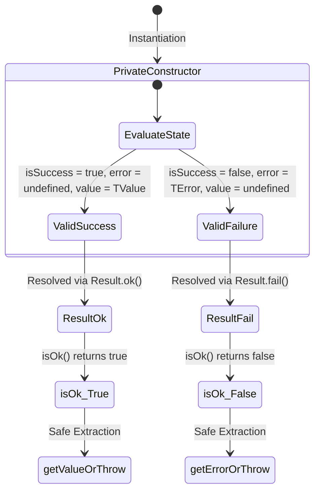

In complex, multi-layered enterprise architectures, error handling dictates the
long-term maintainability and predictability of the codebase. Xeno replaces
traditional, unstructured exception throwing with a deterministic, type-safe
functional monad pattern.

---

## Understanding the Functional Result Pattern over Exceptions (Try/Catch)

The functional Result pattern replaces implicit runtime exceptions with
explicit, typed return values in application flows. By wrapping outcomes in
deterministic success or failure envelopes, it prevents uncontrolled execution
jumps, enforces compile-time safety, and preserves clean software boundaries
across domain and application layers.

In standard Node.js applications, errors are typically propagated using the
`throw` statement. This mechanism creates several architectural vulnerabilities:

- **Lack of Interface Expressiveness** — A function's signature (e.g.,
  `processPayment(payment: Payment): Promise<Receipt>`) hides the fact that it
  can throw a `PaymentFailedException`. Upstream callers cannot determine
  potential failure modes from the compiler interface alone.
- **Uncontrolled Execution Jumps** — Throwing an error interrupts the standard
  call stack, jumping directly to the nearest catching boundary. This
  complicates resource disposal, transaction rollbacks, and log tracing.
- **Fragile Error Handling** — Catch blocks operate on the unconstrained
  `unknown` type in TypeScript. Determining the exact nature of the error
  requires brittle runtime type guarding (e.g., `instanceof`), which is prone to
  breaking during refactoring.

Xeno strongly discourages using `try/catch` blocks for expected business rule
violations (such as validation failures, resource conflicts, or unauthorized
operations). Exceptions should be reserved exclusively for unpredictable system
catastrophes, such as database socket disconnections or out-of-memory states.
All domain and application-level outcomes are modeled explicitly as returned
data values.

---

## Navigating the Structural Design of the Result Class

The Xeno Result class represents a generic monad designed to encapsulate either
a successful value or a typed failure error. Its private constructor prevents
direct instantiation, routing creation through static ok and fail factory
methods to guarantee structurally sound, immutably bound execution states.

The `Result<TValue, TError = never>` class defines three core read-only
properties that represent the state of an operation:

- **\_isSuccess** — A boolean flag stating whether the operation succeeded.
- **\_value** — An optional property containing the successful payload
  (`TValue`).
- **\_error** — An optional property containing the failure state (`TError`).

### State Machine of the Result Monad

The following diagram illustrates how the private constructor and static
factories ensure that a `Result` instance is always in a mathematically valid
state, holding either a success value or a failure error—never both, and never
neither.



---

## Representing Application Failures with AppError

AppError is an explicit, domain-specific exception representation extending the
native Javascript Error class. It integrates custom error keys, standard status
codes, and machine-readable error constants, constructed through expressive
static factory builders to facilitate standardized diagnostic reporting and
structured client responses.

The `AppError` class extends the built-in JavaScript `Error` class while
introducing structure suitable for API and application-level diagnostics:

- **code** — A standardized, uppercase string identifier (e.g.,
  `VALIDATION_FAILED`, `NOT_FOUND`) used by client applications to determine
  programmatic error handling logic.
- **status** — An integer representing the appropriate HTTP status code (e.g.,
  `400`, `401`, `403`, `404`, `409`) associated with the failure context.
- **cause** — An optional inner field used to trap the raw technical execution
  error (e.g., a database connection error) without leaking technical details to
  external clients.
- **custom dictionary keys** — Supports dynamic index signatures
  (`[key: string]: unknown`) to attach contextual payloads, such as fields that
  failed validation.

### Instantiating AppError via Static Factories

`AppError` provides several predefined static builders to ensure consistent
error payloads across modules:

```typescript
import { AppError } from '@/domain/errors/app-error'

// Creating a Not Found error
const userNotFoundError = AppError.notFound(
  'UserService',
  'The requested user account does not exist.',
)

// Creating a Validation error
const validationError = AppError.validationError(
  'UserRegistration',
  'The provided email address format is invalid.',
)

// Creating an unauthorized error with automatic WWW-Authenticate headers
const unauthorizedError = AppError.unauthorized(
  'AuthenticationService',
  'Invalid or expired access token provided.',
)
```

---

## Defining Explicit Types with ResultType

ResultType is a generic utility type mapping successful responses directly to
AppError failures as the default runtime error format. It streamlines functional
method signatures throughout application layers, offering clean, cohesive type
contracts that automatically enforce standardized error-handling policies across
distinct operational boundaries.

In most standard application services, failure modes are represented by the
`AppError` class. Rather than repeatedly writing verbose generic contracts like
`Result<User, AppError>`, the framework exports a simplified utility type:

```typescript
// src/domain/results/result.types.ts
import type { AppError } from '../errors/app-error'
import type { Result } from './result'

export type ResultType<T, E = AppError> = Result<T, E>
```

This type automatically defaults the error type parameter `E` to `AppError`,
simplifying service and repository signatures across application layers:

```typescript
import type { ResultType } from '@/domain/results/result.types'
import type { User } from '@/domain/entities/user'

export interface IUserService {
  // Signature is clean, self-documenting, and type-safe
  registerUser(dto: RegisterUserDto): Promise<ResultType<User>>
}
```

---

## Returning Successful Operations with Result.ok

Returning successful outcomes with Result.ok encapsulates the returned data
model in a read-only, immutable success envelope. This functional factory method
maps successful computations to their matching type definitions, allowing
upstream consumers to immediately evaluate the success state before accessing
the inner payload.

When a database lookup, validation pipeline, or business command completes
successfully, you wrap the resulting entity inside a successful `Result`
instance using the static `.ok` factory method:

```typescript
// src/domain/services/user.service.ts
import { Result } from '@/domain/results/result'
import type { User } from '@/domain/entities/user'

export class UserService {
  public async getActiveUser(id: string): Promise<Result<User>> {
    const user = await this.userRepository.findById(id)

    if (!user) {
      // Handled separately as a failure branch
      return Result.fail(new Error('User not found.'))
    }

    // Wrap the entity inside a successful Result monad
    return Result.ok<User>(user)
  }
}
```

---

## Returning Failed Operations with Result.fail and ResultType

Propagating operational failures via Result.fail captures domain-specific
exceptions as typed error payloads. Combined with ResultType, this mechanism
ensures that failure branches enforce standard AppError validation structures,
equipping application handlers with the exact contextual schema required to
translate errors into structured responses.

When handling operational failures, choose between returning a custom error type
via raw `Result.fail` or a standardized application exception via `ResultType`.

### 1. Returning a Custom Failure with Result

This approach is useful when handling scoped domain failures that require local,
specialized error structures:

```typescript
import { Result } from '@/domain/results/result'

export interface InsufficientFundsError {
  requiredAmount: number
  currentBalance: number
  currency: string
}

export class LedgerService {
  public withdrawFunds(
    amount: number,
    balance: number,
  ): Result<number, InsufficientFundsError> {
    if (amount > balance) {
      return Result.fail<number, InsufficientFundsError>({
        requiredAmount: amount,
        currentBalance: balance,
        currency: 'EUR',
      })
    }

    const newBalance = balance - amount
    return Result.ok<number>(newBalance)
  }
}
```

### 2. Returning Standardized AppError failures with ResultType

This pattern is recommended for application boundary contracts (such as
Controllers, Handlers, or Use Cases) where failures must be mapped directly to
API communication structures:

```typescript
import { Result } from '@/domain/results/result'
import { AppError } from '@/domain/errors/app-error'
import type { ResultType } from '@/domain/results/result.types'

export class CheckoutService {
  public async processOrder(orderId: string): Promise<ResultType<string>> {
    const orderExists = await this.orderRepository.exists(orderId)

    if (!orderExists) {
      // Result.fail matches ResultType definition by enforcing AppError
      const error = AppError.notFound(
        'CheckoutService',
        `The order reservation with ID ${orderId} was not found.`,
      )

      return Result.fail<string, AppError>(error)
    }

    return Result.ok<string>('ORDER_PROCESSED')
  }
}
```

---

## Safely Extracting Payloads and Evaluating Execution States

Extracting values from a Result monad requires checking the active state via the
isOk query method. This runtime guard controls operational branch routing,
safeguarding code from execution exceptions by restricting access to payload
values or error contexts until success states are verified.

To retrieve encapsulated data, upstream consumers must check the status of the
monad via `.isOk()`. This design ensures that developers cannot access a payload
or an error without verifying the outcome status first.

### Method Extraction Mechanics

- **isOk()** — Returns `true` if the operation was successful and `_isSuccess`
  is active, otherwise returns `false`.
- **getValueOrThrow()** — Resolves and returns the inner `_value` if
  `_isSuccess` is true. Throws a hard runtime error if called on a failed
  result.
- **getErrorOrThrow()** — Resolves and returns the inner `_error` if
  `_isSuccess` is false. Throws a hard runtime error if called on a successful
  result.

### Complete Consumer Integration Example

The following implementation demonstrates how an application layer consumer
evaluates and extracts the state of a returned `ResultType` securely:

```typescript
// src/presentation/controllers/user.controller.ts
import type { UserService } from '@/application/services/user.service'
import type { HttpContext } from '@/presentation/types'

export class UserController {
  constructor(private readonly _userService: UserService) {}

  public async handleRegistration(context: HttpContext): Promise<void> {
    const dto = context.request.body

    // 1. Invoke the service returning a ResultType wrapper
    const result = await this._userService.registerUser(dto)

    // 2. Query the execution state prior to value access
    if (result.isOk()) {
      // Safe to call getValueOrThrow() now
      const registeredUser = result.getValueOrThrow()

      context.response.status(201).send({
        success: true,
        data: {
          id: registeredUser.id,
          email: registeredUser.email,
        },
      })
      return
    }

    // 3. Handle the failure state securely
    const errorPayload = result.getErrorOrThrow() // Guaranteed to be an AppError

    context.response.status(errorPayload.status).send({
      success: false,
      error: {
        code: errorPayload.code,
        message: errorPayload.message,
        details:
          errorPayload.cause instanceof Error
            ? errorPayload.cause.message
            : undefined,
      },
    })
  }
}
```
