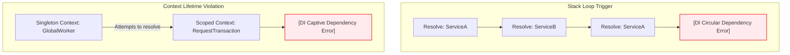

---
title:
  'ServiceContainer & Inversion of Control: Lifetimes and Resource Management'
description:
  'An architectural deep-dive into the Xeno ServiceContainer, detailing
  singleton, scoped, and transient lifetimes, core safeguards, and native
  resource disposal.'
keywords:
  [
    'ServiceContainer',
    'Inversion of Control',
    'Dependency Injection',
    'Captive Dependency Guard',
    'Circular Dependency Guard',
    'AsyncLocalStorage',
    'Resource Management',
    'AppBuilder',
  ]
author: 'Xeno'
sidebar:
  order: 2
---

## Managing Component Lifecycles with the ServiceContainer

The dependency injection subsystem of Xeno revolves around an explicit,
deterministic Inversion of Control (IoC) container. This component is
responsible for orchestrating the creation, lifecycle execution, and structured
resource disposal of all registered domain services and infrastructure modules.

---

## What is the Xeno ServiceContainer?

The Xeno ServiceContainer is a zero-magic Inversion of Control (IoC) engine
engineered for strict runtime dependency resolution. It manages instantiation
lifecycles deterministically without decorator-based metadata reflection,
utilizing explicit factory functions and static type registries to guarantee
robust, compile-time verified software architectures.

Rather than relying on directory scanning or runtime decorators that obscure
system behavior, the `ServiceContainer` implements a programmatic, factory-based
pattern. This ensures that every service creation routine is explicitly defined
by the developer. The container acts as the source of truth for the entire
dependency graph, leveraging the static definitions of `XenoRegistry` to assure
the compiler that every resolved service is type-safe and structurally sound.

### Architectural Core Concepts

- **Zero-Reflection Performance** — Because the container rejects runtime
  metadata reflection, it incurs negligible bootstrap overhead. This design
  avoids the startup penalties and high memory footprints common in large-scale
  decorator-heavy applications.
- **Deterministic Configuration** — Dependencies are constructed using simple,
  explicit factory functions. This allows developers to pass runtime
  configurations or environment parameters directly into service constructors
  using programmatic control structures.
- **Hermetic Execution Contexts** — The container is divided into root registers
  and localized scopes. By managing isolation boundaries cleanly, it prevents
  cross-request data corruption in concurrent server environments.

---

## How to Configure Service Lifetimes: Singleton, Scoped, and Transient

Xeno governs object lifetimes through three explicit registration modes:
singletons for globally shared stateless instances, scoped dependencies bound to
asynchronous request lifecycles, and transients for short-lived stateful
entities. These lifetimes prevent state pollution and optimize memory allocation
across complex application layers.

Every service registered within Xeno belongs to one of three lifecycle scopes.
Selecting the correct lifetime guarantees optimal resource usage and preserves
the integrity of state boundaries.

### Lifetime Classifications

- **Singleton Lifetime** — Instantiates a single shared object reference stored
  at the root container layer. It persists for the entire process duration and
  is ideal for stateless utilities, database connection pools, or configuration
  services.
- **Scoped Lifetime** — Restricts an instance to a specific execution context
  (e.g., an inbound HTTP transaction or queue processing thread). It relies on
  `AsyncLocalStorage` to isolate dependencies and prevents data leakage across
  requests.
- **Transient Lifetime** — Generates a completely new, unshared object instance
  on every subsequent resolution call. This mode is suited for stateful
  validation chains, data formatters, or short-lived calculations.

### Registering Lifetimes with the AppBuilder

The most common way to register services is through the fluent `addServices`
pipeline configuration block on the `AppBuilder` instance. This block exposes
the raw `IServiceContainer` and `IConfigurationService` interfaces.

```typescript
import { AppBuilder, LOG_LEVEL, TOKENS } from '@xeno/core'
import type { AppRegistry } from './registry'

// 1. Instantiating the programmatic AppBuilder
const builder = new AppBuilder<AppRegistry>()

// 2. Declaring explicit lifetime registrations
builder
  .addLogger((opts) => {
    opts.level = LOG_LEVEL.DEBUG
    opts.console = true
  })
  .addServices((container, configuration) => {
    // Registering a global Singleton dependency
    container.addSingleton('MY_DB_CLIENT', () => {
      return new PostgresDbClient(configuration.getOrThrow('DATABASE_URL'))
    })

    // Registering a Request-Scoped dependency
    container.addScoped('USER_CONTEXT', (scope) => {
      // Resolved dependencies within the same scope are shared safely
      const logger = scope.resolve(TOKENS.LOGGER)
      return new RequestUserContext(logger)
    })

    // Registering a Transient dependency
    container.addTransient('ID_GENERATOR', () => {
      return new SnowflakeIdGenerator()
    })
  })
```

---

## Understanding IoC Safeguards: Captive and Circular Dependency Detection

The ServiceContainer incorporates native validation checks that monitor the
dependency resolution stack at runtime. By utilizing asynchronous thread
isolation, the engine actively identifies recursive loops and halts execution
upon detecting captive scoped instances inside long-lived singleton scopes.

As applications grow, structural design errors can bypass static compiler
checks. To enforce clean architectural boundaries, the `ServiceContainer`
implements strict runtime validation stacks.

### Circular Dependency Detection

If service `A` requires service `B`, and service `B` recursively demands service
`A`, the application will enter an infinite stack loop. To prevent catastrophic
stack overflows, the container tracks the current execution path using a
thread-local tracking stack (`AsyncLocalStorage`).

If a token is evaluated a second time within the same active resolution chain,
the container immediately terminates execution and throws a
`[DI Circular Dependency Error]`, printing the full path of the offending loop
(e.g., `A -> B -> A`).

### Captive Dependency Prevention

A **Captive Dependency** occurs when a short-lived dependency (such as a
request-scoped database transaction handler) is injected into a long-lived
dependency (such as a singleton controller or global config service). This error
"captures" the short-lived resource, keeping it alive indefinitely and causing
connection pool exhaustion or context corruption.



The validation layer detects this state discrepancy. If a singleton factory
attempts to resolve a scoped token during construction, the system halts
execution with a `[DI Captive Dependency Error]`.

---

## Managing Scoped Resources and Graceful Scope Disposal

Resource management in Xeno relies on a programmatic disposal engine governed by
the IDisposable interface contract. Upon scope closure, the container
automatically evaluates and terminates tracked resources in reverse registration
order, ensuring leak-free connections and clean memory recycling.

When a transient or scoped resource initializes network connections, internal
file streams, or transactional state boundaries, it is critical to release those
resources once the operation completes.

### The IDisposable Contract

Services can implement the explicit `IDisposable` interface to participate in
automated cleanups:

```typescript
import type { IDisposable } from '@xeno/core'

export class MyDatabaseDisposable implements IDisposable {
  private isReleased = false

  public async commit(): Promise<void> {
    console.log('Transaction committed.')
  }

  // Mandatory implementation of the IDisposable interface
  public async dispose(): Promise<void> {
    if (this.isReleased) return

    this.isReleased = true
    console.log('Releasing database connections and resources...')
    // Execute connection closures, lock releases, and channel terminations
  }
}
```

### Deterministic Reverse-Order Disposal

When an active scope is closed (such as at the end of an HTTP request middleware
loop), the container retrieves all instantiated resources registered inside that
specific scope.

- **Sequential Execution** — The container processes tracked resources
  sequentially, minimizing unexpected execution interferences.
- **LIFO Execution Pattern** — Resources are disposed of in a Last-In, First-Out
  (LIFO) pattern. By executing disposal in reverse-order of creation, downstream
  dependencies (e.g., transactional services) are closed _before_ upstream
  dependencies (e.g., raw database connections) are severed. This pattern
  eliminates common "connection not found" or "closed socket" runtime errors
  during server shutdown.

---

## Support Us

Xeno is an MIT-licensed open source project. It can grow thanks to the support
of these awesome people. If you'd like to join them, please read more at
[support section](../support-us)
