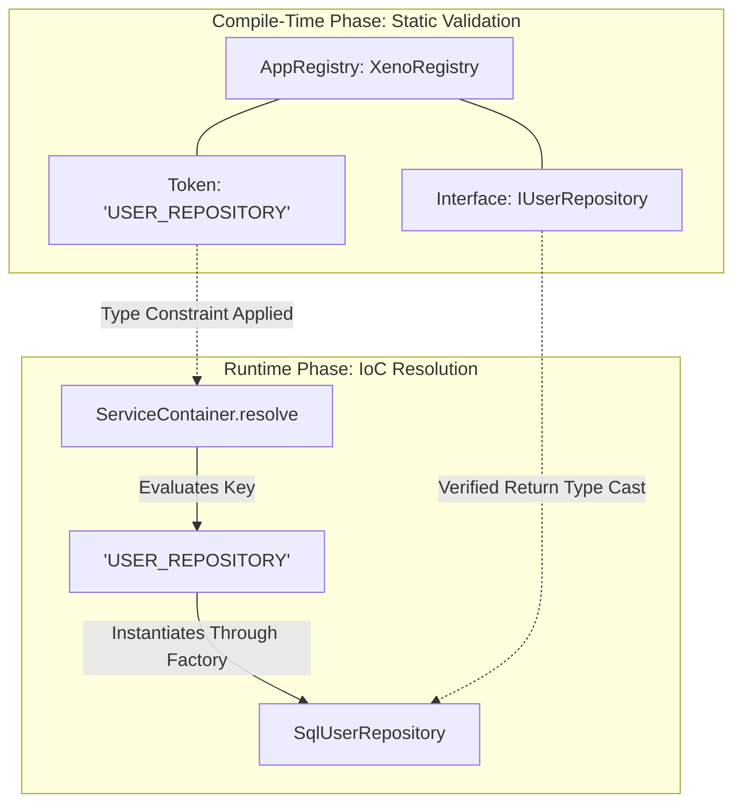
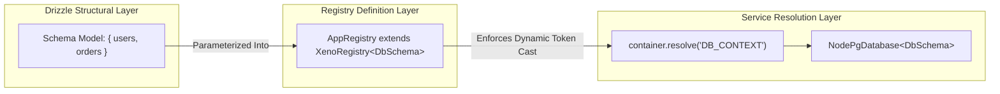

In the dependency injection design pattern, type safety represents one of the
main challenges for preventing runtime resolution failures. Xeno addresses this
issue by introducing the concept of **XenoRegistry**, a centralized contract
based exclusively on TypeScript's static type system.

---

## How XenoRegistry Works in Detail

XenoRegistry is the static type contract that defines the schema of the
ServiceContainer. By programmatically mapping injection tokens to structural
interfaces, it guarantees compile-time type safety, eliminating runtime
resolution errors and removing the need for metadata-based reflection.

Unlike other frameworks in the Node.js ecosystem that rely on experimental
decorators (`reflect-metadata`) or arbitrary strings, Xeno depends on explicit
mapping. This architectural choice removes any "implicit magic," forcing the
entire dependency graph to conform to a single interface before the code is
compiled or executed.

### Static Dependency Validation Flow

The diagram below highlights how `XenoRegistry` acts as a compile-time barrier
between the application code and the concrete resolution inside the Inversion of
Control (IoC) container.



### Key Characteristics of the Registration Model

- **Nominal Token Safety** — A type-based methodology that maps injection tokens
  to unique data structures, preventing collisions between constructors with
  similar signatures.
- **Zero Runtime Overhead** — The `XenoRegistry` interface exists exclusively
  within TypeScript's type space; it is completely removed during JavaScript
  transpilation, ensuring maximum performance.
- **Resolution Error Prevention** — If a developer attempts to request an
  unregistered service or associate a non-conforming factory, the TypeScript
  compiler immediately stops the build.

---

## How to Create a Custom AppRegistry in Your Project

Creating a custom AppRegistry requires extending the base XenoRegistry interface
to explicitly declare the signature of every application module. This
centralization allows the TypeScript compiler to validate structural consistency
between constructors, service contracts, and infrastructure modules.

To correctly implement a registry in your project, the developer must define the
service interfaces (within the Domain or Application layer) and associate them
with unique literal keys inside an interface that extends `XenoRegistry`.

### 1. Defining Service Interfaces (Domain/Application Layer)

```typescript
// src/domain/repositories/user-repository.interface.ts
export interface User {
  id: string
  email: string
}

export interface IUserRepository {
  findById(id: string): Promise<User | null>
  save(user: User): Promise<void>
}
```

```typescript
// src/application/services/notification.interface.ts
export interface INotificationService {
  sendEmail(to: string, subject: string, body: string): Promise<void>
}
```

### 2. Structuring the Centralized AppRegistry

The registry file consolidates all injection tokens available in the application
into a single centralized schema.

```typescript
// src/infrastructure/xeno-registry/app-registry.ts
import type { XenoRegistry } from '@xeno/core';
import type { IUserRepository } from '../../domain/repositories/user-repository.interface';
import type { INotificationService } from '../../application/services/notification.interface';

/**
 * AppRegistry extends the XenoRegistry</** Your DB Schema **/> interface.
 * It defines a static dictionary where each key represents a runtime injection token
 * and the corresponding type represents the guaranteed structural signature.
 */
export interface AppRegistry extends XenoRegistry {
  USER_REPOSITORY: IUserRepository;
  NOTIFICATION_SERVICE: INotificationService;
}

```

---

## How to Initialize Bootstrap with AppRegistry

Bootstrap initialization leverages the fluent `AppBuilder` class parameterized
with the custom AppRegistry. This coupling forces the Dependency Injection
engine to verify the signature of registered factories at the client module
level, structuring application startup according to the principles of
deterministic software.

By configuring the `AppBuilder` instance with your own `AppRegistry` interface,
all subsequent configuration and injection methods automatically inherit the
type restrictions defined within it.

### Bootstrap Sequence Implementation

Below is the complete bootstrap code for registering concrete implementations
and resolving services with complete type safety.

```typescript
// src/main.ts
import { AppBuilder, LOG_LEVEL } from '@xeno/core'
import type { AppRegistry } from './infrastructure/xeno-registry/app-registry'

// Concrete implementations (Infrastructure)
import { SqlUserRepository } from './infrastructure/repositories/sql-user.repository'
import { SmtpNotificationService } from './infrastructure/services/smtp-notification.service'

async function bootstrap() {
  // 1. Initialize AppBuilder typed with AppRegistry
  const builder = new AppBuilder<AppRegistry>()

  // 2. Configure and register modules
  builder
    .addContext() // Enables asynchronous context tracking
    .addLogger((config) => {
      config.level = LOG_LEVEL.DEBUG // Configures the system logger
    })
    .addServices((container, configuration) => {
      // Registration with static type checking.
      // Any error in class signatures or token definitions will produce a compilation error.
      container.addSingleton('USER_REPOSITORY', () => new SqlUserRepository())
      container.addSingleton(
        'NOTIFICATION_SERVICE',
        () => new SmtpNotificationService(),
      )
    })

  // 3. Finalize bootstrap and build the IoC container
  const container = await builder.build()

  // 4. Resolve services with automatic type inference
  const userRepository = container.resolve('USER_REPOSITORY')
  // userRepository is automatically inferred as IUserRepository

  const notificationService = container.resolve('NOTIFICATION_SERVICE')
  // notificationService is automatically inferred as INotificationService

  // Execute a safe example call
  const user = await userRepository.findById('usr_1001')
  if (user) {
    await notificationService.sendEmail(
      user.email,
      'Registration Completed',
      'Your Xeno account is now active.',
    )
  }
}

bootstrap().catch((error) => {
  console.error('Fatal error during the bootstrap phase:', error)
  process.exit(1)
})
```

---

## Integrating Drizzle ORM via Database Schema Parameterization

If you want to use Drizzle ORM with Xeno, yuo can register your db schema in
XenoRegistry. A core architectural capability of `XenoRegistry` is its
structural specialization over database engines. Rather than binding database
contexts to raw, loosely-typed storage clients, Xeno statically couples your
custom database schema definitions directly to the core `ApplicationRegistry`
type layout via the generic `XenoRegistry` abstraction.

By feeding your Drizzle table mappings directly into the registry constructor,
the `DB_CONTEXT` token changes from an unNarrowed object instance into a highly
predictive, completely type-safe instance of Drizzle's
`NodePgDatabase<TSchema>`.



### 1. Defining the Database Schema (Infrastructure Layer)

When configuring Drizzle ORM, you declare your tables inside an isolated schema
object layout:

```typescript
// src/infrastructure/db/schema.ts
import { pgTable, uuid, text, timestamp } from 'drizzle-orm/pg-core'

export const usersTable = pgTable('users', {
  id: uuid('id').defaultRandom().primaryKey(),
  email: text('email').notNull().unique(),
  createdAt: timestamp('created_at').defaultNow().notNull(),
})

// Aggregate into a comprehensive database dictionary contract
export const dbSchema = {
  users: usersTable,
  /** OTHER TABLE HERE **/
}

export type ProjectDbSchema = typeof dbSchema
```

### 2. Parameterizing AppRegistry with the Database Layout

When declaring your centralized `AppRegistry`, pass your `ProjectDbSchema` type
as the initial generic parameter of `XenoRegistry`. This automatically types the
internal `DB_CONTEXT` token throughout the framework execution lifecycle:

```typescript
// src/infrastructure/xeno-registry/app-registry.ts
import type { XenoRegistry } from '@xeno/core'
import type { ProjectDbSchema } from '../db/schema'
import type { IUserRepository } from '../../domain/repositories/user-repository.interface'

/**
 * AppRegistry specializes XenoRegistry by passing the Drizzle ProjectDbSchema.
 * This implicitly forces TOKENS.DB_CONTEXT to resolve as DbContext<ProjectDbSchema>.
 */
export interface AppRegistry extends XenoRegistry<ProjectDbSchema> {
  USER_REPOSITORY: IUserRepository
}
```

### 3. Structural Impact on Dependency Isolation

Because `DB_CONTEXT` maps natively to `DbContext<TSchema>` under the hood, any
infrastructure service or data access object (DAO) that resolves it gains full
auto-completion of table structures directly from the container context:

```typescript
// src/infrastructure/repositories/sql-user.repository.ts
import type { DbContext } from '@xeno/core'
import type {
  IUserRepository,
  User,
} from '@/domain/repositories/user-repository.interface'
import type { ProjectDbSchema } from '../db/schema'
import { usersTable } from '../db/schema'
import { eq } from 'drizzle-orm'

export class SqlUserRepository implements IUserRepository {
  // DbContext is automatically inferred with strict relational table awareness
  constructor(private readonly _db: DbContext<ProjectDbSchema>) {}

  public async findById(id: string): Promise<User | null> {
    // Type-safe selection: table structures and field parameters are strictly validated at compile-time
    const [row] = await this._db
      .select()
      .from(usersTable)
      .where(eq(usersTable.id, id))
      .execute()

    return row ? { id: row.id, email: row.email } : null
  }

  public async save(user: User): Promise<void> {
    await this._db
      .insert(usersTable)
      .values({
        id: user.id,
        email: user.email,
      })
      .execute()
  }
}
```

### 4. Bootstrap Sequence Implementation With Drizzle Registration

```typescript
// src/main.ts
import { AppBuilder, LOG_LEVEL, TOKENS } from '@xeno/core'
import type { AppRegistry } from './infrastructure/xeno-registry/app-registry'

// Concrete implementations (Infrastructure)
import { SqlUserRepository } from './infrastructure/repositories/sql-user.repository'

async function bootstrap() {
  // 1. Initialize AppBuilder typed with AppRegistry
  const builder = new AppBuilder<AppRegistry>()

  // 2. Configure and register modules
  builder
    .addLogger((config) => {
      config.level = LOG_LEVEL.DEBUG // Configures the system logger
    })
    // 3. Configure and register Drizzle Orm
    .addDb((opts, config) => {
      opts.connectionString = config.getOrThrow('DATABASE_URL')
    })
    .addServices((container) => {
      // Registration with static type checking.
      // Any error in class signatures or token definitions will produce a compilation error.
      container.addSingleton(
        'USER_REPOSITORY',
        (c) => new SqlUserRepository(c.resolve(TOKENS.DB_CONTEXT)),
      )
    })

  // 4. Finalize bootstrap and build the IoC container
  const container = await builder.build()

  // 5. Resolve services with automatic type inference
  const userRepository = container.resolve('USER_REPOSITORY')
  // userRepository is automatically inferred as IUserRepository
  const logger = container.resolve(TOKENS.LOGGER)

  // Execute a safe example call
  const user = await userRepository.findById('usr_1001')
  if (user) {
    logger.info(`The user email is: ${user.email}`)
  }
}

bootstrap().catch((error) => {
  console.error('Fatal error during the bootstrap phase:', error)
  process.exit(1)
})
```
