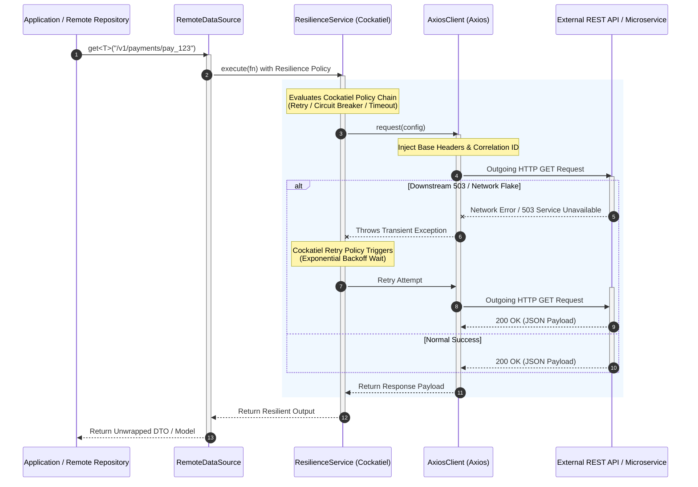

---
title:
  'HTTP Core Subsystem: Resilient External HTTP Client & Remote Data Sources'
description:
  'Technical specification for the HTTP Core client module in Xeno, detailing
  outgoing HTTP request encapsulation via Axios, Cockatiel resilience policies,
  RemoteDataSource integration, and AppBuilder registration.'
keywords:
  [
    'HTTP Core',
    'AxiosClient',
    'Cockatiel',
    'ResilienceService',
    'RemoteDataSource',
    'Circuit Breaker',
    'HttpCoreModule',
    'Xeno',
  ]
author: 'Xeno'
---

## Resilient Outgoing HTTP Communications with HTTP Core

The **HTTP Core** module in Xeno is the framework's enterprise wrapper for
making **outgoing HTTP requests** to external REST APIs, third-party
microservices, and remote endpoints. Built on top of **Axios** and
**Cockatiel**, HTTP Core combines HTTP transport primitives with resilience
policies—such as automated retries, circuit breakers, timeouts, and
fallbacks—ensuring high fault tolerance across distributed architectures.

---

## What is HTTP Core and How It Works

HTTP Core abstracts external HTTP communication away from raw `axios` or native
`fetch` calls. Instead of instantiating unmanaged HTTP clients inside domain or
infrastructure services, Xeno encapsulates outgoing HTTP execution within a
resilient data source pipeline.

When an application service or repository executes an external HTTP call:

1. **Remote Data Source Invocation**: A repository or integration service
   extends or consumes `RemoteDataSource`, calling typed HTTP methods (`get`,
   `post`, `put`, `delete`, `patch`).
2. **Resilience Policy Wrapping (Cockatiel)**: `ResilienceService` intercepts
   the outgoing call and executes it within Cockatiel resilience policies (e.g.,
   retrying transient 5xx errors with exponential backoff, or tripping a circuit
   breaker if downstream endpoints fail consistently).
3. **HTTP Transport Execution (AxiosClient)**: `AxiosClient` wraps the
   underlying `axios` instance, applying default base URLs, connection timeouts,
   custom headers, and automatically injecting active tracing headers
   (`correlationId`, `requestId`) extracted from `RequestContext`.
4. **Normalized Response Unwrapping**: The external JSON response is unwrapped
   and returned as a strongly-typed payload or functional `ResultType<T>` monad.



---

## Key Actors in HTTP Core

The HTTP Core module divides external HTTP communication across four primary
components:

```text
┌───────────────────────────────────────────────────────────────────────────┐
│                            HTTP Core Subsystem                            │
│                                                                           │
│   ┌──────────────────────────┐             ┌──────────────────────────┐   │
│   │    RemoteDataSource      │ ──────────> │    ResilienceService     │   │
│   │ (Base Remote Repository) │             │   (Cockatiel Policies)   │   │
│   └──────────────────────────┘             └──────────────────────────┘   │
│                 │                                        │                │
│                 ▼                                        ▼                │
│   ┌──────────────────────────┐             ┌──────────────────────────┐   │
│   │       AxiosClient        │ ──────────> │      HttpCoreModule      │   │
│   │   (Axios HTTP Engine)    │             │   (IoC Registration)     │   │
│   └──────────────────────────┘             └──────────────────────────┘   │
└───────────────────────────────────────────────────────────────────────────┘

```

### 1. `AxiosClient`

The underlying HTTP client wrapper that encapsulates an `axios` instance. It
manages default request configuration (base URL, timeout, headers, query
serialization) and automatically propagates active tracing metadata
(`X-Correlation-Id`, `X-Request-Id`) across outgoing HTTP request headers.

### 2. `ResilienceService` (Cockatiel Integration)

The fault-tolerance engine built on top of **Cockatiel**. It configures and
applies execution policies to outgoing HTTP calls, including:

- **Retry Policy**: Retries transient network failures or specific status codes
  using exponential backoff with jitter.
- **Circuit Breaker Policy**: Temporarily opens (blocks execution) when
  downstream services breach error threshold limits, preventing cascading system
  failures.
- **Timeout Policy**: Enforces hard cancellation limits on slow external HTTP
  requests.
- **Fallback Policy**: Provides default fallback values or secondary execution
  paths when external calls fail consistently.

### 3. `RemoteDataSource`

The abstract base data source designed to be extended by infrastructure remote
repositories (e.g., `PaymentRemoteDataSource`, `NotificationClient`). It
combines `AxiosClient` and `ResilienceService` into a unified helper interface
for executing typed HTTP operations (`get`, `post`, `put`, `delete`, `patch`).

### 4. `HttpCoreModule`

The framework container module responsible for registering HTTP Core services,
default client configurations, and resilience policy singletons inside the IoC
container.

---

## Registering and Configuring HTTP Core via AppBuilder

HTTP Core is registered during host bootstrapping using the `.addHttpCore()`
setup method on `AppBuilder`.

```typescript
// src/infrastructure/bootstrap-http-core.ts
import { AppBuilder } from '@xeno/core'
import type { AppRegistry } from './infrastructure/app-registry'

export const bootstrap = async () => {
  const builder = new AppBuilder<AppRegistry>()

  builder.addContext().addHttpCore((opts, configuration) => {
    // 1. Configure DataSource using the token in AppRegistry
    opts.dataSourceToken = DATA_SOURCE_TOKEN
    // 2. Configure Base Axios Settings
    opts.http.client.baseURL = configuration.get(
      'PAYMENT_GATEWAY_URL',
      'https://api.payments.com',
    )
    ;((opts.http.client.timeout = 10000), // 10 seconds timeout
      (opts.http.client.defaultHeaders = {
        'Accept': 'application/json',
        'Content-Type': 'application/json',
      }))
    // 3. Configure Http Client using the token in AppRegistry
    opts.http.token = HTTP_CLIENT_TOKEN

    // 4. Configure Cockatiel Resilience Policies
    opts.resilience.retry.attempts = 10 // 10 attempts for retrying failed requests
    opts.resilience.retry.baseDelayMs = 100 // 100 milliseconds base delay for retrying failed requests
    opts.resilience.retry.maxDelayMs = 1000 // 1000 milliseconds max delay for retrying failed requests
    opts.resilience.circuitBreaker.consecutiveFailures = 7 // 7 consecutive failures to open the circuit
    opts.resilience.circuitBreaker.halfOpenTimeoutMs = 5000 // 5000 milliseconds timeout for half-open state
    opts.resilience.bulkhead.maxConcurrent = 5 // 5 concurrent requests allowed
  })

  return await builder.build()
}
```

---

## How to Use HTTP Core in Application Code

To interact with external services, extend `RemoteDataSource` or inject
`AxiosClient` / `ResilienceService` into your infrastructure repositories.

### Register The DataSource Token in AppRegistry

```typescript
// src/infrastructure/app-registry.ts
import { IHttpClient, IRemoteDataSource, XenoRegistry } from '@xeno/core'

export interface AppRegistry extends XenoRegistry {
  PAYMENT_DATA_SOURCE: IRemoteDataSource
  PAYMENT_HTTP_CLIENT_TOKEN: IHttpClient
}
```

### Extending `RemoteDataSource` (Recommended Pattern)

```typescript
// src/infrastructure/datasources/payment-remote.datasource.ts
import {
  RemoteDataSource,
  type IHttpClient,
  type IServiceResilience,
} from '@xeno/core'

export interface PaymentGatewayResponse {
  transactionId: string
  status: 'APPROVED' | 'DECLINED'
  amount: number
}

export class PaymentRemoteDataSource extends RemoteDataSource {
  constructor(axiosClient: IHttpClient, resilienceService: IServiceResilience) {
    super(axiosClient, resilienceService)
  }

  public async processCharge(
    payload: { amount: number; cardToken: string },
    signal?: AbortSignal,
  ): Promise<PaymentGatewayResponse> {
    // Automatically wrapped with Cockatiel resilience policies and AxiosClient
    return await this.post<PaymentGatewayResponse>('/v1/charges', payload, {
      signal,
    })
  }

  public async getTransactionStatus(
    transactionId: string,
    singal?: AbortSignal,
  ): Promise<PaymentGatewayResponse> {
    return await this.get<PaymentGatewayResponse>(
      `/v1/charges/${transactionId}`,
      { signal },
    )
  }
}
```

### Registering the Remote Data Source in the Container

```typescript
// src/infrastructure/bootstrap-services.ts
import { AppBuilder, TOKENS } from '@xeno/core'
import { PaymentRemoteDataSource } from './datasources/payment-remote.datasource'
import type { AppRegistry } from './infrastructure/app-registry'

export const bootstrap = async () => {
  const builder = new AppBuilder<AppRegistry>()

  builder.addHttpCore((opts, config) => {
    opts.dataSourceToken = (container) => {
      // Resolve AxiosClient and ResilienceService bound by HttpCoreModule
      container.addSingleton('PAYMENT_DATA_SOURCE', (c) => {
        const axiosClient = c.resolve('PAYMENT_HTTP_CLIENT_TOKEN')
        const resilienceService = c.resolve(TOKENS.RESILIENCE_SERVICE)

        return new PaymentRemoteDataSource(axiosClient, resilienceService)
      })
    }
    opts.http.client.baseURL = config.get(
      'PAYMENT_GATEWAY_URL',
      'https://api.payments.com',
    )
    opts.http.client.timeoutMs = 5000
    opts.http.token = 'PAYMENT_HTTP_CLIENT_TOKEN'
    opts.resilience.retry.attempts = 10 // 10 attempts for retrying failed requests
    opts.resilience.retry.baseDelayMs = 100 // 100 milliseconds base delay for retrying failed requests
    opts.resilience.retry.maxDelayMs = 1000 // 1000 milliseconds max delay for retrying failed requests
    opts.resilience.circuitBreaker.consecutiveFailures = 7 // 7 consecutive failures to open the circuit
    opts.resilience.circuitBreaker.halfOpenTimeoutMs = 5000 // 5000 milliseconds timeout for half-open state
    opts.resilience.bulkhead.maxConcurrent = 5 // 5 concurrent requests allowed
  })
  return await builder.build()
}
```

---

## Why Should You Use HTTP Core?

1. **Built-in Resilience (Cockatiel Integration)** Instead of writing custom
   `try/catch` retry loops or installing unintegrated retry libraries, HTTP Core
   provides native, configurable circuit breakers, exponential backoff retries,
   and execution timeouts out of the box.
2. **Automatic Distributed Tracing Propagation** `AxiosClient` automatically
   reads the active `RequestContext` from `AsyncLocalStorage` and injects
   `X-Correlation-Id` and `X-Request-Id` headers into outgoing requests. This
   ensures end-to-end distributed tracing across external microservices.
3. **Standardized Base Remote Data Source (`RemoteDataSource`)** Provides a
   clean architectural pattern for infrastructure repositories interacting with
   external REST APIs, enforcing consistent error mapping and response
   serialization across the codebase.
4. **Centralized Client Configuration & IoC Registration** All outgoing HTTP
   client settings—such as base URLs, default authentication headers, timeouts,
   and resilience thresholds—are centrally managed during host initialization
   via `AppBuilder.addHttpCore()`.

---

> ⚠️ **WARNING — Installing Mandatory Peer Dependencies for HTTP Core** In order
> to keep the core library footprint lightweight, external libraries required by
> **HTTP Core** (`axios` and `cockatiel`) are registered as **optional peer
> dependencies** in Xeno. If you choose to enable HTTP Core via
> `.addHttpCore()`, you must explicitly install `axios` and `cockatiel` in your
> project's workspace:
>
> ```bash
> # Install mandatory peer dependencies for HTTP Core
> npm install axios cockatiel
>
> ```
>
> If `.addHttpCore()` is configured without these dependencies present in your
> project, Node.js will throw a runtime module resolution exception when Xeno
> attempts to import `axios` or `cockatiel`.

---

## Support Us

Xeno is an MIT-licensed open source project. It can grow thanks to the support
of these awesome people. If you'd like to join them, please read more at
[support section](../support-us)
