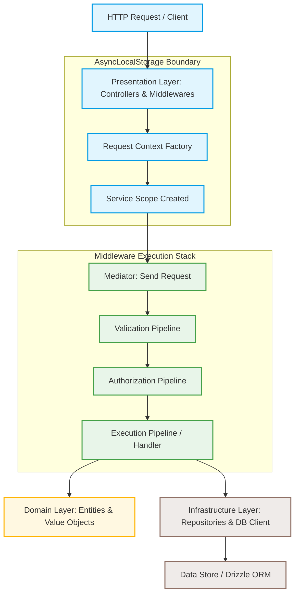

## What is Xeno and Why Use It?

Xeno is an emerging, type-safe architectural framework designed for Node.js
runtime environments. It provides explicit abstractions for Domain-Driven Design
(DDD) and Command-Query Responsibility Segregation (CQRS), leveraging a
customized Inversion of Control (IoC) container to manage request-scoped
dependencies without implicit runtime magic.

Unlike high-magic frameworks that rely heavily on decorators and global
execution contexts, Xeno introduces an explicit, deterministic design model. It
is architected for teams seeking to maintain deep control over their dependency
graph, request lifecycle, and execution boundaries. The framework offers an
alternative design pattern focused on programmatic composition, strict
compile-time validation, and runtime predictability.

Xeno is engineered to address the common pain points of architectural drift in
large applications by enforcing clean architectural boundaries. It structures
code into explicit layers—Presentation, Infrastructure, Application, and
Domain—ensuring that business logic remains completely decoupled from database
engines, HTTP clients, and third-party transport layers.

---

## What is the Core Design Philosophy of Xeno?

The design philosophy of Xeno prioritizes architectural determinism,
compile-time type safety, and strict separation of concerns. By implementing a
zero-magic dependency injection container and explicit module boundaries, the
framework eliminates captive dependencies and guarantees clean, testable
software boundaries across domain and infrastructure layers.

Xeno is built upon several foundational architectural pillars:

- **Explicit Dependency Injection** — The framework avoids auto-scanning
  directory trees or guessing registration scopes. Every service, repository,
  and controller must be programmatically registered inside an explicit registry
  using dedicated lifetime scopes. This guarantees that your dependency tree can
  be fully validated at bootstrap, preventing unexpected runtime lookup
  failures.
- **Asynchronous Execution Context Isolation** — Using Node.js
  `AsyncLocalStorage`, the underlying IoC container manages request-scoped
  lifecycles safely. It prevents cross-request state pollution and ensures that
  scoped dependencies (such as active database transactions or user contexts)
  are resolved consistently across the asynchronous execution path.
- **Clean Architecture and DDD Primacy** — Domain entities, value objects, and
  specifications are isolated from external delivery channels and persistent
  databases. Infrastructure concerns are kept strictly behind interfaces,
  allowing developers to switch from SQL to NoSQL, or from HTTP to gRPC, without
  modifying core application logic.
- **Command-Query Responsibility Segregation (CQRS)** — Write operations
  (Commands) and read operations (Queries) are processed through separate
  pipelines. This separation allows developers to tune data access strategies
  individually, implement targeted caching, and apply custom validation or
  performance monitoring strategies where they matter most.

### Architectural Blueprint: Data & Dependency Flow

The diagram below illustrates how Xeno handles request propagation through its
layered boundaries, using its native IoC container and middleware execution
stack to isolate contexts.

---
