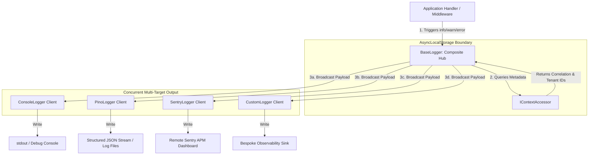

## Logging Subsystem Architecture & Composite Logger Overview

Application observability requires capturing telemetry data across diverse
execution environments without coupling business logic to specific logging
vendors. Xeno resolves this by providing a unified, composite logging subsystem
that aggregates diagnostic outputs, enriches telemetry with request-scoped
tracing context, and distributes log entries simultaneously across multiple
targets.

---

## Understanding the Base Logger Composite Architecture

The Base Logger in Xeno acts as a composite log aggregator that broadcasts
telemetry events simultaneously across multiple registered log drivers. It
unifies logging streams across diverse destinations without duplicating dispatch
calls or coupling domain services to specific logging providers.

Under the hood, `BaseLogger` implements a composite design pattern. Rather than
forwarding log events to a single output stream (e.g., standard output),
`BaseLogger` maintains an internal collection of active logging client drivers
(`ILoggerClient[]`) resolved from the service container. When an application
service or framework pipeline triggers a log operation (`debug`, `info`, `warn`,
or `error`), `BaseLogger` evaluates global log level thresholds, enriches the
log context with active request-scoped metadata from `CONTEXT_ACCESSOR` (such as
`correlationId`, `requestId`, or `tenantId`), and dispatches the payload
concurrently across all active driver instances.



### Key-Value Specification of Composite Logger Attributes

- **Composite Aggregation** — Distributes a single log call across multiple
  output channels concurrently, eliminating redundant logging statements across
  business handlers.

- **Contextual Enrichment** — Automatically attaches active `correlationId`,
  `spanId`, and `userId` metadata to log entries by querying `AsyncLocalStorage`
  through `CONTEXT_ACCESSOR`.

- **MinLevel Filtering** — Filters out low-priority messages globally before
  passing payloads to individual drivers, reducing unnecessary formatting
  overhead.

---

## Supported Framework Logger Drivers and Extensions

Xeno offers out-of-the-box support for Console, Pino, and Sentry logger drivers,
alongside an extensible custom logger registration interface. This modular
driver ecosystem enables enterprise applications to combine local stdout
debugging outputs with distributed error tracking platforms seamlessly.

The framework provides three pre-built logging drivers, along with an open
contract for custom telemetry sinks:

- **ConsoleLogger Driver** — A lightweight stdout/stderr wrapper designed for
  local development environments and unit testing suites.

- **PinoLogger Driver** — A high-performance, structured JSON driver designed
  for production container environments, supporting log redaction for sensitive
  fields (e.g., tokens or passwords) and pretty-print formatting.

- **SentryLogger Driver** — An error-tracking adapter that intercepts warning
  and error events, attaching request context metadata before dispatching
  exception reports to remote Sentry monitoring endpoints.

- **Custom Logger Extensions** — An open factory hook (`customLoggers`) allowing
  engineers to attach bespoke logging drivers (e.g., Datadog, AWS CloudWatch, or
  ElasticSearch clients) directly into the primary composite logging hub.

---

## Configuring Loggers via the AppBuilder Bootstrapper

Registering logging providers uses the fluent addLogger method on the AppBuilder
host during host bootstrapping. This centralized setup action evaluates
environment parameters, sets global log level thresholds, and automatically
mounts configured logging drivers into the core dependency injection container.

Logging configuration is managed through the `.addLogger()` configuration block
during application startup. The framework evaluates the provided `LoggerConfig`
parameters, instantiates enabled drivers using internal factories, and binds the
composite `BaseLogger` to the central IoC container under `TOKENS.LOGGER`.

### Programmatic Logger Configuration Example

```typescript
// src/infrastructure/bootstrap-logging.ts
import { AppBuilder, LOG_LEVEL } from '@xeno/core'
import type { AppRegistry } from './infrastructure/app-registry'

export const bootstrap = async () => {
  const builder = new AppBuilder<AppRegistry>()

  builder.addContext().addLogger((options, config) => {
    // 1. Set global minimum log level threshold
    options.level = LOG_LEVEL.INFO

    // 2. Toggle standard console logging
    options.console = true

    // 3. Optional: Configure Pino for structured production logs
    options.pino.config = {
      env: config.get('NODE_ENV', 'development'),
      destination: config.getOrThrow('LOG_DESTINATION'),
      prettyPrint: config.get('LOG_PRETTY_PRINT') === 'true' ?? false,
    }

    // 4. Optional: Configure Sentry for remote exception tracking
    options.sentry.config = {
      dsn: config.getOrThrow('SENTRY_DSN'),
      environment: config.getOrThrow('SENTRY_ENVIRONMENT'),
    }
  })

  return await builder.build()
}
```

---

## Internal Framework Usage Across Middlewares and Pipelines

The framework automatically injects the primary logger service into
system-critical execution workflows. It captures transport-level anomalies
within request middleware execution boundaries and tracks handler timing metrics
and payload telemetry inside the CQRS logging and performance pipeline behavior
stack.

Xeno relies on the primary `LOGGER` service internally to enforce system
observability across three primary execution zones:

### 1. Request Context Middleware

The `RequestContextMiddleware` receives `TOKENS.LOGGER` to log security
failures, missing Bearer tokens, or unhandled system exceptions that occur while
processing incoming requests. For a detailed breakdown of middleware lifecycles,
see the [Middleware Architecture Documentation](../fundamentals/middleware).

### 2. CQRS Logging Pipeline

The `LoggingPipeline` intercepts command and query executions on the mediator
bus. It records inbound message intent names, payload properties, and operation
outcomes, providing an audit trail for state mutations and read queries.

### 3. CQRS Performance Pipeline

The `PerformancePipeline` tracks the execution duration of command and query
handlers. If a handler's execution time exceeds a configured millisecond
threshold, the pipeline emits a performance warning via `TOKENS.LOGGER` to flag
potential latency bottlenecks. For more on CQRS pipelines, consult the
[CQRS Primitives Documentation](../cqrs/overview).

---

## Resolving the Unified Logger Service from the Container

Application services and domain handlers access the primary logging engine by
resolving the standardized framework logger token directly from the dependency
container. This provides type-safe logging operations enriched automatically
with active request-scoped tracing context parameters and correlation metadata.

To use the logger within custom application services, inject `TOKENS.LOGGER`
(which resolves to `ILogger`) via constructor injection.

### 1. Constructor Injection in Custom Services

```typescript
// src/application/services/payment.service.ts
import type { ILogger } from '@xeno/core'

export class PaymentService {
  constructor(private readonly _logger: ILogger) {}

  public async processTransaction(
    transactionId: string,
    amount: number,
  ): Promise<void> {
    // Log entries automatically capture active correlationId and tenantId from context
    this._logger.info(
      `Initiating payment transaction: ${transactionId} for amount: ${amount}`,
    )

    try {
      // Execute payment logic...
    } catch (error) {
      this._logger.error(
        `Payment processing failed for transaction: ${transactionId}`,
        error,
      )
      throw error
    }
  }
}
```

### 2. Service Registration inside AppBuilder

When registering custom services that depend on logging, resolve `TOKENS.LOGGER`
from the active scope container:

```typescript
// src/infrastructure/bootstrap-services.ts
import { AppBuilder, TOKENS } from '@xeno/core'
import { PaymentService } from '../application/services/payment.service'
import type { AppRegistry } from './infrastructure/app-registry'

export const bootstrap = async () => {
  const builder = new AppBuilder<AppRegistry>()

  builder
    .addContext()
    .addLogger()
    .addServices((services) => {
      services.addScoped('PAYMENT_SERVICE', (container) => {
        // Resolve the unified composite logger instance from IoC
        const logger = container.resolve(TOKENS.LOGGER)
        return new PaymentService(logger)
      })
    })

  return await builder.build()
}
```

## Understanding the Numeric Log Level Mapping Matrix

Log levels in Xeno are managed numerically via the frozen `LOG_LEVEL` constant
map. Assigning discrete integer values ranging from 0 to 3 establishes an
explicit severity hierarchy, enabling composite loggers and client drivers to
execute high-performance threshold filtering using straightforward numeric
comparisons at runtime.

Rather than relying on string-based comparisons during log execution loops, the
framework defines log levels as frozen numeric constants. Internal loggers
perform simple threshold checks (e.g., `if (level < this._minLevel) return`)
before evaluating context wrappers or serializing log payloads, minimizing
performance overhead for suppressed log entries.

### Key-Value Specification of Log Level Constants

- **LOG_LEVEL.DEBUG (0)** — Mapped to numeric value `0`, representing the lowest
  severity threshold for verbose execution diagnostics.

- **LOG_LEVEL.INFO (1)** — Mapped to numeric value `1`, establishing the
  standard baseline for operational progress messages.

- **LOG_LEVEL.WARN (2)** — Mapped to numeric value `2`, setting the severity
  threshold for non-fatal execution anomalies and potential performance risks.

- **LOG_LEVEL.ERROR (3)** — Mapped to numeric value `3`, representing the
  highest severity threshold reserved for critical application failures and
  unhandled exceptions.

### Programmatic Mapping and String Resolution

The framework exports the frozen `LOG_LEVEL` object alongside the
`LOG_LEVEL_NAMES` dictionary to facilitate bi-directional resolution between
numeric log level values and human-readable string representations:

```typescript
// shared/constants/log-level.constants.ts
export const LOG_LEVEL = Object.freeze({
  DEBUG: 0,
  INFO: 1,
  WARN: 2,
  ERROR: 3,
} as const)

export type LogLevel = (typeof LOG_LEVEL)[keyof typeof LOG_LEVEL]

export const LOG_LEVEL_NAMES: Record<LogLevel, string> = {
  [LOG_LEVEL.DEBUG]: 'DEBUG',
  [LOG_LEVEL.INFO]: 'INFO',
  [LOG_LEVEL.WARN]: 'WARN',
  [LOG_LEVEL.ERROR]: 'ERROR',
}
```

### Usage Example in Logger Drivers and Configuration

When configuring minimum log levels via `AppBuilder` or implementing custom
`ILoggerClient` drivers, assign severity levels directly using the `LOG_LEVEL`
constant:

```typescript
import {
  AppBuilder,
  LOG_LEVEL,
  LOG_LEVEL_NAMES,
  type LogLevel,
} from '@xeno/core'

// 1. Setting the global minimum log level in AppBuilder
const builder = new AppBuilder()
builder.addLogger((options) => {
  options.level = LOG_LEVEL.WARN // Sets minimum threshold to 2 (suppresses DEBUG and INFO)
})

// 2. Resolving numeric values to human-readable labels within custom logic
function formatLogPrefix(level: LogLevel): string {
  const levelName = LOG_LEVEL_NAMES[level] // e.g., LOG_LEVEL_NAMES[2] resolves to 'WARN'
  return `[${levelName}]`
}

console.log(formatLogPrefix(LOG_LEVEL.WARN)) // Output: "[WARN]"
```

---

## Support Us

Xeno is an MIT-licensed open source project. It can grow thanks to the support
of these awesome people. If you'd like to join them, please read more at
[support section](../support-us)
