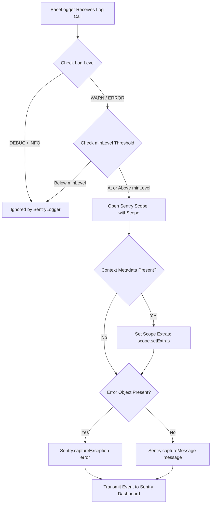

## Remote Error Tracking with SentryLogger

Capturing unhandled exceptions and performance anomalies in production
distributed systems requires real-time telemetry forwarding to centralized
Application Performance Monitoring (APM) platforms. Xeno provides native
integration with Sentry through the `SentryLogger` driver.

---

## How to Register and Configure SentryLogger via AppBuilder

Registering SentryLogger in Xeno requires populating the options.sentry.config
property object within the addLogger configuration block on AppBuilder. This
triggers the SentryLoggerFactory during bootstrap, instantiating the Sentry SDK
and binding a remote exception tracking driver to the framework's primary
composite logger.

To activate Sentry error reporting, configure the `options.sentry.config` object
inside the `.addLogger()` configuration method during host initialization. When
`SentryLoggerFactory` detects a defined configuration object containing a valid
Data Source Name (DSN), it initializes the `@sentry/node` client and registers
the resulting `SentryLogger` instance as an active driver inside the composite
`BaseLogger` hub.

### Programmatic Bootstrap Registration Example

```typescript
import { AppBuilder, LOG_LEVEL } from '@xeno/core'
import type { AppRegistry } from './infrastructure/app-registry'

export const bootstrap = async () => {
  const builder = new AppBuilder<AppRegistry>()

  builder.addContext().addLogger((options, configuration) => {
    // 1. Set global minimum log level (Sentry defaults to WARN)
    options.level = LOG_LEVEL.WARN

    // 2. Enable standard console logging alongside Sentry
    options.console = true

    // 3. Populate Sentry SDK initialization parameters
    options.sentry.config = {
      dsn: config.getOrThrow('SENTRY_DSN'),
      environment: config.getOrThrow('SENTRY_ENVIRONMENT'),
    }
  })

  return await builder.build()
}
```

---

## Understanding Sentry Configuration Parameters and Initialization

Sentry configuration parameters in Xeno govern remote project targeting,
environment isolation, and payload filtering. Managed through
SentryLoggerFactory, options like dsn and environment dictate error reporting
destinations, while native beforeSend hooks automatically filter out expected
schema validation errors before transmission to remote dashboards.

The `SentryLoggerFactory` maps user configurations directly to native Sentry SDK
initialization options during bootstrap.

### Key-Value Specification of Sentry Configuration Attributes

- **dsn** — The Data Source Name string required by Sentry to route telemetry
  payloads to the correct project workspace (raises an explicit error during
  bootstrap if omitted).

- **environment** — The logical deployment stage identifier (e.g.,
  `'production'`, `'staging'`, `'development'`), falling back to
  `process.env.NODE_ENV` if unsupplied.

- **tracesSampleRate** — Automatically assigned by the factory based on
  environment mode: set to `0.1` (10% sampling) in production environments to
  control event volume, and `1.0` (100% sampling) in development for
  comprehensive tracing.

- **sendDefaultPii** — Hardcoded to `false` within the factory initialization to
  prevent accidental transmission of Personally Identifiable Information (PII)
  to remote servers.

- **beforeSend Filtering** — A built-in event interceptor that evaluates thrown
  exceptions before dispatching events; automatically returns `null` to drop
  expected `ZodError` validation failures and prevent APM dashboard noise.

---

## Managing Severity Filtering and Contextual Error Capture

SentryLogger handles error tracking by restricting transmission strictly to WARN
and ERROR severity levels. When invoked, it opens a Sentry scope, attaches
request-scoped contextual metadata via scope.setExtras, and dispatches captured
exceptions or diagnostic warning messages directly to remote monitoring
platforms.

Unlike stdout drivers that record every debug or info entry, `SentryLogger`
targets operational anomalies. If `BaseLogger` dispatches a `DEBUG` or `INFO`
level message, `SentryLogger` silently ignores the invocation to conserve
bandwidth and API rate limits.

### Error Processing Workflow

When a `WARN` or `ERROR` log entry reaches `SentryLogger`, the driver creates an
isolated Sentry scope wrapper via `withScope`.



### Context Enrichment and Exception Routing

- **Contextual Extras** — If contextual data (such as `requestId`,
  `correlationId`, or route path metadata) accompanies the log call,
  `SentryLogger` passes the record object to `scope.setExtras(context)`.

- **Exception Capture** — If an explicit JavaScript `Error` object is supplied
  in the log invocation, `SentryLogger` invokes `captureException(error)`,
  preserving stack traces and inner cause properties.

- **Message Capture** — If no error instance is attached to a `WARN` or `ERROR`
  log, `SentryLogger` fallback-invokes `captureMessage(message, 'warning')` to
  report the diagnostic string.

---

## Installing Mandatory Peer Dependencies for Sentry

Integrating SentryLogger requires explicitly installing the @sentry/node peer
dependency in your project workspace. Because Xeno follows a
pay-for-what-you-use peer dependency model, external monitoring libraries are
lazy-loaded and must be added manually before activating Sentry logging within
the AppBuilder host configuration.

Because Sentry is classified as an **optional peer dependency** in Xeno
(`@xeno/core`), the `@sentry/node` package is not bundled with the core
framework installation. This prevents pulling heavy third-party monitoring
dependencies into environments that do not require remote APM tracking.

To enable Sentry error logging, execute the package manager installation command
within your project root:

```bash
# Install the mandatory Sentry SDK peer dependency
npm install @sentry/node

```

> **Note**: Ensure that the installed `@sentry/node` version satisfies the
> framework's peer dependency range (`^7.64.0` or higher). If you configure
> Sentry logging via `.addLogger()` without installing `@sentry/node`, Node.js
> will throw a runtime module resolution error during host initialization.

---

## Support Us

Xeno is an MIT-licensed open source project. It can grow thanks to the support
of these awesome people. If you'd like to join them, please read more at
[support section](../support-us)
