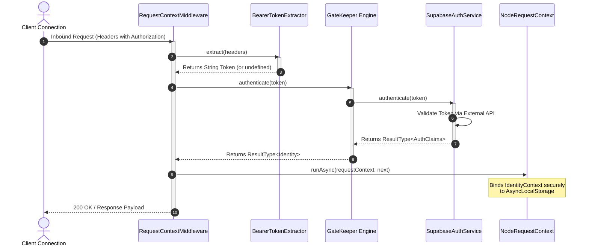

## Authentication and Identity Verification Architecture

Securing access endpoints and tracking cross-layer credentials across an
asynchronous execution stack requires a reliable approach to identity
verification. Xeno separates transport delivery layers from core security
mechanisms through a pipeline that extracts, validates, and propagates client
identity contexts securely.

---

## Understanding the Authentication Mechanism and Security GateKeeper

The authentication subsystem in Xeno enforces identity verification across
protected application paths via a centralized GateKeeper component. It
programmatically extracts incoming credentials, communicates with external
identity providers, and materializes strongly-typed authorization claims,
ensuring secure, isolated execution context boundaries for downstream request
processing handlers.

The core execution path is driven by the `RequestContextMiddleware` within the
framework's presentation layer. When an inbound request hits the transport
layer, this middleware intercepts the network envelope to extract metadata from
the headers.



### Components of the Security Architecture

- **BearerTokenExtractor** — A discrete service that plucks the `Authorization`
  header from incoming headers, normalizes its case, and strips away the
  `Bearer ` string prefix to isolate the raw cryptographic token.

- **GateKeeper** — The primary domain orchestrator responsible for coordinating
  authentication flows. It passes raw extracted tokens down to configured
  external security providers and handles identity mapping routines.

- **AuthClaims Schema** — A strongly-typed contract that structures identity
  components, containing user identifiers (`sub`), allocated application
  `roles`, active fine-grained `permissions`, and tenant identifiers
  (`tenantId`).

- **ClaimsIdentityMapper** — Maps external authentication vendor claims into a
  standardized internal `Identity` object, separating the core application from
  specific third-party data structures.

---

## Handling Missing or Invalid Bearer Tokens and Error Serialization

When an inbound request omits a mandatory Bearer token or provides invalid
credentials on a protected route, Xeno halts execution early. The security
middleware immediately short-circuits the pipeline stack, rejecting the
transaction and returning a standardized, machine-readable unauthenticated error
response envelope with a 401 status code.

If the incoming request targets a route that is not explicitly registered within
`publicRoutes`, the framework flags the request as protected. If the client
fails to provide an `Authorization` header, or if the token has expired, the
internal `GateKeeper` returns a failed `Result` instance containing a
specialized `AppError` configuration.

The `RequestContextMiddleware` captures this failure, short-circuits the
execution path before reaching the application use-case handler, and routes the
failure to the framework's error serialization mechanism.

### Technical Properties of an Unauthenticated Rejection

- **Status Code** — `401 Unauthorized` (`STATUS_CODES.UNAUTHORIZED`), indicating
  that the client must present valid credentials before retrying the
  transaction.

- **Error Code** — `AUTHENTICATION_FAILED`
  (`ERROR_CODES.AUTHENTICATION_FAILED`), providing a machine-readable string key
  for programmatic client-side routing and error handling.

- **Response Envelope** — A structured `ResponseDto` object populated with an
  `ErrorResponseDto` payload. It explicitly marks `success: false` and bundles
  the endpoint path, unique `correlationId` tracking flags, a `requestId`
  parameter, and an ISO 8601 server `timestamp`.

- **Audit Logging Behavior**: Authentication failures do not trigger
  server-level `error` hooks. The framework logs credentials rejections under
  the `warn` log level to prevent distributed telemetry poisoning and false
  alerts inside alerting systems like Sentry.

---

## Configuring Supabase Authentication via the AppBuilder Utility

Integrating Supabase authentication within Xeno requires programmatically
binding endpoint credentials using the fluent AppBuilder interface. The built-in
authentication client factory initializes the native client stream, registers
custom identity mappers, and injects the verified provider directly into the
framework security gatekeeper loop.

Xeno includes a built-in integration provider for Supabase. When enabled, the
framework mounts the `SupabaseAuthService`, which manages token verification by
calling the external API endpoint `auth.getUser(token)`.

Successful responses are processed by the `SupabaseClaimsMapper`. This module
inspects the `app_metadata` dictionary returned by Supabase to automatically
extract tenant parameters (`tenant_id`), group designations (`roles`), and
capability lists (`permissions`) into internal context tracking properties.

### Integrating Supabase via Bootstrapping

To wire up the Supabase integration provider, apply the `.addAuth()` setup
action block during the application bootstrapping cycle:

```typescript
// src/infrastructure/bootstrap-security.ts
import { AppBuilder } from '@xeno/core'
import type { AppRegistry } from './xeno-registry/app-registry'

export const configureSecurityStack = async () => {
  const builder = new AppBuilder<AppRegistry>()

  builder
    // 1. Activate AsyncLocalStorage context isolation boundaries
    .addContext()

    // 2. Configure public route bypass configurations
    .addMiddlewares((config) => {
      config.publicRoutes = {
        // Exempts specific entry points from Bearer validation checks
        '/api/v1/auth/login': { POST: 'isPublic' },
        '/api/v1/auth/register': { POST: 'isPublic' },
        '/api/v1/system/health': { GET: 'isPublic' },
      }
    })

    // 3. Mount and configure the native Supabase Provider via SetupAction
    .addAuth((options, env) => {
      // Programmatically extracts variables from the configuration client
      options.url = env.getOrThrow('SUPABASE_URL')
      options.key = env.getOrThrow('SUPABASE_KEY')

      // Optional: Pass specialized client-level configuration options
      options.options = {
        auth: {
          persistSession: false,
          autoRefreshToken: false,
        },
      }
    })

  // Compile modules and return the type-safe ServiceContainer
  return await builder.build()
}
```

> [!WARNING]
>
> To use supabase auth remember to install the relative dependencies
>
> ```
> npm i @supabase/supabase-js
>
> ```
