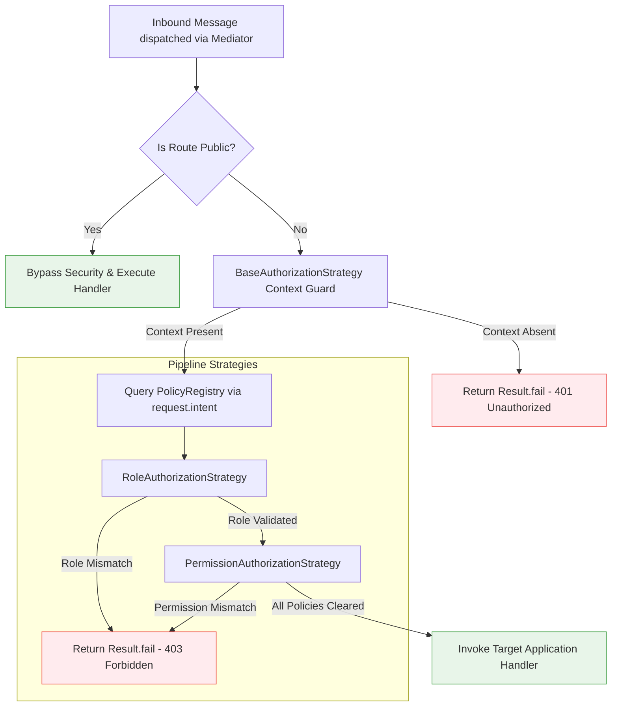

## Declarative Access Control: Roles and Permissions

Securing message execution branches across a decoupled application architecture
requires mapping verified identities to discrete capability constraints. Xeno
implements these boundaries using specialized pipeline strategies that evaluate
role and permission matrices directly against message intents before invoking
business logic.

---

## Introduction to Role and Permission Authorization Policies

Role-based and permission-based authorization in Xeno secures CQRS message
handlers by evaluating explicit user identities against a centralized policy
registry. These strategies intercept incoming command and query intents within
the mediator execution stack, validating access privileges prior to triggering
core business domain transformations.

By moving security boundaries away from HTTP delivery endpoints and embedding
them within the mediator bus, Xeno enforces consistent security across any
ingress channel (e.g., HTTP REST, WebSockets, or background workers). This
declarative approach leverages an `IPolicyRegistry` to track application
policies, validating inbound message parameters against claims extracted from
the user's verified identity.



---

## Understanding the Mechanics of Role-Based Authorization

The RoleAuthorizationStrategy protects application handlers by verifying that an
authenticated identity possesses at least one matching group designation
required by the target operation. It queries the policy registry using the
unique message intent, returning a forbidden result monad upon a validation
failure.

The `RoleAuthorizationStrategy` evaluates broad, group-level user
classifications (e.g., `admin`, `manager`, `guest`). When a message passes
through the mediator bus, the strategy intercepts execution, reads the unique
`intent` string token from the request, and fetches the associated policy from
the `IPolicyRegistry`.

If the policy contains a non-empty `roles` array, the strategy checks if the
user's roles (`auth.roles`) satisfy the requirements using an array
intersection:

```typescript
const roles = auth.roles ?? []
const hasRequiredRole = policy.roles?.some((role) => roles.includes(role))
```

If the authenticated actor does not possess at least one of the required group
roles, the strategy short-circuits the pipeline execution loop, returning a
failed `Result` enclosing a `403 Forbidden` (`STATUS_CODES.FORBIDDEN`)
application exception.

### Key-Value Specification of Role Authorization Properties

- **Base Class Evaluation** — Extends `BaseAuthorizationStrategy`, automatically
  executing pre-flight checks to ensure the `RequestContext` is present and
  active.

- **Intent Token Mapping** — Extracts the policy criteria dynamically by passing
  the unique message token (`request.intent`) directly to the registry engine.

- **Case-Sensitive Array Matching** — Executes an array evaluation
  (`policy.roles.some`) matching user role signatures, requiring exact casing
  configurations between identity claims and registry definitions.

---

## Understanding the Mechanics of Permission-Based Authorization

The PermissionAuthorizationStrategy implements granular access control by
matching an identity's capability scopes against the fine-grained permissions
declared for a message payload. It isolates execution streams, ensuring that
authenticated actors cannot execute specialized write commands or query lookups
without valid capability tokens.

While roles represent high-level organizational buckets, permissions define
granular functional capabilities (e.g., `write:users`, `read:reports`). This
granularity is essential for zero-trust architectures where access control must
be applied at the single-action layer.

The `PermissionAuthorizationStrategy` functions identically to the role-based
subsystem but evaluates fine-grained capabilities (`auth.permissions`) against
the targeted message policy. If an identity lacks the explicit permission
signature demanded by the handler's policy, execution halts instantly with an
`AppError.forbidden` validation failure, preventing unauthorized state mutations
or data leaks.

### Key-Value Specification of Permission Authorization Properties

- **Granular Action Targeting** — Restricts resource manipulation by verifying
  precise application capabilities regardless of the user's role groupings.

- **Monadic Short-Circuiting** — Intercepts execution before handler processing
  begins, returning an explicit failure state to maintain predictable control
  flows.

- **Decoupled Architecture** — Evaluates permission logic completely outside
  persistence mechanisms, keeping the core domain logic clean and portable.

---

## Bootstrapping Policies using Command and Query Intent Tokens

Registering role and permission authorization strategies requires provisioning
declarative policy objects tied strictly to unique command or query intent
tokens during bootstrap. The fluent AppBuilder maps these intent contracts
within the PolicyRegistry, enabling automated validation when routing messages
across mediator pipelines.

To ensure seamless execution routing, your authorization configuration must map
directly to the unique `intent` properties of your commands and queries.
Misaligning these tokens will cause the registry to skip checks or return
validation failures at runtime.

### 1. Declaring the Typed Messages with Unique Intent Strings

Every command and query must declare an explicit `intent` token string that acts
as its unique injection key within the framework ecosystem:

```typescript
// src/application/user/commands/delete-user.command.ts
import { type ICommand, REQUEST_TYPE } from '@xeno/core'

export class DeleteUserCommand implements ICommand<void> {
  // The unique string intent acting as the message identifier token
  public readonly intent = 'DELETE_USER_COMMAND_HANDLER_TOKEN'
  public readonly type = REQUEST_TYPE.COMMAND

  constructor(public readonly userId: string) {}
}
```

```typescript
// src/application/user/queries/get-analytics.query.ts
import { type IQuery, type ICacheableOptions, REQUEST_TYPE } from '@xeno/core'

export class GetAnalyticsQuery implements IQuery<Record<string, unknown>> {
  public readonly intent = 'GET_ANALYTICS_QUERY_HANDLER_TOKEN'
  public readonly type = REQUEST_TYPE.QUERY
  public readonly cacheOptions: ICacheableOptions

  constructor() {
    this.cacheOptions = { cacheKey: this.intent, ttl: 300 }
  }
}
```

### 2. Wiring Intent Policies inside the AppBuilder Bootstrapper

During host assembly, use the `.addPipeline()` configuration block to register
policies. This process binds message `intent` string keys directly to their
required roles and permissions:

```typescript
// src/infrastructure/bootstrap.ts
import { AppBuilder } from '@xeno/core'
import type { AppRegistry } from './infrastructure/app-registry'

export const bootstrapApplication = async () => {
  const builder = new AppBuilder<AppRegistry>()

  builder
    // Enable context isolation layers
    .addContext()
    .addMiddleware()
    // Configure and provision the security pipeline stack
    .addPipeline((options) => {
      // Map declarative security requirements using explicit intent keys
      options.authorization.policies = {
        // Enforces role-based checks specifically on DeleteUserCommand
        DELETE_USER_COMMAND_HANDLER_TOKEN: {
          roles: ['super_admin', 'security_officer'],
        },

        // Enforces both role and permission constraints on GetAnalyticsQuery
        GET_ANALYTICS_QUERY_HANDLER_TOKEN: {
          roles: ['admin', 'analyst'],
          permissions: ['read:analytics', 'export:reports'],
        },
      }
    })

  return await builder.build()
}
```

---

## Support Us

Xeno is an MIT-licensed open source project. It can grow thanks to the support
of these awesome people. If you'd like to join them, please read more at
[support section](../support-us)
